[书籍](./books/2023张宇数学基础30讲-高等数学分册.pdf#page=8)

# 函数的概念域特性

## 函数

设 $x$ 与了 $y$ 是两个变量， $x\in D$ ，其中 $D$ 为 $x$ 定义域，对于每一个 $x$ 都有**一个确定的值** $y$ 与之对应，则称 $y$ 为 $x$ 的函数，记作 $y=f(x)$ 。 $x$ 称为**自变量**， $y$ 称为**因变量**。

## 反函数

设函数 $y=f(x)$ 的定义域为 $D$ ，值域为 $R$ 。则对于 $y\in R$ 有 $x\in D$ 使得 $y=f(x)$ 成立，定义一个新的函数 $x=\varphi(y)$ ，称它为反函数，一般记作 $x=f^{-1}(y)$ 定义域为 $R$ 值域为 $D$​ 。

性质：

1. **严格的单调函数（求导后为恒正或恒负）必有反函数**，比如 $y=x^2(x\in[0,+\infty))$ 是严格的单调函数，故他有反函数 $x=\sqrt{y}$ 。

2. 把 $x=f^{-1}(y)$ 域 $y=f(x)$ 的图像完全重合；将 $x=f^{-1}(y)$ 写作 $y=f^{-1}(x)$ ，他们的图像才会**关于 $y=x$ 对称**。
3. 自变量与因变量一一对应的函数才有反函数

## 复合函数

设函数 $y=f(u)$ 的定义域为 $D_1$ ，函数 $u=g(x)$ 定义域为 $D$ ，且 $g(D)\subset D_1$ ，则由

$$
y=f[g(x)](x\in D)
$$

确定的函数，称为由函数 $u=g(x)$ 和函数 $y=f(u)$ 构成的**复合函数**，它的定义域为 $D$ ， $u$ 称为**中间变量**。

### 例题

---

---

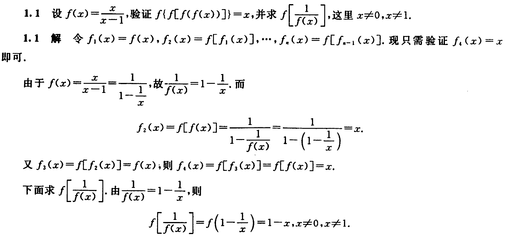

## 四种特性

### 有界性

设如果存在某个正数 $M$ ，使对任一 $x\in I(区间)$ ，有 $|f(z)|≤M$ ，则称 $f(x)$ 在 $I$ 上有界；如果这样的 $M$ 不存在，则称 $f(x)$ 在上 $I$ 无界。

有界还是无界的讨论首先需**指明区间** $I$ 。可通过**求极限**求得。

### 单调性

对于区间 $I$ 上任意两点 $x_1,x_2$ ，**当 $x_1<x_2$ 时，恒有 $f(x_1)<f(x_2)$** ，则称 $f(x)$ 在区间 $I$ 上**单调增加**。反之**单调减少**。

可通过**求导来讨论单调性**，对于 $x_1-x_2[f(x_1)-f(x_2)]\ge0$ 称为单调不减，反之为单调不增。

### 奇偶性

设 $x\in D$ ，恒有 $\pmb{f(-x)=f(x)}$ ，则称 $f(x)$ 为**偶函数**。若恒有 $\pmb{f(-x)=-f(x)}$ ，则称 $f(x)$ 为**奇函数**。即偶函数关于 $y$ **轴对称**，奇函数关于**原点对称**。

---

 $\pmb{F_1(x)=f(x)-f(-x)}$ 为奇函数，因为 $F_1(-x)=f(-x)-f(x)=-F_1(x)$ 。$\pmb{F_1(x)=f(x)+f(-x)}$ 为偶函数。

奇函数有 $f(0)=0$ ，偶函数存在 $f'(0)$ 时 $f'(0)=0$ 。

函数 $y=f(x)$ 与 $y=-f(x)$ 的图形**关于 $x$ 轴对称**；函数 $y=f(x)$ 与 $y=f(-x)$ 的图形**关于 $y$ 轴对称**；函数 $y=f(x)$ 与 $y=-f(-x)$ 的图形**关于原点对称**。

函数 $y=f(x)$ 的图形关于直线 $x=T$ 对称的充分必要条件是 $\pmb{f(x)=f(2T-x)}$ 或 $\pmb{f(x+T)=f(T-x)}$ 。

### 周期性

存在一个正数 $T$ ，使得对于任一 $x\in D$ ，有 $f(x+T)=f(x)$ 。 $T$ 则称 $f(z)$ 为周期函数， $T$ 称为 $f(x)$ 的周期。相邻两个长度为 $T$ 的区间上，函数的图形完全一样。

### 结论

1. 若 $f(x)$ 是可导的**奇或偶函数**，**求导后奇偶性互换**。
2. 若 $f(x)$ 是可导的周期为 $T$ 的**周期函数**，求**导后周期仍为 $T$** 。
3. **连续的奇函数的一切原函数都是偶函数**。
4. **连续的偶函数的原函数中仅有一个原函数是奇函数**。
5. **若连续函数 $f(x)$ 以 $T$ 为周期且 $\int_0^Tf(x){\rm d}x=0$ ,则 $f(x)$ 的一切原函数也以 $T$ 为周期**。
6. **若 $f(x)$ 在 $(a,b)$ 内可导(可导则连续)且 $f’(x)$ 有界,则 $f(x)$ 在 $(a,b)$ 内有界**(函数的导数控制函数，可通过拉格朗日证明 $f(x)=f'(\xi)(x-x_0)+f(x_0)\Rightarrow|f(x)|=|f'(\xi)(x-x_0)+f(x_0)|\\\le|f'(\xi)(x-x_0)|+|f(x_0)|\lt|f'(\xi)(b-a)|+|f(x_0)|$ )。

# 函数的图像

## 直角坐标系下的图像( $f(x,y)=0$ )

### 常见图像

#### 基本初等函数

1. **常数函数**
   
     $y=A$ ， $A$ 为常数,其图形为平行于 $x$ 轴的水平直线
   
   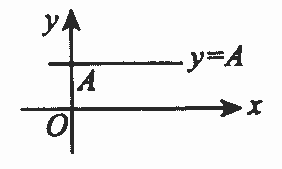

2. **幂函数**
   
     $y=x^\mu(\mu是实数)$ 
   
             
   
   - 见到 $\sqrt{u},\sqrt[3]{u}$ 时,可用 $u$ 来研究最值
   - 见到 $|u|$ 时,由 $|u|=\sqrt{u^2}$ ，可用 $u^2$ 来研究最值
   - 见到 $u_1u_2u_3$ 时，可用 $\ln(u_1u_2u_3)=\ln u_1+\ln u_2+\ln u_3$ 来研究最值
   - 见到 $\frac{1}{u}$ 时,可用 $u$ 来研究最值(结论相反,即 $\frac{1}{u}$ 与 $u$ 的最大值点、最小值点相反)

3. **指数函数**
   
      $y=a^x(a\gt0,a\not=1)$ 
   
         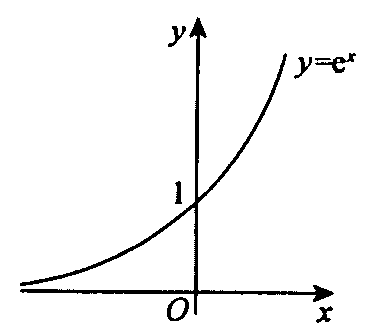
   
   - 定义域： $(-\infty,+\infty)$ ，值域： $(0,+\infty)$ 。
   - 单调性： $a\gt 1$ ，单调增， $0\lt a\lt 1$ ，单调减。
   - 极限： $\underset{x\rightarrow-\infty}{\lim}e^x=0$ ， $\underset{x\rightarrow+\infty}{\lim}e^x=+\infty$ ，极限有唯一性， $\underset{x\rightarrow\infty}{\lim}e^x$ 不存在

4. **对数函数**
   
      $y=\log_ax(a\gt0,a\not=1)$ 是 $y=a^x$ 的反函数
   
     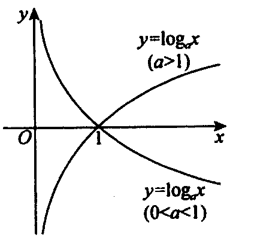    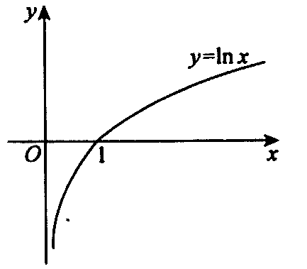
   
   - 定义域： $(0,+\infty)$ ，值域： $(-\infty,+\infty)$ 。
   - 单调性： $a\gt 1$ ，单调增， $0\lt a\lt 1$ ，单调减。
   - 极限： $\underset{x\rightarrow0^+}{\lim}\ln x=-\infty$ ， $\underset{x\rightarrow+\infty}{\lim}\ln x=+\infty$ 

5. **三角函数**
   
   - 正弦函数与余弦函数
     
     正弦函数： $y=\sin x$ 余弦函数： $y=\cos x$ 
     
     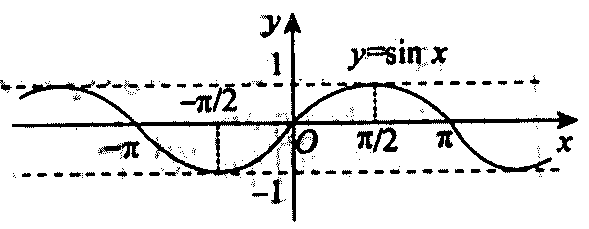    
     
     - 周期性： $y=\sin x$ 和 $y=\cos x$ 均以 $2T$ 为最小正周期， $x\in(-\infty,+\infty)$  。
     - 有界性： $|\sin x|\le1,|\cos x|\le1$ 。
   
   - 正切函数与余切函数
     
     正切函数 $y=\tan x$ ，余切函数 $y=\cot x$ 。
     
     $$
     \tan x=\frac{\sin x}{\cos x},\cot x=\frac{\cos x}{\sin x}=\frac{1}{\tan}
     $$
     
       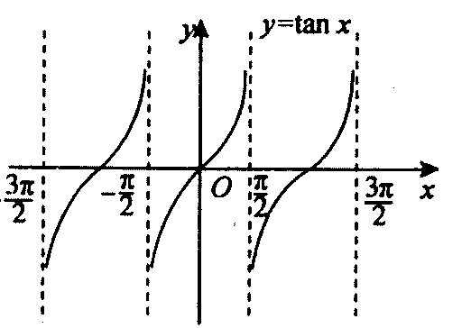    
     
     - 定义域： $y=\tan x$ 的定义域为 $x\not=k\pi+\frac{\pi}{2}$ 的实数， $y=\cot x$ 的定义域为 $x\not=k\pi$ 的实数
     - 奇偶性：均为奇函数
     - 周期性：最小正周期 $\pi$ 
- 正割函数与余割函数
  
  正割函数 $y=\sec x$ ，余割函数 $y=\csc x$ 
  
  $$
  \sec x=\frac{1}{\cos x},\csc x=\frac{1}{\sin x}
  $$
  
      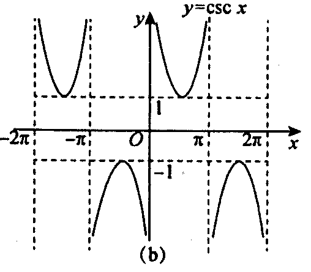
  
  - 定义域： $y=\sec x$ 的定义域为 $x\not=k\pi+\frac{\pi}{2}$ 的实数， $y=\csc x$ 的定义域为 $x\not=k\pi$ 的实数，值域： $(-\infty,-1]\bigcup[1,+\infty)$ 
  - 奇偶性： $y=\sec x$ 是偶函数， $y=\csc x$ 是奇函数
6. **反三角函数**
   
   - 反正弦函数与反余弦函数
     
     反正弦函数 $y=\arcsin x$ ，反余弦函数 $y=\arccos x$ 
     
         
     
      $y=\arcsin x$ 是 $y=\sin x\quad x\in[-\frac{\pi}{2},\frac{\pi}{2}]$ 的反函数， $y=\arccos x$ 是 $y=\cos x\quad x\in[0,\pi]$ 的反函数。
     
     - 定义域： $[-1,1]$ ， $y=\arcsin x$ 值域 $[-\frac{\pi}{2},\frac{\pi}{2}]$ ， $y=\arccos x$ 值域 $[0,\pi]$ 
     - 单调性： $y=\arcsin x$ 单调增， $y=\arccos x$ 单调减
     - 奇偶性： $y=\arcsin x$ 为奇函数
     - 有界性： $\arcsin x\in[-\frac{\pi}{2},\frac{\pi}{2}]$ ， $\arccos x\in[0,\pi]$ 
     - 性质： $\arcsin x+\arccos x=\frac{\pi}{2}(x\in[-1,1])$ 因为其求导为0，即变化率为0
   
   - 反正切函数与反余切函数
     
       反正切函数 $y=\arctan x$ ，反余切函数 $y={\rm arccot}\ x$ 
     
           
     
        $y=\arctan x$ 是 $y=\tan x\quad x\in[-\frac{\pi}{2},\frac{\pi}{2}]$ 的反函数， $y={\rm arccot}\ x$ 是 $y=\cot x\quad x\in[0,\pi]$ 的反函数。
     
     - 定义域： $(-\infty,+\infty)$ ， $y=\arctan x$ 值域 $(-\frac{\pi}{2},\frac{\pi}{2})$ ， $y={\rm arccot}\ x$ 值域 $(0,\pi)$ 
     - 单调性： $y=\arctan x$ 单调增， $y={\rm arccot}\ x$ 单调减
     - 奇偶性： $y=\arctan x$ 为奇函数
     - 性质： $\arctan x+{\rm arccot}\ x=\frac{\pi}{2}(x\in(-\infty,+\infty))$ 因为其求导为0，即变化率为0
     - 极限： $\underset{x\rightarrow-\infty}{\lim}\arctan x=-\frac{\pi}{2}$ ， $\underset{x\rightarrow+\infty}{\lim}\arctan x=\frac{\pi}{2}$ 

7. **初等函数**
   
     由基本初等函数经有限次的四则运算，以及有限次的复合步骤所构成的并且可以由一个式子所表示的函数称为**初等函数**。
   
   - 初等函数的**定义域可以是一个区间**，也可以是几个区间的并集，甚至可以是一些孤立的点。例如， $y=\sqrt{\cos \pi x-1}$ 的定义域是 $x=0,\pm2,\pm4,\cdots$ 

#### *三角函数和差公式推导

1. $\sin(\alpha+\beta)=\sin\alpha\cos\beta+\cos\alpha\sin\beta$ 

$$
\sin(\alpha+\beta)=AB/AO=AB\\
\because AB=AE+EB=AE+CD\\
\begin{aligned}
\therefore\sin(\alpha+\beta)&=AE+CD\\
&=AC\cos\beta+OC\sin\beta\\
&=\sin\alpha\cos\beta+\cos\alpha\sin\beta
\end{aligned}
$$

2. $\sin(\alpha-\beta)=\sin\alpha\cos\beta-\cos\alpha\sin\beta$ 

   $$
   \begin{aligned}
   \sin(\alpha-\beta)&=\sin(\alpha+(-\beta))\\
   &=\sin\alpha\cos(-\beta)+\cos\alpha\sin(-\beta)\\
   &偶:f(x)=f(-x),奇:f(x)=-f(-x)\\
   &=\sin\alpha\cos\beta-\cos\alpha\sin\beta
   \end{aligned}
   $$

3. $\cos(\alpha+\beta)=\cos\alpha\cos\beta-\sin\alpha\sin\beta$ 

   $$
   \cos x=\sin(\frac{\pi}{2}-x)\\
   \begin{aligned}
   \cos(\alpha+\beta)&=\sin(\frac{\pi}{2}-\alpha-\beta)\\
   &=\sin(\frac{\pi}{2}-\alpha)\cos\beta-\cos(\frac{\pi}{2}-\alpha)\sin\beta\\
   &=\cos\alpha\cos\beta-\sin\alpha\sin\beta
   \end{aligned}
   $$

4. $\cos(\alpha-\beta)=\cos\alpha\cos\beta+\sin\alpha\sin\beta$ 

   $$
   \begin{aligned}
   \cos(\alpha-\beta)&=\cos\alpha\cos(-\beta)-\sin\alpha\sin(-\beta)\\
   &偶:f(x)=f(-x),奇:f(x)=-f(-x)\\
   &=\cos\alpha\cos\beta+\sin\alpha\sin\beta
   \end{aligned}
   $$

5. $\tan(\alpha+\beta)=(\tan \alpha+\tan \beta)/(1-\tan \alpha\tan \beta)$ 化为 $\cos$ 和 $\sin$ 上下除 $\cos\alpha\cos\beta$ 可简单求得

6. $\tan(\alpha-\beta)=(\tan \alpha-\tan \beta)/(1+\tan \alpha\tan \beta)$ 使用奇偶性可简单求得

7. 积化和差
    $$
	\sin\alpha\cos\beta=\frac{1}{2}[\sin(\alpha+\beta)+\sin(\alpha-\beta)]\\
	\cos\alpha\sin\beta=\frac{1}{2}[\sin(\alpha+\beta)-\sin(\alpha-\beta)]\\
	\cos\alpha\cos\beta=\frac{1}{2}[\cos(\alpha+\beta)+\cos(\alpha-\beta)]\\
	\sin\alpha\sin\beta=-\frac{1}{2}[\cos(\alpha+\beta)-\cos(\alpha-\beta)]
	$$
	**推导**   由和角公式可得
	$$
	\sin(\alpha+\beta)=\sin\alpha\cos\beta+\cos\alpha\sin\beta\\
	\sin(\alpha-\beta)=\sin\alpha\cos\beta-\cos\alpha\sin\beta
	$$
	上面两式相加相减可推得积化和差公式前两个式子，同理也可推导后两个式子
8. 和差化积

    $$
    \sinα+\sinβ = 2\sin[\frac{α+β}{2}]\cos[\frac{α-β}{2}]\\
    \sinα-\sinβ = 2\cos[\frac{α+β}{2}]\sin[\frac{α-β}{2}]\\
    \cosα+\cosβ = 2\cos[\frac{α+β}{2}]\cos[\frac{α-β}{2}]\\
    \cosα-\cosβ = -2\sin[\frac{α+β}{2}]\sin[\frac{α-β}{2}]\\
    $$
    **推导**   由和角公式可得
    $$
    \sin\alpha=\sin(\frac{\alpha+\beta}{2}+\frac{\alpha-\beta}{2})=\sin\frac{\alpha+\beta}{2}\cos\frac{\alpha-\beta}{2}+\cos\frac{\alpha+\beta}{2}\sin\frac{\alpha-\beta}{2}\\
    \sin\beta=\sin(\frac{\alpha+\beta}{2}-\frac{\alpha-\beta}{2})=\sin\frac{\alpha+\beta}{2}\cos\frac{\alpha-\beta}{2}-\cos\frac{\alpha+\beta}{2}\sin\frac{\alpha-\beta}{2}
    $$
    相加减可得公式

9. 万能公式

   
   $$
   \sin\alpha=\frac{2\tan\frac{\alpha}{2}}{1+tan^2\frac{\alpha}{2}}\\
   \cos\alpha=\frac{1-\tan\frac{\alpha}{2}}{1+tan^2\frac{\alpha}{2}}\\
   \tan\alpha=\frac{2\tan\frac{\alpha}{2}}{1-tan^2\frac{\alpha}{2}}\\
   $$
   
    证明
   
   $$
   \sin\alpha=2\sin(\frac{\alpha}{2})\cos(\frac{\alpha}{2})
   =\frac{2\sin(\frac{\alpha}{2})\cos(\frac{\alpha}{2})}
   {\sin^2(\frac{\alpha}{2})+\cos^2(\frac{\alpha}{2})}
   =\frac{2\tan\frac{\alpha}{2}}{1+tan^2\frac{\alpha}{2}}\\
   \cos\alpha=\cos^2(\frac{\alpha}{2})-\sin^2(\frac{\alpha}{2})
   =\frac{\cos^2(\frac{\alpha}{2})-\sin^2(\frac{\alpha}{2})}
   {\sin^2(\frac{\alpha}{2})+\cos^2(\frac{\alpha}{2})}
   =\frac{1-tan^2\frac{\alpha}{2}}{1+tan^2\frac{\alpha}{2}}\\
   \tan\alpha=\frac{\sin\alpha}{\cos\alpha}
   =\frac{\frac{2\tan\frac{\alpha}{2}}{1+tan^2\frac{\alpha}{2}}}
   {\frac{1-tan^2\frac{\alpha}{2}}{1+tan^2\frac{\alpha}{2}}}
   =\frac{2\tan\frac{\alpha}{2}}{1-tan^2\frac{\alpha}{2}}
   $$

#### 分段函数

在不同变化范围内，对应不同法则的函数称为**分段函数**，一般说来它**不是初等函数**。

1. $y=|x|=\left\{\begin{matrix}&x,&x\ge0\\&-x,&x\lt0\\ \end{matrix}\right.$ 称为**绝对值函数**
   
   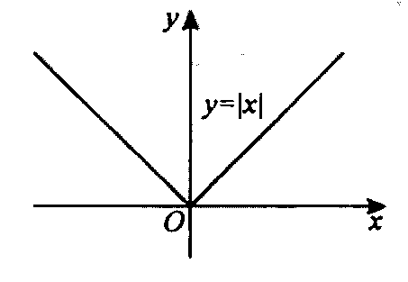

2. $y={\rm sgn}\ x=\left\{\begin{matrix}&1,&x\gt0\\&0,&x=0\\&-1,&x\lt0\\ \end{matrix}\right.$ 称为**符号函数**，对于任何实数 $x$ ，有 $x=|x|{\rm sgn}\ x$ 。
   
   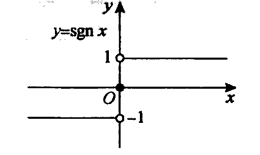

3. $y=[x]$ 称为**取整函数**。设 $x$ 为任一实数，不超过 $x$ 的最大整数称为 $x$ 的整数部分，记作 $[x]$ 。
   
   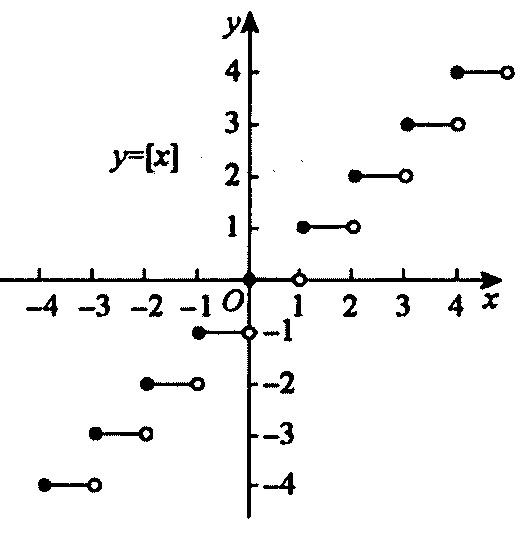
   
   - $x-1\lt[x]\le x$ 
   - $\underset{x\rightarrow0^+}{\lim}[x]=0$ ， $\underset{x\rightarrow0^-}{\lim}[x]=-1$ 

### 图像变换

#### 平移变换

**左加右减**，左右平移。将函数 $y=f(x)$ 的图像沿 $x$ 轴向左平移 $x_0(x_0>0)$ 个单位长度,得到函数 $y=f(x+x_0)$ 的图像，向右同理。

**上加下减**，上下平移。将函数 $y=f(x)$ 的图像沿 $y$ 轴向上平移 $y_0(y_0>0)$ 个单位长度，得到函数 $y=f(x)+y_0$ 的图像，向下同理。

#### 对称变换

1. 将函数 $y=f(x)$ 的图像关于 $x$ 轴对称，得到函数 $y=-f(x)$ 的图像
   
   

2. 将函数 $y=f(x)$ 的图像关于 $y$ 轴对称，得到函数 $y=f(-x)$ 的图像
   
   

3. 将函数 $y=f(x)$ 的图像关于原点对称，得到函数 $y=-f(-x)$ 的图像
   
   

4. 将函数 $y=f(x)$ 的图像关于直线 $y=x$ 对称，得到函数 $y=f^-1(x)$ 的图像
   
   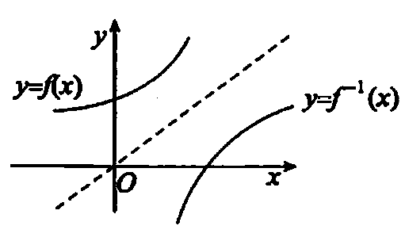

5. 保留函数 $y=f(x)$ 在 $x$ 轴及上方的部分，把 $x$ 轴下方对称到 $x$ 轴上方，去掉原来下方的部分，得到函数 $y=|f(x)|$ 的图像。
   
   

6. 保留函数 $y=f(x)$ 在 $y$ 轴及右侧的部分，去掉 $y$ 轴左侧的部分，把 $y$ 轴右侧对称到 $y$ 轴左侧，得到函数 $y=f(|x|)$ 的图像。
   
   

#### 伸缩变换

1. 水平伸缩： $y=f(kx)(k\gt1)$ 的图像， $y=f(x)$ 图像每点的横坐标缩短到原来的 $\frac{1}{k}$ 倍，纵坐标不变； $y=f(kx)(0\lt k\lt 1)$ 的图像, $y=f(z)$ 图像每点的横坐标伸长到原来的 $\frac{1}{k}$ 倍，纵坐标不变。
   
   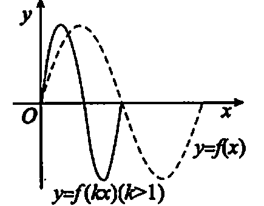

2. 垂直伸缩： $y=kf(x)(k\gt1)$ 的图像， $y=f(x)$ 图像每点的纵坐标伸长到原来的 $k$ 倍，横坐标不变； $y=kf(x)(0\lt k\lt1)$ 的图像，可由 $y=f(x)$ 图像每点的纵坐标缩短到原来的 $k$ 倍，横坐标不变。
   
   

## 极坐标系下的图像( $g(r,\theta)=0$ )

### 用描点法画常见图像

#### 心形线(外摆线)

$$
r=a(1-\cos \theta)(a\gt0)
$$

表达式是以 $2\pi$ 为周期的周期函数，因为当 $\theta$ 换成 $2\pi-\theta$ 时，其值不变，所以其关于极轴对称，只需考虑 $0\le\theta\le\pi$ 。

| $\theta$        | $0$ | $\frac{\pi}{6}$         | $\frac{\pi}{4}$         | $\frac{\pi}{3}$ | $\frac{\pi}{2}$ | $\frac{2\pi}{3}$ | $\frac{3\pi}{4}$        | $\frac{5\pi}{6}$        | $\pi$ |
|:---------------:|:---:|:-----------------------:|:-----------------------:|:---------------:|:---------------:|:----------------:|:-----------------------:|:-----------------------:| ----- |
| $1-\cos \theta$ | $0$ | $\frac{2-\sqrt{3}}{2}$  | $\frac{2-\sqrt{2}}{2}$  | $\frac{1}{2}$   | $1$             | $\frac{3}{2}$    | $\frac{2+\sqrt{2}}{2}$  | $\frac{2+\sqrt{3}}{2}$  | $2$   |
| $r$             | $0$ | $\frac{2-\sqrt{3}}{2}a$ | $\frac{2-\sqrt{2}}{2}a$ | $\frac{1}{2}a$  | $a$             | $\frac{3}{2}a$   | $\frac{2+\sqrt{2}}{2}a$ | $\frac{2+\sqrt{3}}{2}a$ | $2a$  |

当 $\theta$ 由 $0$ 增大到 $\pi$ ， $\cos\theta$ 的值由 $1$ 逐渐减小到 $-1$ ， $r$ 由 $0$ 逐渐增大到 $2a$ ，画出图像。

#### 玫瑰线

三叶玫瑰线

$$
r=a\sin 3\theta(a\lt0)
$$

表达式周期为 $\frac{2\pi}{3}$ ，然后仿照在这一范围内曲线上的点的变化规律，画出剩下的图像。

| $\theta$ | $0$ | $\frac{\pi}{12}$      | $\frac{\pi}{6}$ | $\frac{\pi}{4}$       | $\frac{\pi}{3}$ | $\frac{5\pi}{12}$      | $\frac{\pi}{2}$ | $\frac{7\pi}{12}$      | $\frac{2\pi}{3}$ |
|:--------:|:---:|:---------------------:|:---------------:|:---------------------:|:---------------:|:----------------------:|:---------------:|:----------------------:|:----------------:|
| $r$      | $0$ | $\frac{\sqrt{2}}{2}a$ | $a$             | $\frac{\sqrt{2}}{2}a$ | $0$             | $-\frac{\sqrt{2}}{2}a$ | $-a$            | $-\frac{\sqrt{2}}{2}a$ | $0$              |

#### 阿基米德螺线

$$
r=a\theta
$$

当 $\theta(\theta\ge0)$ 由 $0$ 增大时， $r$ 亦逐渐增大

#### 伯努利双纽线

在线段 $AB$ 长度为 $2a$ ，动点 $M$ 满足 $MA\cdot MB=a^2$ ，那么 $M$ 的轨迹就称为双纽线。

假设 $A,B$ 的坐标分别为 $(-a,0),(a,0)$ 则有 $\sqrt{(x+a)^2+y^2}\cdot\sqrt{(x-a)^2+y^2}=a^2$ 整理得 $(x^2+y^2)^2=2a^2(x^2-y^2)$ ，求得极坐标。

$$
r^2=a^2\cos 2\theta(a\gt 0)\\
r^2=a^2\sin 2\theta(a\gt 0)
$$

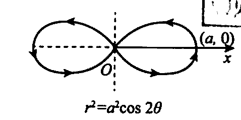

由 $r^2=a^2\sin2\theta(a\gt 0)$ 可知 $r=a\sqrt{\sin2\theta}(a\gt 0)\\$ ， $\theta$ 的取值范围是 $\big[0,\frac{\pi}{2}\big]\bigcup\big[\pi,\frac{3\pi}{2}\big]$ 。当 $\theta$ 从 $0$ 增加到 $\frac{\pi}{4}$ 时， $r$ 从 $0$ 增加到 $a$ ，后面也同样画出。

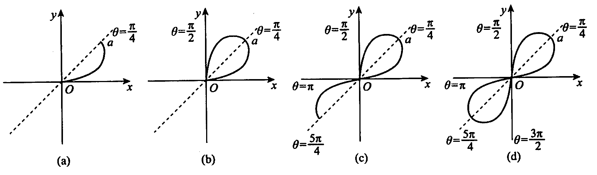

### 用直角系观点画极坐标下的图像

直角坐标方程 $y=x$ 表示平面上的一条直线，而极坐标方程 $r=\theta$ 表示螺线。以方程的角度看问题，两个方程的形式相同，只是表示变量的字母不同而已，但是由于坐标系不同，它们表示的曲线完全不同。若较易画出直角坐标系观点下 $r=f(\theta)$ 的图像，可转化为极坐标系下的曲线图像。

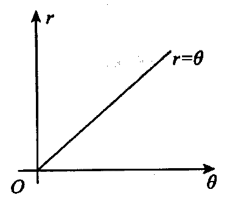    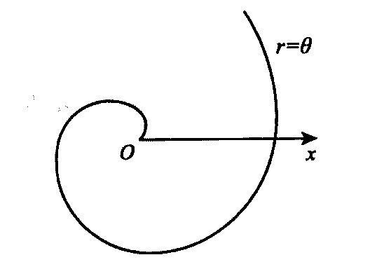

比如 $r=2(1+\cos \theta)$ ，较易**画出其在直角坐标系**下 $r=f(\theta)$ 的图像，可转化为极坐标系下的图像。

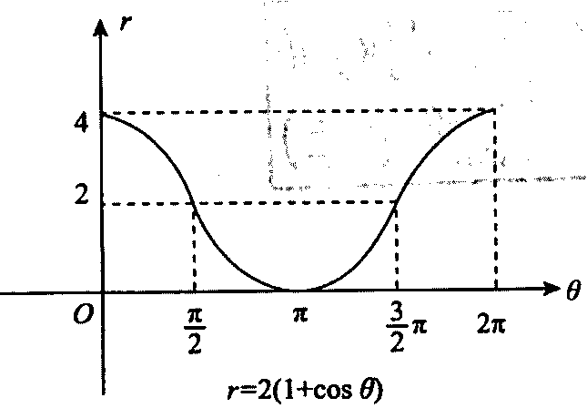    

## 参数法——参数方程( $\left\{\begin{matrix}x=x(t)\\y=y(t)\end{matrix}\right.$ )

在实际问题中，有些曲线用直角坐标系或极坐标系表示比较困难，所以将引人一个新变量(叫作参数)来表示曲线方程，即**参数方程**。

### 摆线(平摆线)

当一个圆沿一条定直线作纯滚动时，动圆圆周上一个定点的轨迹叫作摆线。

取给的定直线为 $x$ 轴，正方向是圆滚动的方向，圆与直线在圆上的定点 $A$ 相切时，就取该点为原点 $O$ 。取半径 $|CO|$ 旋转的角度 $t$ 为参数。

通过图片可得 $x=|OP|=|OQ|-|PQ|$ 其中 $|OQ|=圆的弧长=rt$ ， $|PQ|=|AC'|\sin t=r\sin t$ 

综上可求得

$$
x=rt-r\sin t
$$

同时也易得

$$
y=|PA|=|QC'|-|DC'|=r-r\cos t
$$

所以求得参数方程

$$
\left\{\begin{matrix}x=r(t-\sin t)\\y=r(1-\cos t)\end{matrix}\right.
$$

### 星形线(内摆线)

一个小圆在一个固定的大圆内部作纯滚动，当大圆半径是小圆半径的4倍，那么小圆圆周上任一点M的轨迹称为星形线。

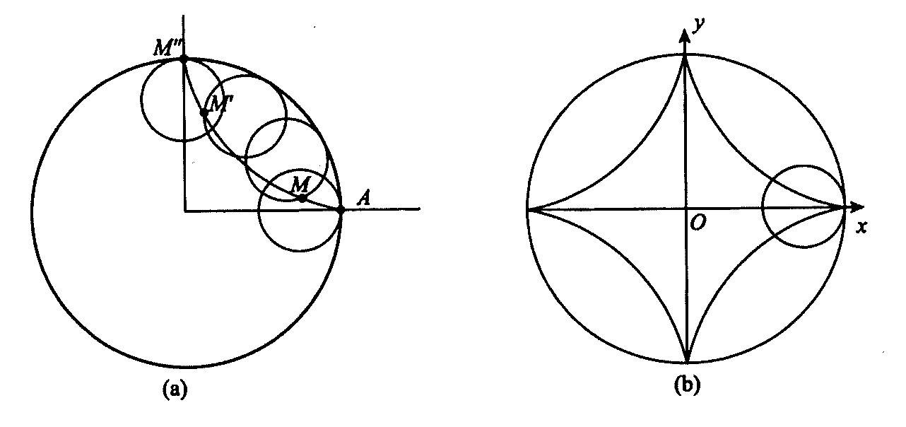

此轨迹方程的推导过程要用到繁杂的几何知识与三角公式，不作要求，读者记住它的参数方程表达式即可，其表达式为

$$
\left\{\begin{matrix}x=r\cos^3t\\y=r\sin^3t\end{matrix}\right.
$$

消去 $t$ ，得 $x^\frac{2}{3}+y^\frac{2}{3}=r^\frac{2}{3}$ ，得到直角坐标方程。

# 常用基础知识

## 数列

1. 等差数列
   
    首项为 $a_1$ ，公差为 $d(d\not=0)$ 的数列 $a_1,a_1+d,a_1+2d,\cdots,a_1+(n-1)d,\cdots$ 
   
   - 通项公式 ： $a_n=a_1+(n-1)d$ 
   - 前 $n$ 项和： $S_n=a_1n+\frac{(n-1)n}{2}d=\frac{n}{2}[2a_1+(n-1)d]=\frac{n}{2}(a_1+a_n)$ 

2. 等比数列
   
    首项为 $a_1$ ，公比为 $r(r\not=0)$ 的数列 $a_1,a_1r,a_1r^2,\cdots,a_1r^{n-1},\cdots$ 
   
   - 通项公式 ： $a_n=a_1r^{n-1}$ 
   - 前 $n$ 项和： $S_n=\left\{\begin{matrix}na_1&,r=1\\\frac{a_1(1-r^n)}{1-r}&,r\not=1\end{matrix}\right.$ ，证明$\left\{\begin{matrix}S_n=a_1+a_1r+a_1r^{n-1}\\rS_n=a_1r+a_1r^2+a_1r^n\end{matrix}\right.$ 然后下式减上式求得。
   -  $1+r+r^2+\cdots+r^{n-1}=\frac{1-r^n}{1-r}$ ，当 $|r|\lt1$ ，可以得到 $\underset{n\rightarrow\infty}{\lim}\frac{1-r^n}{1-r}=\frac{1}{1-r}$ 
   
3. 一些常见数列前n项的和
   
   $$
   \begin{aligned}
   &(1)\sum_{k=1}^{n}k=1+2+3+\cdots+n=\frac{n(n+1)}{2}\\
   &(2)\sum_{k=1}^{n}k^2=1^2+2^2+3^2+\cdots+n^2=\frac{n(n+1)(2n+1)}{6}\\
   &(3)\sum_{k=1}^{n}\frac{1}{k(k+1)}=\frac{1}{1\times2}+\frac{1}{2\times3}+
   \frac{1}{3\times4}+\cdots+\frac{1}{n\times(n+1)}=\frac{n}{n+1}
   \end{aligned}
   $$
   
   第二个式子证明：
   
   

## 三角函数

1. 三角函数基本关系
   
   $$
   \csc\alpha=\frac{1}{\sin \alpha}\quad,\sec \alpha=\frac{1}{\cos\alpha},\quad
   \cot\alpha=\frac{1}{\tan\alpha},\quad\tan\alpha=\frac{\sin\alpha}{\cos\alpha},
   \quad\cot\alpha=\frac{\cos\alpha}{\sin\alpha}\\
   \sin^2\alpha+\cos^2\alpha=1,\quad1+\tan^2\alpha=\sec^2\alpha,
   \quad1+\cot^2\alpha=\csc\alpha
   $$

2. 诱导公式
   
   | 角$\theta\rightarrow$               | $\frac{\pi}{2}-\alpha$ | $\frac{\pi}{2}+\alpha$ | $\pi-\alpha$       | $\pi+\alpha$       | $\frac{3}{2}\pi-\alpha$ | $\frac{3}{2}\pi+\alpha$ | $2\pi-\alpha$      |
   |:----------------------------------:|:----------------------:|:----------------------:|:------------------:|:------------------:|:-----------------------:|:-----------------------:|:------------------:|
   | 函数$\downarrow$角$\theta\rightarrow$ | $90^\circ-\alpha$      | $90^\circ+\alpha$      | $180^\circ-\alpha$ | $180^\circ+\alpha$ | $270^\circ-\alpha$      | $270^\circ+\alpha$      | $360^\circ-\alpha$ |
   | $\sin\theta$                       | $\cos\alpha$           | $\cos\alpha$           | $\sin\alpha$       | $-\sin\alpha$      | $-\cos\alpha$           | $-\cos\alpha$           | $-\sin\alpha$      |
   | $\cos\theta$                       | $\sin\alpha$           | $-\sin\alpha$          | $-\cos\alpha$      | $-\cos\alpha$      | $-\sin\alpha$           | $\sin\alpha$            | $\cos\alpha$       |
   | $\tan\theta$                       | $\cot\alpha$           | $-\cot\alpha$          | $-\tan\alpha$      | $\tan\alpha$       | $\cot\alpha$            | $-\cot\alpha$           | $-\tan\alpha$      |
   | $\cot\theta$                       | $\tan\alpha$           | $-\tan\alpha$          | $-\cot\alpha$      | $\cot\alpha$       | $\tan\alpha$            | $-\tan\alpha$           | $-\cot\alpha$      |
   
   | 角所在象限        | 第一象限 | 第二象限 | 第三象限 | 第四象限 |
   |:------------:|:----:|:----:|:----:|:----:|
   | $\sin\theta$ | $+$  | $+$  | $-$  | $-$  |
   | $\cos\theta$ | $+$  | $-$  | $-$  | $+$  |
   | $\tan\theta$ | $+$  | $-$  | $+$  | $-$  |
   | $\cot\theta$ | $+$  | $-$  | $+$  | $-$  |

3. 特殊的三角函数值如下表所示
   
   

4. 重要公式
   
   - 倍角公式
     
     $$
     \sin2\alpha=2\sin\alpha\cos\alpha,\quad\cos2\alpha=\cos^2\alpha-\sin^2\alpha
     =1-2\sin^2\alpha=2\cos^2\alpha-1\\
     \sin3\alpha=-4\sin^2\alpha+3\sin\alpha,\quad\cos3\alpha
     =4\cos^3\alpha-3\cos\alpha\\
     \tan2\alpha=\frac{2\tan\alpha}{1-\tan^2\alpha},\quad
     \cot2\alpha=\frac{\cot^2\alpha-1}{2\cot\alpha}
     $$
   
   - 半角公式
     
     $$
     \sin^2\frac{\alpha}{2}=\frac{1}{2}(1-\cos\alpha),\quad
     \cos^2\frac{\alpha}{2}=\frac{1}{2}(1+\cos\alpha)\\
     \sin\frac{\alpha}{2}=\pm\sqrt{\frac{1-\cos\alpha}{2}},\quad
     \cos\frac{\alpha}{2}=\pm\sqrt{\frac{1+\cos\alpha}{2}}\\
     \tan\frac{\alpha}{2}=\frac{1-\cos\alpha}{\sin\alpha}
     =\frac{\sin\alpha}{1+\cos\alpha}=\pm\sqrt{\frac{1-\cos\alpha}{1+\cos\alpha}}\\
     \cot\frac{\alpha}{2}=\frac{\sin\alpha}{1-\cos\alpha}=
     \frac{1+\cos\alpha}{\sin\alpha}=\pm\sqrt{\frac{1+\cos\alpha}{1-\cos\alpha}}
     $$
   
   - 和差公式
     
     $$
     \sin(\alpha\pm\beta)=\sin\alpha\cos\beta\pm\cos\alpha\sin\beta,\quad
     \cos(\alpha\pm\beta)=\cos\alpha\cos\beta\mp\sin\alpha\sin\beta\\
     \tan(\alpha\pm\beta)=\frac{\tan\alpha\pm\tan\beta}{1\mp\tan\alpha\tan\beta},
     \quad\cot(\alpha\pm\beta)
     =\frac{1\mp\cot\alpha\cot\beta}{\cot\alpha\pm\cot\beta}
     $$
- *积化和差与和差化积公式
  
  - 积化和差公式
    
    $$
    \sin\alpha\cos\beta=\frac{1}{2}[\sin(\alpha+\beta)+\sin(\alpha-\beta)],\quad
    \cos\alpha\sin\beta=\frac{1}{2}[\sin(\alpha+\beta)-\sin(\alpha-\beta)]\\
    \cos\alpha\cos\beta=\frac{1}{2}[\cos(\alpha+\beta)+\cos(\alpha-\beta)],\quad
    \sin\alpha\sin\beta=\frac{1}{2}[\cos(\alpha-\beta)-\cos(\alpha+\beta)]
    $$
  
  - 和差化积公式
    $$
    \sin\alpha+\sin\beta=2\sin\frac{\alpha+\beta}{2}\cos\frac{\alpha-\beta}{2},\quad
    \sin\alpha-\sin\beta=2\sin\frac{\alpha-\beta}{2}\cos\frac{\alpha+\beta}{2}\\
    \cos\alpha+\cos\beta=2\cos\frac{\alpha+\beta}{2}\cos\frac{\alpha-\beta}{2},\quad
    \cos\alpha-\cos\beta=-2\sin\frac{\alpha+\beta}{2}\sin\frac{\alpha-\beta}{2},\quad
    $$
  
- 万能公式
  
  若 $u=\tan\frac{x}{2}(-\pi\lt x\lt\pi)$ ，则 $\sin x=\frac{2u}{1+u^2},\cos x=\frac{1-u^2}{1+u^2}$ 

## 指数运算法则

$$
a^\alpha a^\beta=a^{\alpha+\beta},\quad\frac{a^\alpha}{a^\beta}=a^{\alpha-\beta},\quad
(a^\alpha)^\beta=a^{\alpha\beta},\quad(ab)^\alpha=a^\alpha b^\alpha,\quad
(\frac{a}{b})^\alpha=\frac{a^\alpha}{b^\alpha}
$$

其中 $a,b$ 是正实数， $\alpha,\beta$ 是任意实数

## 对数运算法则

1. $\log_a(MN)=\log_aM+\log_aN$ (积的对数=对数的和)
2. $\log_a(\frac{M}{N})=\log_aM-\log_aN$ (商的对数一对数的差)
3. $\log_aM^n=n\log_aM$ (幂的对数一对数的倍数)
4. $\log_a\sqrt[n]{M}=\frac{1}{n}\log_aM$ 

常考：

- $\ln\sqrt{x}=\frac{1}{2}\ln x$ 
- $\ln\frac{1}{x}=-\ln x$ 
- $\ln(1+\frac{1}{x})=\ln\frac{x+1}{x}=\ln(x+1)-\ln x$ 

## 一元二次方程

1. 一元二次方程 $ax^2+bx+c=0(a\not=0)$ 

2. 根的公式 $x_{1,2}=\frac{-b\pm\sqrt{b^2-4ac}}{2a}$ ，当 $\Delta\lt0$ 时，根为 $\frac{-b}{2a}\pm\frac{\sqrt{4ac-b^2}}{2a}i=\alpha+\beta i$ 

3. 根与系数的关系(韦达定理) $x_1+x_2=-\frac{b}{a},x_1x_2=\frac{c}{a}$ (可由求根公式推得)

4. 判别式 $\Delta=b^2-4ac$
   
     $\Delta\gt0$ ，方程有两个不等的实根； $\Delta=0$ ，方程有两个相等的实根； $\Delta\lt0$ ，方程有两个共轭的复根。

5. 抛物线 $y=ax^2+bx+c$ 的顶点 $(-\frac{b}{2a},c-\frac{b^2}{4a})$ ( $x$ 可由韦达定律的 $\frac{x_1+x_2}{2}$ 求得，然后代入抛物线求得y)

## 因式分解公式

$$
\begin{aligned}
&1.(a+b)^2=a^2+2ab+b^2\\&2.(a-b)^2=a^2-2ab+b^2\\
&3.(a+b)^3=a^3+3a^2b+3ab^2+b^3\\&4.(a-b)^3=a^3-3a^2b+3ab^2-b^3\\
&5.a^2-b^2=(a+b)(a-b)\\&6.a^3-b^3=(a-b)(a^2+ab+b^2)\\
&7.a^3+b^3=(a+b)(a^2-ab+b^2)\\
&8.a^n-b^n=(a-b)(a^{n-1}+a^{n-2}b+\cdots+ab^{n-2}+b^{n-1})(n是正整数)\\
&9.n是偶数:a^n-b^n=(a+b)(a^{n-1}-a^{n-2}b+\cdots+ab^{n-2}-b^{n-1})\\
&10.n是奇数:a^n+b^n=(a+b)(a^{n-1}-a^{n-2}b+\cdots-ab^{n-2}+b^{n-1})\\
&11.二项式定理:(a+b)^n=\sum_{k=0}^{n}C_n^ka^{n-k}b^k\\
&=a^n+na^{n-1}b+\frac{n(n-1)}{2!}a^{n-2}b^2+\cdots+\frac{n(n-1)\cdots(n-k+1)}{k!}
a^{n-k}b^k+\cdots+nab^{n-1}+b^n
\end{aligned}
$$

## 阶乘与双阶乘

双阶乘表示不超过这个正整数且与它有**相同奇偶性**的所有正整数乘积。即有 $n!=n!!\cdot(n-1)!!$ 
$$
n!=1\pmb{\cdot}2\pmb{\cdot}3\pmb{\cdot}\ \cdots\ \pmb{\cdot}n,规定0!=1\\
(2n)!!=2\pmb{\cdot}4\pmb{\cdot}6\pmb{\cdot}\ \cdots\ \pmb{\cdot}(2n)=2^n\pmb{\cdot}n!\\
(2n-1)!!=1\pmb{\cdot}3\pmb{\cdot}5\pmb{\cdot}\ \cdots\ \pmb{\cdot}(2n-1)
$$

## 常用不等式

(1)设 $a,b$ 为实数,则
$$
|a\pm b|\le|a|+|b|\\
||a|-|b||\le|a-b|
$$
离散情况：设 $a_1,b_2,\cdots,a_n$ 为实数，则
$$
|a_1\pm a_2\pm\cdots\pm a_n|\le|a_1|+|a_2|+\cdots+|a_n|
$$
连续情况：设 $f(x)$ 在 $[a,b](a<b)$ 上可积,则
$$
\bigg|\int_a^bf(x){\rm d}x\bigg|\le\int_a^b|f(x)|{\rm d}x
$$
(2)
$$
\sqrt{ab}(算术平均)\le\frac{a+b}{2}(几何平均)\le\sqrt{\frac{a^2+b^2}{2}}(a,b\gt0)
$$
还有 $|ab|\le\frac{a^2+b^2}{2}$ ，在考研中考过：若 $u_n\gt0$ ，则 $\frac{u_n}{n}=u_n\cdot\frac{1}{n}\le\frac{u_n^2+\frac{1}{n^2}}{2}$ 
$$
\sqrt[3]{abc}\le\frac{a+b+c}{3}\le\sqrt{\frac{a^2+b^2+c^2}{3}}(a,b,c\gt0)
$$
(3)设 $a\gt b\gt0$ ，则 $\left\{\begin{matrix}当n\gt0,a^n\gt b^n\\当n\lt0,a^n\lt b^n\end{matrix}\right.$ 

(4)若 $0\lt a\lt x\lt b,0\lt c\lt y\lt d$ ，则 $\frac{c}{b}\lt\frac{y}{x}\lt\frac{d}{a}$ 

考研中考过：当 $n\pi\lt x\lt(n+1)\pi,2n\lt S(x)\lt2(n+1)$ 时， $\frac{2n}{(n+2)\pi}\lt\frac{S(x)}{x}\lt\frac{2(n+1)}{n\pi}$ 

(5) $\sin x\lt x \lt\tan x(0\lt x\lt\frac{\pi}{2})$ 

(6) $\sin x\lt x(x\gt 0)$ 

考研中考过：当 $x_n\gt0$ 时， $x_{n+1}=\sin x_n\lt x_n$ ，故 ${x_n}$ 单调减少.

(7) $\arctan x\le x\le\arcsin x(0\le x\le1)$ 

(8) $e^x\ge x+1(\forall x)$ 

可考：当 $x_{n+1}=e^{x_n}-1$ 时，由 $e^{x_n}-1\ge x_n$ ，得 $x_{n+1}\ge x_n$ ，即 ${x_n}$ 单调不减。

(9) $x-1\ge\ln x(x\gt 0)$ 

可考：当 $x_n\gt 0$ 时，若 $x_{n+1}=\ln x_n+1$ ，由 $\ln x_n+1\le x_n$ ，得 $ x_{n+1}\le x_n$ ，即 ${x_n}$ 单调不增。

(10) $\frac{1}{1+x}\lt\ln(1+\frac{1}{x})\lt\frac{1}{x}$ 

证明：令 $f(x)=\ln x$ 并在区间 $[x,x+1]$ 上对其应用拉格朗日中值定理，有
$$
拉格朗日：f'(\xi)=\frac{f(a)-f(b)}{a-b}(\xi\in(x,x+1))\\
\ln(1+\frac{1}{x})=\ln(1+x)-\ln x=\frac{1}{\xi}
$$
所以 $0\lt x\lt\xi\lt x+1$ 。因此，对任意的 $x\gt 0$ 有 $\frac{1}{1+x}\lt\ln(1+\frac{1}{x})=\frac{1}{\xi}\lt\frac{1}{x}$ 。

### 例题

# 其他笔记

## 充分必要条件

假设A是条件，B是结论，设C、D分别为A、B所描述对象的集合，则有下列定义和推论：

1. 由A可以推出B，B可以推出A，则A是B的充分必要条件（此时 $C=D$ ）

2. 由A可以推出B，B不可以推出A，则A是B的充分不必要条件，也叫充分条件（此时 $C\subsetneqq D$ ，C属于D但是C不等于D）

3. 由A不可以推出B，B可以推出A，则A是B的必要不充分条件，也叫必要条件（此时 $D\subsetneqq C$ ）

4. 由A不可以推出B，B不可以推出A，则A是B的既不充分也不必要条件（此时 $C\nsubseteq D,D\nsubseteq C$ ）

在第二个定义的条件中，将条件翻转以下，B不可以推出A，A可以推出B，根据第三条定义可得，B是A的必要条件，所以可以推出**A是B的充分条件，那么B一定是A的必要条件**，同理可推出**A是B的必要条件，那么B一定是A的充分条件**

对于所描述对象的集合的解释：A是B的充分条件，B是A的必要条件，即B能够表述A，也能够描述更大的范围，所以B能描述的对象集合的范围更广；同理A是B的必要条件，B是A的充分条件，A能描述的对象集合的范围更广

## 部分积分表以及推导

推导过程只是用最基本积分公式 参考[同济七版积分表公式推理](https://www.zhihu.com/column/c_1260694134991990784)，下面只有部分

### 含有 $ax+b$ 的积分

1. $$
    \begin{aligned}
    \int\frac{{\rm d}x}{ax+b}&=\frac{1}{a}\int\frac{{\rm d}(ax+b)}{ax+b}(凑微分)\\
    &=\frac{1}{a}\ln|ax+b|+C
    \end{aligned}
    $$
    
2. $$
    \begin{aligned}
    \int(ax+b)^\mu{\rm d}x&=\frac{1}{a}\int(ax+b)^\mu{\rm d}(ax+b)(凑微分)\\
    &=\frac{1}{a(\mu+1)}(ax+b)^{\mu+1}+C(\mu\neq-1)
    \end{aligned}
    $$
    
3. $$
    \begin{aligned}
    \int\frac{x}{ax+b}{\rm d}x&=\frac{1}{a}\int\frac{ax+b-b}{ax+b}{\rm d}x=\frac{1}{a^2}\int\frac{ax+b-b}{ax+b}{\rm d}(ax+b)(凑微分)\\
    &=\frac{1}{a^2}\int(1-\frac{b}{ax+b}){\rm d}(ax+b)=\frac{1}{a^2}(ax+b-b\ln|ax+b|)+C_1\\
    &=\frac{1}{a^2}(ax-b\ln|ax+b|)+C(将常数归并到C里面C=C_1+\frac{b}{a^2})
    \end{aligned}
    $$
    
4. $$
    \begin{aligned}
    \int\frac{x^2}{ax+b}{\rm d}x&=\frac{1}{a^2}\int\frac{a^2x^2}{ax+b}{\rm d}x=\frac{1}{a^2}\int\frac{(ax+b)^2-2abx-b^2}{ax+b}{\rm d}x(凑分母)\\
    &=\frac{1}{a^2}[\int(ax+b){\rm d}x-2ab\int\frac{x}{ax+b}{\rm d}x-b^2\int\frac{{\rm d}x}{ax+b}](这几个式子都是前面的积分)\\
    &=\frac{1}{a^2}[\frac{1}{2a}(ax+b)^2-2bx+\frac{2b^2}{a}\ln|ax+b|-\frac{b^2}{a}\ln|ax+b|]+C\\
    &=\frac{1}{a^3}[\frac{1}{2}(ax+b)^2-2abx+b^2\ln|ax+b|]+C
    \end{aligned}
    $$
	
5. $$
    \int\frac{{\rm d}x}{x(ax+b)}\\
    记\frac{1}{x(ax+b)}=\frac{A}{x}+\frac{B}{ax+b}(按照留数法求系数原则)\\
    A=(\frac{1}{ax+b})|_{x=0}=\frac{1}{b};B=(\frac{1}{x})|_{x=-\frac{b}{a}}=-\frac{a}{b}\\
    \begin{aligned}
    原式&=\frac{a}{b}\int(\frac{1}{ax}-\frac{1}{ax+b}){\rm d}x=\frac{1}{b}\int\frac{1}{x}{\rm d}x-\frac{1}{b}\int \frac{1}{ax+b}{\rm d}(ax+b)\\
    &=\frac{1}{b}\ln|x|-\frac{1}{b}\ln|ax+b|+C\\
    &=\frac{1}{b}\ln|\frac{x}{ax+b}|+C
    \end{aligned}
    $$
	
	[留数法](https://www.bilibili.com/video/BV1TV411B7DW)
	
6. $$
    \int\frac{{\rm d}x}{x^2(ax+b)}\\
    记\frac{1}{x^2(ax+b)}=\frac{A}{x}+\frac{B}{x^2}+\frac{C}{ax+b}(按照留数法求系数原则)\\
    A=\frac{{\rm d}}{{\rm d}x}[\frac{1}{ax+b}]|_{x=0}=[\frac{-a}{(ax+b)^2}]|_{x=0}=-\frac{a}{b^2}\\
    B=(\frac{1}{ax+b})|_{x=0}=\frac{1}{b};C=(\frac{1}{x^2})|_{x=-\frac{b}{a}}=\frac{a^2}{b^2}\\
    \begin{aligned}
    原式&=\frac{1}{b}\int[-\frac{a}{bx}+\frac{1}{x^2}+\frac{a^2}{b(ax+b)}]{\rm d}x\\
    &=-\frac{a}{b^2}\int\frac{1}{x}{\rm d}x+\frac{1}{b}\int\frac{1}{x^2}{\rm d}x+\frac{a^2}{b^2}\int\frac{1}{ax+b}{\rm d}x\\
    &=-\frac{a}{b^2}\ln|x|-\frac{1}{bx}+\frac{a}{b^2}\ln|ax+b|+C\\
    &=-\frac{1}{bx}+\frac{a}{b^2}\ln|\frac{ax+b}{x}|+C
    \end{aligned}
    $$
	
7. $$
    \begin{aligned}
    \int\frac{x}{(ax+b)^2}{\rm d}x&=\frac{1}{a}\int\frac{x}{(ax+b)^2}{\rm d}(ax+b)\\
    &=-\frac{1}{a}\int x{\rm d}(\frac{1}{ax+b})\\
    &=-\frac{1}{a}[\frac{x}{ax+b}-\int \frac{1}{ax+b}{\rm d}x](分部积分法)\\
    &=-\frac{1}{a}[\frac{x}{ax+b}-\frac{1}{a}\ln|ax+b|]+C\\
    &=\frac{1}{a^2}\ln|ax+b|-\frac{x}{a(ax+b)}+C(消去x,上面等于\frac{1}{a^2}(a^2x+ab)-\frac{b}{a})\\
    &=\frac{1}{a^2}(\ln|ax+b|+\frac{b}{ax+b})+C
    \end{aligned}
    $$
	
8. $$
    \begin{aligned}
    \int\frac{x^2}{(ax+b)^2}{\rm d}x&=\int\frac{\frac{1}{a^2}(ax+b)^2-\frac{2bx}{a}-\frac{b^2}{a^2}}{(ax+b)^2}{\rm d}x\\
    &=\frac{x}{a^2}-\frac{2b}{a^3}(\ln|ax+b|+\frac{b}{ax+b})+\frac{b^2}{a^3}\frac{1}{ax+b}\\
    &=\frac{1}{a^3}(ax-2b\ln|ax+b|-\frac{b^2}{ax+b})+C
    \end{aligned}
    $$
	
9. $$
    \int\frac{{\rm d}x}{x(ax+b)^2}\\
    记\frac{1}{x(ax+b)^2}=\frac{A}{x}+\frac{B}{ax+b}+\frac{C}{(ax+b)^2}(留数法)\\
    A=\frac{1}{b^2};B=\frac{-a}{b^2};C=\frac{-a}{b}\\
    \begin{aligned}
    原式&=\frac{1}{b^2}\int\frac{{\rm d}x}{x}-\frac{a}{b^2}\int \frac{{\rm d}x}{ax+b}-\frac{a}{b}\int\frac{{\rm d}x}{(ax+b)^2}\\
    &=\frac{\ln|x|}{b^2}-\frac{1}{b^2}\ln|ax+b|+\frac{1}{b(ax+b)}+C\\
    &=\frac{1}{b^2}\ln|\frac{x}{ax+b}|+\frac{1}{b(ax+b)}+C
    \end{aligned}
    $$
	
	如果分子大于等于分母的最高次幂，使用**凑微分**方法；反之使用**分部积分法或留数法**拆分

### 含有 $\sqrt{ax+b}$ 的积分

1. $$
   \begin{aligned}
    \int\sqrt{ax+b}{\rm d}x&=\frac{1}{a}\int\sqrt{ax+b}{\rm d}(ax+b)\\
    &=\frac{2}{3a}\sqrt{(ax+b)^3}+C
    \end{aligned}
   $$
   
2. $$
    \begin{aligned}
    \int x\sqrt{ax+b}{\rm d}x&=\frac{1}{a}\int x\sqrt{ax+b}{\rm d}(ax+b)\\
    &=\frac{2}{3a}\int x{\rm d}(ax+b)^\frac{3}{2}\\
    &=\frac{2}{3a}[x(ax+b)^\frac{3}{2}-\int(ax+b)^\frac{3}{2}{\rm d}x]\\
    &=\frac{2}{3a}[x(ax+b)^\frac{3}{2}-\frac{2}{5a}(ax+b)^\frac{5}{2}]+C\\
    &=\frac{2}{15a^2}(3ax-2b)\sqrt{(ax+b)^3}+C
    \end{aligned}
    $$
    
3. $$
    \begin{aligned}
    \int x^2\sqrt{ax+b}{\rm d}x&=\frac{2}{3a}\int x^2d(ax+b)^\frac{3}{2}\\
    &=\frac{2}{3a}x^2(ax+b)^\frac{3}{2}-\frac{8}{15a^2}\int x{\rm d}(ax+b)^\frac{5}{2}\\
    &=\frac{2}{3a}x^2(ax+b)^\frac{3}{2}-\frac{8}{15a^2}[x(ax+b^\frac{5}{2})-\int(ax+b)^\frac{5}{2}{\rm d}x]\\
    &=\frac{2}{3a}x^2(ax+b)^\frac{3}{2}-\frac{8}{15a^2}x(ax+b^\frac{5}{2})+\frac{16}{105a^3}(ax+b)^\frac{7}{2}+C\\
    &=\frac{2}{105a^3}(15a^2x^2-12abx+8b^2)\sqrt{(ax+b)^3}+C
    \end{aligned}
    $$
    
4. $$
    \begin{aligned}
    \int\frac{x}{\sqrt{ax+b}}{\rm d}x&=\frac{1}{a}\int\frac{ax+b-b}{\sqrt{ax+b}}\\
    &=\frac{1}{a}\int\sqrt{ax+b}{\rm d}x-\frac{b}{a^2}\int\frac{{\rm d}(ax+b)}{\sqrt{ax+b}}\\
    &=\frac{2}{3a^2}(ax+b)^\frac{2}{3}-\frac{2b}{a^2}\sqrt{ax+b}+C\\
    &=\frac{2}{3a^2}(ax-2b)\sqrt{ax+b}+C
    \end{aligned}
    $$
    
5. $$
    \begin{aligned}
    \int\frac{x^2}{\sqrt{ax+b}}{\rm d}x&=\frac{1}{a^2}\int\frac{(ax+b)^2-2abx-b^2}{\sqrt{ax+b}}{\rm d}x\\
    &=\frac{1}{a^2}\int(ax+b)^\frac{3}{2}{\rm d}x-\frac{2b}{a}\int\frac{x}{\sqrt{ax+b}}{\rm d}x-\frac{b^2}{a^2}\int\frac{{\rm d}x}{\sqrt{ax+b}}\\
    &=\frac{2}{5a^3}(ax+b)^\frac{5}{2}-\frac{4b}{3a^3}(ax+b)^\frac{1}{2}(ax-2b)-\frac{2b^2}{a^3}(ax+b)^\frac{1}{2}+C\\
    &=\frac{2}{15a^3}(2a^2x^2-4abx+8b^2)\sqrt{ax+b}+C
    \end{aligned}
    $$
    
6. $$
    \begin{aligned}
    &\int\frac{{\rm d}x}{x\sqrt{ax+b}}\\
    &令\sqrt{ax+b}=u，则{\rm d}x=\frac{2u}{a}{\rm d}u,原式=2\int\frac{{\rm d}u}{u^2-b},分两种情况讨论\\
    &1.当b\gt0时,记\frac{2}{u^2-b}=\frac{A}{u-\sqrt{b}}+\frac{B}{u+\sqrt{b}},则\\
    &A=\frac{1}{\sqrt{b}},B=-\frac{1}{\sqrt{b}}\\
    &原式=\frac{1}{\sqrt{b}}\int(\frac{1}{u-\sqrt{b}}-\frac{1}{u+\sqrt{b}}){\rm d}u=\frac{1}{\sqrt{b}}\ln\bigg|\frac{u-\sqrt{b}}{u+\sqrt{b}}\bigg|+C\\
    &=\frac{1}{\sqrt{b}}\ln\bigg|\frac{\sqrt{ax+b}-\sqrt{b}}{\sqrt{ax+b}+\sqrt{b}}\bigg|+C\\
    &2.当b\lt0时,原式=2\int\frac{{\rm d}u}{u^2+(\sqrt{-b})^2}=\frac{2}{\sqrt{-b}}\int\frac{{\rm d}(\frac{u}{\sqrt{-b}})}{(\frac{u}{\sqrt{-b}})^2+1}\\
    &=\frac{2}{\sqrt{-b}}\arctan\frac{u}{\sqrt{-b}}+C=\frac{2}{\sqrt{-b}}\arctan\sqrt{\frac{ax+b}{-b}}+C
    \end{aligned}
    $$
    
7. $$
    \int\frac{{\rm d}x}{x^2\sqrt{ax+b}}\\
    记\frac{1}{x^2\sqrt{ax+b}}=\frac{A}{x\sqrt{ax+b}}+\frac{B\sqrt{ax+b}}{x^2}\\
    则Ax+B(ax+b)=1,由待定系数法得B=\frac{1}{b},A=-\frac{a}{b}\\
    \begin{aligned}
    原式&=-\frac{a}{b}\int\frac{{\rm d}x}{x\sqrt{ax+b}}+\frac{1}{b}\int\frac{\sqrt{ax+b}}{x^2}{\rm d}x\\
    &=-\frac{a}{b}\int\frac{{\rm d}x}{x\sqrt{ax+b}}-\frac{1}{b}\int\sqrt{ax+b}{\rm d}\frac{1}{x}\\
    &=-\frac{a}{b}\int\frac{{\rm d}x}{x\sqrt{ax+b}}-\frac{\sqrt{ax+b}}{bx}+\frac{1}{b}\int\frac{1}{x}{\rm d}(\sqrt{ax+b})\\
    &=-\frac{a}{b}\int\frac{{\rm d}x}{x\sqrt{ax+b}}-\frac{\sqrt{ax+b}}{bx}+\frac{a}{2b}\int\frac{{\rm d}x}{x\sqrt{ax+b}}\\
    &=-\frac{\sqrt{ax+b}}{bx}-\frac{a}{2b}\int\frac{{\rm d}x}{x\sqrt{ax+b}}
    \end{aligned}
    $$
    
8. $$
    \int\frac{\sqrt{ax+b}}{x}{\rm d}x\\
    令\sqrt{ax+b}=u则{\rm d}x=\frac{2u}{a}du\\
    故原式=2\int\frac{u^2}{u^2-b}{\rm d}u=2\int\frac{u^2-b+b}{u^2-b}{\rm d}u\\
    =2\int(1+\frac{b}{u^2-b}){\rm d}u=2u+2b\int\frac{1}{u^2-b}{\rm d}u\\
    将\sqrt{ax+b}=u代入,原式=2\sqrt{ax+b}+b\int\frac{{\rm d}x}{x\sqrt{ax+b}}
    $$
    
9. $$
    \int\frac{\sqrt{ax+b}}{x^2}{\rm d}x=-\int\sqrt{ax+b}{\rm d}\frac{1}{x}\\
    =-\frac{\sqrt{ax+b}}{x}+\frac{a}{2}\int\frac{{\rm d}x}{x\sqrt{ax+b}}
    $$

如果分子大于等于分母的最高次幂，使用**凑微分**方法；其他要使用**换元法或分部积分法**

### 含有 $x^2\pm a^2$ 的积分

1. $$
    \int\frac{{\rm d}x}{x^2+a^2}=\frac{1}{a}\int\frac{{\rm d}{\frac{x}{a}}}{(\frac{x}{a})^2+1}=\frac{1}{a}\arctan\frac{x}{a}+C
    $$
    
2. $$
    \begin{aligned}
    &\int\frac{{\rm d}x}{(x^2+a^2)^n}(利用分部积分法使分母产生次方差)\\
    =&\frac{x}{(x^2+a^2)^n}-\int x{\rm d}[\frac{1}{(x^2+a^2)^n}]\\
    =&\frac{x}{(x^2+a^2)^n}+2n\int\frac{x^2}{(x^2+a^2)^{n+1}}{\rm d}x\\
    =&\frac{x}{(x^2+a^2)^n}+2n\int\frac{x^2+a^2-a^2}{(x^2+a^2)^{n+1}}{\rm d}x\\
    =&\frac{x}{(x^2+a^2)^n}+2n\int\frac{1}{(x^2+a^2)^{n}}{\rm d}x-2na^2\int\frac{1}{(x^2+a^2)^{n+1}}{\rm d}x\\
    移项得&\int\frac{1}{(x^2+a^2)^{n+1}}{\rm d}x=\frac{x}{2na^2(x^2+a^2)^n}+\frac{2n-1}{2na^2}\int\frac{1}{(x^2+a^2)^{n}}{\rm d}x\\
    将n换成n-a得&原式=\frac{x}{2(n-1)a^2(x^2+a^2)^{(n-1)}}+\frac{2n-3}{2(n-1)a^2}\int\frac{1}{(x^2+a^2)^{n-1}}{\rm d}x
    \end{aligned}
    $$
    
3. $$
    \int\frac{{\rm d}x}{a^2-x^2}\\
    记\frac{1}{x^2-a^2}=\frac{A}{x-a}+\frac{B}{x+a},得A=\frac{1}{2a};B=-\frac{1}{2a}\\
    原式=\frac{1}{2a}(\int\frac{{\rm d}x}{x-a}-\int\frac{{\rm d}x}{x+a})\\
    =\frac{1}{2a}\ln|\frac{x-a}{x+a}|+C
    $$

### 含有 $ax^2+b$ 的积分

1. $$
    \int\frac{dx}{ax^2+b}\\
    1.当b\gt0时,原式=\frac{1}{b}\int\frac{{\rm d}x}{\frac{ax^2}{b}+1}=\frac{1}{\sqrt{ab}}\int\frac{{\rm d}(\sqrt\frac{a}{b}x)}{(\sqrt{\frac{a}{b}}x)^2+1}=\frac{1}{\sqrt{ab}}\arctan(\sqrt{\frac{a}{b}}x)+C\\
    2.当b\lt0时,原式=\int\frac{{\rm d}x}{ax^2-(-b)}=\int\frac{{\rm d}x}{(\sqrt{a}x)^2+(-\sqrt{b})^2}=\frac{1}{2\sqrt{-ab}}\ln\bigg|\frac{\sqrt{a}x-\sqrt{-b}}{\sqrt{ax}+\sqrt{-b}}\bigg|+C
    $$
    
2. $$
    \int\frac{x}{ax^2+b}{\rm d}x=\frac{1}{2a}\int\frac{{\rm d}(ax^2+b)}{ax^2+b}=\frac{1}{2a}\ln|ax^2+b|+C
    $$
    
3. $$
    \int\frac{x^2}{ax^2+b}{\rm d}x=\frac{1}{a}\int(1-\frac{b}{ax^2+b}){\rm d}x=\frac{x}{a}-\frac{b}{a}\int\frac{{\rm d}x}{ax^2+b}
    $$
    
4. $$
    \begin{aligned}
    &\int\frac{{\rm d}x}{x(ax^2+b)}=\frac{1}{2}\int\frac{{\rm d}x^2}{x^2(ax^2+b)}\\
    &令x^2=u,原式=\frac{1}{2}\int\frac{{\rm d}u}{u(au+b)}\\
    &记\frac{1}{u(au+b)}=\frac{A}{u}+\frac{B}{au+b},A=\frac{1}{b};B=-\frac{a}{b}\\
    &原式=\frac{1}{2b}[\int\frac{{\rm d}u}{u}-\int\frac{{\rm d}(au+b)}{au+b}]=\frac{1}{2b}\ln\bigg|\frac{u}{au+b}\bigg|+C=\frac{1}{2b}\ln\frac{x^2}{|ax^2+b|}+C
    \end{aligned}
    $$
    
5. $$
    \begin{aligned}
    &\int\frac{{\rm d}x}{x(ax^2+b)}=\frac{1}{2}\int\frac{{\rm d}x^2}{x^2(ax^2+b)}\\
    &令x^2=u,原式=\frac{1}{2}\int\frac{{\rm d}u}{u(au+b)}\\
    &记\frac{1}{u(au+b)}=\frac{A}{u}+\frac{B}{au+b},A=\frac{1}{b};B=-\frac{a}{b}\\
    &原式=\frac{1}{2b}[\int\frac{{\rm d}u}{u}-\int\frac{{\rm d}(au+b)}{au+b}]=\frac{1}{2b}\ln\bigg|\frac{u}{au+b}\bigg|+C=\frac{1}{2b}\ln\frac{x^2}{|ax^2+b|}+C
    \end{aligned}
    $$
    
6. $$
    \begin{aligned}
    &\int\frac{{\rm d}x}{x^2(ax^2+b)}\\
    &记\frac{1}{x^2(ax^2+b)}=\frac{A}{x}+\frac{B}{x^2}+\frac{Cx+D}{ax^2+b}\\
    &A=(\frac{1}{ax^2+b})'|_{x=0}=0;B=(\frac{1}{ax^2+b})|_{x=0}=\frac{1}{b}\\
    &令a^2+b=0，解得x=\sqrt{\frac{b}{a}}i(i是虚数)\\
    &故C(\sqrt{\frac{b}{a}}i)+D=(\frac{1}{x^2})|_{x=\sqrt{\frac{b}{a}}i}=-\frac{a}{b},比较两边得C=0,D=-\frac{a}{b}\\
    &原式=\frac{1}{b}\int\frac{{\rm d}x^2}{x^2}-\frac{a}{b}\int\frac{{\rm d}x}{ax^2+b}=-\frac{1}{bx}-\frac{a}{b}\int\frac{{\rm d}x}{ax^2+b}
    \end{aligned}
    $$

## 区别 $f_-(x_0)$ 和 $\underset{x\rightarrow x_0}f(x)$

 $f_-(x_0)$ 讨论时前提的在 $x_0$ 处有定义，而 $\underset{x\rightarrow x_0}f(x)$ 不需要

# 题型

