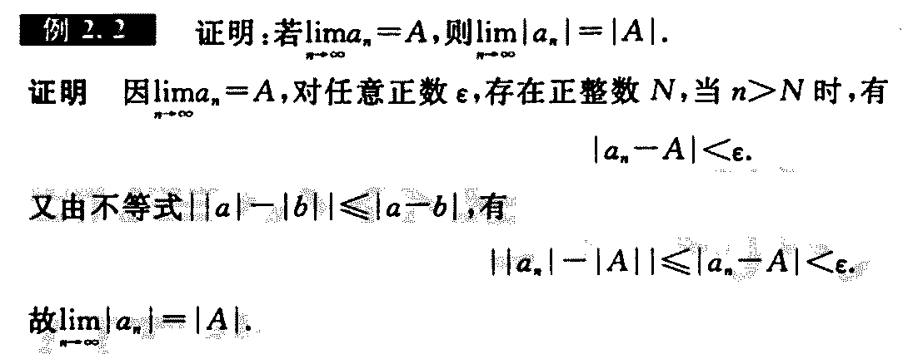
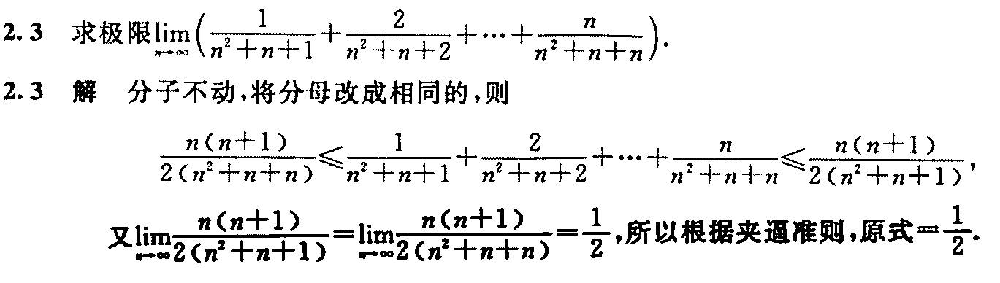
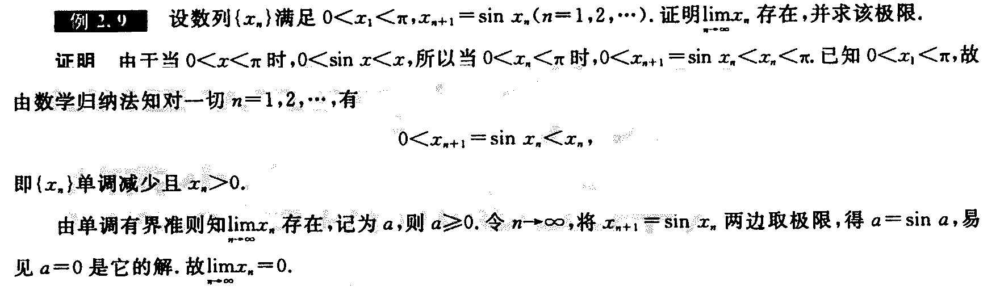

[书籍](./books/2023张宇数学基础30讲-高等数学分册.pdf#page=32)

# 数列极限定义

设 $\{x_n\}$ 为一数列，若存在常数 $a$ ，对于任意的 $\epsilon\gt0$ (不论它多么小)，总存在正整数 $N$ ，使得当 $n\gt N$ 时， $|x_n-a|<\epsilon$ 恒成立（即当 $n$ 大于一个常数 $N$ 时， $x_n$ 离 $a$ 更加接近且距离小于 $\epsilon$ ）。则称数 $a$ 是数列 $\{x_n\}$ 的极限，或者称数列 $\{x_n\}$ 收敛于 $a$ ，记为
$$
\lim_{n\rightarrow\infty}x_n=a或x_n\rightarrow a(n\rightarrow\infty)
$$

当数列越趋近极限，那么极限的距离 $|x_n-a|$ 就越小

如果不存在，则说数列 $\{x_n\}$ 是**发散**的

数学符号表示：
$$
\lim_{n\rightarrow\infty}x_n=a\Leftrightarrow\forall\epsilon\gt0,\exist N\in N_{+},
当n\gt N时，恒有|x_n-\alpha|\lt\epsilon
$$
定义：如果从数列 $\{a_n\}$ 中取无穷项得到新的数列 $\{a_{n_k}\}$ 叫子列。若数列 $\{a_n\}$ 收敛，则其**任何子列 $\{a_{n_k}\}$ 也收敛**，且 $\underset{k\rightarrow\infty}{\lim}a_{n_k}=\underset{n\rightarrow\infty}{\lim}a_n$ (所有**子列的极限的值都相等**)。

上面定义在证明**极限不存在**时可以使用，即证明上面命题的逆否命题即可，当有**子列**的**极限不收敛**或者**收敛的值不相等**时即可。

>  定义证明极限**做题步骤**：
> 
> $$
> \begin{aligned}
> &1.写|x_n-a|\lt\epsilon\\
> &2.反解出n\gt g(\epsilon)\\
> &3.取N=[g(\epsilon)]+1\quad(n\gt N)
> \end{aligned}
> $$

**步骤解释：**

根据定义【 $\forall\epsilon\gt0,\exist N\in N_{+},
当n\gt N时，恒有|x_n-\alpha|\lt\epsilon$ 】，我们只要证明式子满足这个条件即可。首先就是要求出满足 $|x_n-\alpha|\lt\epsilon$ 的 $n$ ，其中 $\epsilon$ 可以**自定义范围**，通过不等式 $|x_n-\alpha|\lt\epsilon$ 可以求解出 $n$ 和 $\epsilon$ 的不等式 $n\gt g(\epsilon)$ ，这样就求得了 $n$ 的范围，因为 $N$ 为正整数，通过求得 $g(\epsilon)$ 的向上取整即可 $\left \lceil g(\epsilon)\right \rceil$ ，得到 $n$ 的取值范围，从而证明满足条件

---

### 例题

---

对于等比数列中得到其前 $n$ 项和为
$$
S_n=a_1\frac{1-q^n}{1-q}
$$
当 $q$ 为常数且 $|q|\lt1$ 时， $S=\underset{n\rightarrow\infty}{\lim}S_n=\frac{a_1}{1-q}$ 

但是**没有强调 $q$ 为常数**时，如 $q=1-\frac{1}{n},n=2,3,\cdots$ ，有
$$
\lim_{n\rightarrow\infty}q^n=\lim_{n\rightarrow\infty}
(1-\frac{1}{n})^n=e^{\underset{n\rightarrow\infty}{\lim}n\ln(1-\frac{1}{n})}
\overset{\ln x\sim x-1}{=}e^{\lim_{n\rightarrow\infty}-\frac{n}{n})}
=e^{-1}\not=0
$$

---

若 $A=0$ ，则 $||a_n|-|A||=||a_n|-0|=|a_n-0|$ ，则有
$$
\lim_{n\rightarrow\infty}a_n=0\Leftrightarrow\lim_{n\rightarrow\infty}|a_n|=0
$$
所以在证明 $\underset{n\rightarrow\infty}{\lim}a_n=0$ 时，就转换为 $\underset{n\rightarrow\infty}{\lim}|a_n|=0$ ，根据夹逼准则证明时，因为 $|a_n|\ge0$ 所以**只需要证明 $|a_n|\le0$ 即可**，可通过放大右侧变成常数。

---

---

# 收敛数列的性质

---

## 唯一性

给出数列 $\{x_n\}$ ，若 $\underset{n\rightarrow\infty}{\lim}=a$ (存在)，则 $a$ 是惟一的

---

## 有界性

若极限存在，则数列 $\{x_a\}$ 有界

---

## 保号性

设数列 $\{a_n\}$ 存在极限 $a$ ，且 $a\gt 0(或a\lt0)$ ，则存在正整数 $N$ ，当 $n\gt N$ 时，有 $a_n\gt0(或a_n\lt0)$ 

通俗的说就是， $a_n$ 中下标大于正整数 $N$ 的数，都和 $a$ 符号相同

**推论**：如果数列 $\{a_n\}$ 从某项起有 $a_n\ge0$ ，且 $\underset{n\rightarrow\infty}{\lim}a_n=b$ ，则 $b\ge0$ 。因为当 $a_n=\frac{1}{n}$ 时 $\underset{n\rightarrow\infty}{\lim}a_n=0,\frac{1}{n}\gt0$ ，所以等号存在。

# 极限运算规则

设 $\underset{n\rightarrow\infty}{\lim}x_n=a,\underset{n\rightarrow\infty}{\lim}y_n=b$ ，则
$$
\begin{aligned}
&(1)\lim_{n\rightarrow\infty}(x_n\pm y_n)=a\pm b;\\
&(2)\lim_{n\rightarrow\infty}x_ny_n=ab;\\
&(3)若b\not=0,y_n\not=0,则\lim_{n\rightarrow\infty}\frac{x_n}{y_n}=\frac{a}{b}
\end{aligned}
$$

## 例题

---

# 夹逼准则

如果数列 $\{x_n\},\{y_n\},\{z_n\}$ 满足以下条件：

（1） $y_n\le x_n\le z_n(n=1,2,3,\cdots)$ ；（2） $\underset{n\rightarrow\infty}{\lim}y_n=a,\underset{n\rightarrow\infty}{\lim}z_n=a$ 

则数列 $\{x_n\}$ 的极限存在，且 $\underset{n\rightarrow\infty}{\lim}x_n=a$ 

## 例题

>  在做放缩的时候**只放缩分母即可**。

---

---

# 单调有界准则

单调有界数列必有极限，即若数 $\{x_n\}$ 列**单调增加(减少)**且**有上界(下界)**，则 $\underset{n\rightarrow\infty}{\lim}x_n$ 存在。

>1. 证明式子单调且有对应的界
>2. 记极限为A，对递推式两边求极限，可得一个关于A的等式
>3. 求得极限

## 例题

**对于递推式 $a_{n+1}=f(a_n)$ ，一般用单调有界准则。**

---

---

---

其中的 $a_n$ 通过 $(1)$ 的证明可得，通过 $a_n=a_n-a_{n-1}+a_{n-1}-a_{n-2}+\cdots+a_0-a_0$ 求得。

---

---

# 我的总结

| 小节         | 考点                                                         |
| ------------ | ------------------------------------------------------------ |
| 数列极限定义 | 用定义证明极限；证明极限不存在，通过子集求得                 |
| 极限运算规则 | 通过运算规则求极限，其中极限拆开的前提是其中的各个部分极限都存在 |
| 夹逼准则     | 通过放缩（只放缩分母即可）和夹逼准则求极限                   |
| 单调有界准则 | 通过单调有界原则求极限（对于递推式使用）                     |