[书籍](./books/2023张宇数学基础30讲-高等数学分册.pdf#page=40)

# 函数的极限

## 邻域

1. 一维的情形

    **邻域**：数轴上**以点 $x_0$ 为中心**的任何**开区间**称为点 $x_0$ 的**邻域**，记作 $U(x_0)$ 。

    **$\delta$ 邻域**：设 $x_0$ 是数轴上一个点， $\delta$ 是某一正数，则称开区间 $(x_0-\delta,x_0+\delta)$ 为点 $x_0$ 的 $\delta$ 邻域，记作 $U(x_0,\delta)$ ，即
    $$
    U(x_0,\delta)=\{x|x_0-\delta\lt x\lt x_0+\delta\}=\{x||x-x_0|\lt\delta\}
    $$
    其中 $x_0$ 称为**邻域的中心**， $\delta$ 称为**邻域的半径**。

    **去心 $\delta$ 邻域**：定义点 $x_0$ 的去心邻域 $\overset{\circ}{U}(x_0,\delta)=\{x|0\lt|x-x_0|\lt\delta\}$ 。

    **左、右 $\delta$ 邻域**： $\{x|0\lt x-x_0\lt\delta\}$ 称为点  $x_0$ 的**右 $\delta$ 邻域**，记作 $U^+(x_0,\delta)$ ， $\{x|0\lt x_0-x\lt\delta\}$ 称为点  $x_0$ 的**左 $\delta$ 邻域**，记作 $U^-(x_0,\delta)$ 。

2. 二维的情形

    **$\delta$ 邻域**：设 $P_0(x_0,y_0)$ 是 $xOy$ 平面上的一个点， $\delta$ 是某一正数。与点 $P_0(x_0,y_0)$ 的距离小于 $\delta$ 的点 $P(x,y)$ 的全体，称为点 $P_0$ 的 $\delta$ 邻域，记为 $U(P_0,\delta)$ ，即
    $$
    U(P_0,\delta)=\{P||PP_0|\lt\delta\}或U(P_0,\delta)=\{(x,y)|\sqrt{(x-x_0)^2+(y-y_0)^2}\lt\delta\}
    $$
    **去心 $\delta$ 邻域**：点 $P_0$ 的去心 $\delta$ 邻域，记作 $\overset{\circ}{U}(P_0,\delta)$ ，即 $\overset{\circ}{U}(P_0,\delta)=\{P|0\lt|PP_0|\lt\delta\}$ 。特别指出，如果不需要强调邻域的半径 $\delta$ ，则用 $U(P_0)$ 表示点 $P_0$ 的某个邻域，点 $P_0$ 的去心邻域记作 $\overset{\circ}{U}(P_0)$ 。

    **$\delta$ 邻域的几何意义**： $U(P_0,\delta)$ 表示 $xOy$ 平面上以点 $P_0(x_0,y_0)$ 为中心， $\delta\gt0$ 为半径的圆的内部的点 $P(x,y)$ 的全体。

## 定义

设函数 $f(x)$ 在点 $x_0$ 的某一去心邻域内有定义。若存在常数 $A$ ，对于任意给定的 $\varepsilon\gt0$ (不论它多么小)，总存在正数 $\delta$ ，使得当 $0\lt|x-x_0|\lt\delta$ 时，对应的函数值 $f(x)$ 都满足不等式 $|f(x)-A|\lt\varepsilon$ ，则 $A$ 就叫作函数 $f(x)$ 当 $x\rightarrow x_0$ 时的极限，记为
$$
\lim_{x\rightarrow x_0}f(x)=A或f(x)\rightarrow A(x\rightarrow x_0)
$$
写成” $\varepsilon-\delta$ 语言“： $\underset{x\rightarrow x_0}{\lim}f(x)=A\Leftrightarrow\forall\varepsilon\gt0,\exists\delta\gt0,当0\lt|x-x_0|\lt\delta时,有|f(x)-A|\lt\varepsilon$ 。

- 函数的单侧极限

  若当 $x\rightarrow x_0^-$ 时， $f(x)$ 无限接近于某常数 $A$ ，则常数 $A$ 叫作函数 $f(x)$ 当 $x\rightarrow x_0$ 时的**左极限**。记为 $\underset{x\rightarrow x_0^-}{\lim}f(x)=A或f(x_0^-)=A$ 。

  同理**右极限**为记为 $\underset{x\rightarrow x_0^+}{\lim}f(x)=A或f(x_0^+)=A$ 。

  写成“ $\varepsilon-\delta$ ”语言：

   $\underset{x\rightarrow x_0^+}{\lim}f(x)=A\Leftrightarrow\forall\varepsilon\gt0,\exists\delta\gt0,当x_0\lt x\lt x_0+\delta时,有|f(x)-A|\lt\varepsilon$ 

   $\underset{x\rightarrow x_0^-}{\lim}f(x)=A\Leftrightarrow\forall\varepsilon\gt0,\exists\delta\gt0,当x_0-\delta\lt x\lt x_0时,有|f(x)-A|\lt\varepsilon$ 

- 函数极限存在的充要条件
	$$
	\lim_{x\rightarrow x_0}f(x)=A\Leftrightarrow\lim_{x\rightarrow x_0^-}f(x)=A
	且\lim_{x\rightarrow x_0^+}f(x)=A\\
	\lim_{x\rightarrow x_0}f(x)=A\Leftrightarrow f(x)=A+\alpha(x),
	\lim_{x\rightarrow x_0}\alpha(x)=0
	$$
	
- 自变量趋向无穷大时函数的极限

	这个和数列的极限相似，写成“ $\varepsilon-X$ ”语言：
	$$
	\begin{aligned}
	&当x\rightarrow+\infty时\quad\underset{x\rightarrow+\infty}{\lim}f(x)=A\Leftrightarrow\forall\varepsilon\gt0,\exist X\gt0,当x\gt X时有，|f(x)-A|\lt\varepsilon\\
	&当x\rightarrow-\infty时\quad\underset{x\rightarrow-\infty}{\lim}f(x)=A\Leftrightarrow\forall\varepsilon\gt0,\exist X\gt0,当x\lt -X时有，|f(x)-A|\lt\varepsilon\\
	&当x\rightarrow\infty时\quad\underset{x\rightarrow\infty}{\lim}f(x)=A\Leftrightarrow\forall\varepsilon\gt0,\exist X\gt0,当|x|\gt X时有，|f(x)-A|\lt\varepsilon
	\end{aligned}
	$$
	**例题**

	证明： $\underset{x\rightarrow\infty}{\lim}\cfrac{\sin x}{x}=0$ 

	证：
	$$
	\begin{aligned}
	&|\cfrac{\sin x}{x}-0|=|\cfrac{\sin x}{x}|\le\cfrac{1}{|x|}\lt\varepsilon\\
	\Rightarrow&|x|\gt\cfrac{1}{\varepsilon}\\
	&取X=\cfrac{1}{\varepsilon}(函数不用取整)有\forall\varepsilon\gt0,取X=\cfrac{1}{\varepsilon},|x|\gt\cfrac{1}{\varepsilon},有|\cfrac{\sin x}{x}-0|\lt\varepsilon\\
	&\therefore\underset{x\rightarrow\infty}{\lim}\cfrac{\sin x}{x}=0
	\end{aligned}
	$$

## 性质

### 唯一性

如果极限 $\underset{x\rightarrow x_0}{\lim}f(x)$ 存在，那么**极限唯一**。

### 局部有界性

如果 $\underset{x\rightarrow x_0}{\lim}f(x)=A$ ，则存在正常数 $M$ 和 $\delta$ ，使得当 $0\lt|x-x_0|\lt \delta$ 时，有 $|f(x)|\le M$ 。

证明：

根据函数极限的定义 $\underset{x\rightarrow x_0}{\lim}f(x)=A\Leftrightarrow\forall\varepsilon\gt0,\exists\delta\gt0,当0\lt|x-x_0|\lt\delta时,有|f(x)-A|\lt\varepsilon$ ，所以已知 $|f(x)-A|\lt\varepsilon$ ，证明 $|f(x)|\le M$ 
$$
由|a+b|\le|a|+|b|\\
\begin{aligned}
&|f(x)-A+A|\le|f(x)-A|+|A|\lt\varepsilon+|A|\\
\Rightarrow&|f(x)|\lt\varepsilon+|A|\\
&令M=\varepsilon+|A|\\
\Rightarrow&|f(x)|\lt M
\end{aligned}
$$

### 局部保守性(保号性)

如果 $f(x)\rightarrow A(x\rightarrow x_0)$ ，且 $A\gt 0$ (或 $A\lt 0$ )，那么存在常数 $\delta\gt0$ ，使得当 $0\lt|x-x_0|\lt\delta$ 时，有 $f(x)\gt0$ (或 $f(x)\lt0$ )。

**证明**

$\underset{x\rightarrow x_0}{\lim}f(x)=A$ ，假设 $A\gt0$ ，根据定义有 $|f(x_0)-A|\lt\varepsilon$ 展开 $A-\varepsilon\lt f(x_0)\lt\varepsilon+A$ ，设 $\varepsilon=\cfrac{A}{2}$ ( $\varepsilon$ 满足 $A-\varepsilon\ge0$ 即可)，所以 $f(x_0)\gt A-\varepsilon=\cfrac{A}{2}\gt0$ ，所以取 $\varepsilon=\cfrac{A}{2},\exist\delta\gt0$ 使得当 $0\lt|x-x_0|\lt\delta$ 时， $f(x_0)\gt A$ 

同理可得当 $A\lt0$ 的情况

**推论**：如果在 $x_0$ 的某去心邻域内 $f(x)\ge0$ (或 $\le0$ )且 $\underset{x\rightarrow x_0}{\lim}f(x)=A$ ，则 $A\ge0$ (或 $\le0$ )

## 运算规则

若 $\lim f(x)=A,\lim g(x)=B$ ，那么

1.  $\lim [kf(x)\pm lg(x)]=k\lim f(x)\pm l\lim g(x)=kA+lB$ ，其中 $k,l$ 为常数

2.  $\lim[f(x)\cdot g(x)]=\lim f(x)\cdot\lim g(x)=A\cdot B$ ，特别的，若 $\lim f(x)$ 存在， $n$ 为正常数，则
	$$
	\lim[f(x)]^n=[\lim f(x)]^n
	$$

3.  $\lim\cfrac{f(x)}{g(x)}=\cfrac{\lim f(x)}{\lim g(x)}=\cfrac{A}{B}(B\not=0)$ 

以上所有等式的成立规则都是 $\lim f(x)=A,\lim g(x)=B$ **两个极限都存在**

## 夹逼准则

如果函数 $f(x),g(x),h(x)$ 满足以下条件：

1.  $g(x)\le f(x)\le h(x)$ 
2.  $\lim g(x)=A,\lim h(x)=A$ 

则 $\lim f(x)$ 存在，且 $\lim f(x)=A$ ， $A$ 是**数或无穷大** 。

## 洛必达法则

对于 $\cfrac{f(x)}{F(x)}$ 

**法则一**：

设①当 $x\rightarrow a$ (或 $x\rightarrow\infty$ )时，函数 $f(x)$ 及 $F(x)$ **都趋于零**；

② $f’(x)$ 及 $F’(x)$ 在点 $a$ 的某去心邻域内(或当 $|x|\gt X$ ，此时 $X$ 为充分大的正数)存在，且 $F’(x)\not=0$ (极限存在)；

③ $\underset{x\rightarrow a}{\lim}\cfrac{f'(x)}{F'(x)}$ (或 $\underset{x\rightarrow\infty}{\lim}\cfrac{f'(x)}{F'(x)}$ )**存在或无穷大**

则 $\underset{x\rightarrow a}{\lim}\cfrac{f(x)}{F(x)}=\underset{x\rightarrow a}{\lim}\cfrac{f'(x)}{F'(x)}$ (或 $\underset{x\rightarrow\infty}{\lim}\cfrac{f(x)}{F(x)}=\underset{x\rightarrow\infty}{\lim}\cfrac{f'(x)}{F'(x)}$ )

**法则二**：

设①当 $x\rightarrow a$ (或 $x\rightarrow\infty$ )时，函数 $f(x)$ 及 $F(x)$ **都趋于无穷大**；

② $f’(x)$ 及 $F’(x)$ 在点 $a$ 的某去心邻域内(或当 $|x|\gt X$ ，此时 $X$ 为充分大的正数)存在，且 $F’(x)\not=0$ (极限存在)；

③ $\underset{x\rightarrow a}{\lim}\cfrac{f'(x)}{F'(x)}$ (或 $\underset{x\rightarrow\infty}{\lim}\cfrac{f'(x)}{F'(x)}$ )存在或无穷大

则 $\underset{x\rightarrow a}{\lim}\cfrac{f(x)}{F(x)}=\underset{x\rightarrow a}{\lim}\cfrac{f'(x)}{F'(x)}$ (或 $\underset{x\rightarrow\infty}{\lim}\cfrac{f(x)}{F(x)}=\underset{x\rightarrow\infty}{\lim}\cfrac{f'(x)}{F'(x)}$ )

1. 一般说来，洛必达法则是**用来计算“ $\cfrac{0}{0}$ ”型或者“ $\cfrac{\infty}{\infty}$ ”型未定式极限**的，不是“ $\cfrac{0}{0}$ ”型或“ $\cfrac{\infty}{\infty}$ ”型，就不能用洛必达法则。
2. 如果极限 $\underset{x\rightarrow a}{\lim}\cfrac{f'(x)}{F'(x)}$ 任属于“ $\cfrac{0}{0}$ ”型或者“ $\cfrac{\infty}{\infty}$ ”型，且 $f’(x),F’(x)$ 继续满足洛必达法则的条件，则可以继续使用洛必达法则。
3. 如果 $\underset{x\rightarrow a}{\lim}\cfrac{f'(x)}{F'(x)}$ 不存在也不为 $\infty$ ，不能推出 $\underset{x\rightarrow a}{\lim}\cfrac{f(x)}{F(x)}$ 不存在也不为 $\infty$ ，简单一点就是：对于 $\underset{x\rightarrow a}{\lim}\cfrac{f(x)}{F(x)}=\underset{x\rightarrow a}{\lim}\cfrac{f(x)}{F(x)}$ ，**右存在,则左存在;但左存在,并不意味着右一定存在**。

## 泰勒公式

$$
在0处的展开式f(x)=\frac{f^{(0)}(0)x^0}{0!}+\frac{f^{(1)}(0)x^1}{1!}
+\frac{f^{(2)}(0)x^2}{2!}+\cdots+\frac{f^{(n)}(0)x^n}{n!}+\cdots
$$

**几个重要函数的泰勒公式熟稔于心** $x\rightarrow 0$ ：
$$
\begin{aligned}
&\sin x=x-\frac{x^3}{3!}+o(x^3),&&\cos x=1-\frac{x^2}{2!}+\frac{x^4}{4!}+o(x^4),\\
&\arcsin x=x+\frac{x^3}{3!}+o(x^3),&&\tan x=x+\frac{x^3}{3}+o(x^3),\\
&\arctan x=x-\frac{x^3}{3}+o(x^3),&&\ln(1+x)=x-\frac{x^2}{2}+\frac{x^3}{3}+o(x^3)\\
&e^x=1+x+\frac{x^2}{2!}+\frac{x^3}{3!}+o(x^3),&&(1+x)^a=1+ax
+\frac{a(a-1)x^2}{2!}+o(x^2)
\end{aligned}
$$
从数学命题的角度，对以上公式进行处理，可得到一组“差函数”的**等价无穷小代换式**：

$x-\sin x=\cfrac{1}{6}x^3+o(x^3)$ ，则 $x=\sin x\sim\cfrac{1}{6}x^3(x\rightarrow 0)$ ，同理有 $\arcsin x-x\sim\cfrac{x^3}{6}(x\rightarrow 0)$ ， $\tan x-x\sim\cfrac{x^3}{3}(x\rightarrow 0)$ ， $x-\arctan x\sim\cfrac{x^3}{3}(x\rightarrow 0)$ 

1.  $\cfrac{A}{B}$  型，适用“**上下同阶**”原则

	具体说来，如果分母(或分子)是 $x$ 的 $k$ 次幂，则应把分子(或分母)展开到 $x$ 的 $k$ 次幂，可称为“上下同阶”原则。

2.  $A-B$ 型，适用“**幂次最低**”原则。

	具体说来，即将 $A,B$ 分别展开到它们的**系数不相等的 $x$ 的最低次幂为止。**

## 海涅定理(归结原则)

设 $f(X)$ 在 $\overset{\circ}{U}(x_0,\delta)$ 内有定义，则

$\underset{x\rightarrow x_0}{\lim}f(x)=A$ 存在 $\Leftrightarrow$ 对任何 $\overset{\circ}{U}(x_0,\delta)$ 内以 $x_0$ 为极限的数列 $\{x_n\}(x_n\not=x_0)$ ，极限 $\underset{n\rightarrow \infty}{\lim}f(x_n)=A$ 存在

海涅定理是联系数列极限与函数极限的桥梁。它指出：在极限存在的条件下，函数极限和数列极限可以相互转化。

## 无穷小比阶

1. 定义

  如果当 $x\rightarrow x_0(或x\rightarrow\infty)$ 时，函数 $f(x)$ 的极限为零，那么称函数 $f(x)$ 为当 $x\rightarrow x_0(或x\rightarrow\infty)$ 时的无穷小，记为
$$
  \lim_{x\rightarrow x_0}f(x)=0(或\lim_{x\rightarrow\infty}f(x)=0)
$$
  特别的，以零为极限的数列 $\{x_n\}$ 称为 $n\rightarrow\infty$时的无穷小。

2. 无穷小的比阶

  设在自变量的同一变化过程中， $\lim\alpha(x)=0,\lim\beta(x)=0$ 且 $\beta(x)\not=0$ ，则

  ①若 $\cfrac{\alpha(x)}{\beta(x)}=0$ ，则称 $\alpha(x)$ 是比 $\beta(x)$ **高阶的无穷小**，记为 $\alpha(x)=o(\beta(x))$ 。

  ②若 $\cfrac{\alpha(x)}{\beta(x)}=\infty$ ，则称 $\alpha(x)$ 是比 $\beta(x)$ **低阶的无穷小**

  ③若 $\cfrac{\alpha(x)}{\beta(x)}=c\not=0$ ，则称 $\alpha(x)$ 与 $\beta(x)$ 是**同阶无穷小**

  ④若 $\cfrac{\alpha(x)}{\beta(x)}=1$ ，则称 $\alpha(x)$ 与 $\beta(x)$ 是**等价无穷小**，记为 $\alpha(x)\sim\beta(x)$ 

  ⑤若 $\lim\cfrac{\alpha(x)}{[\beta(x)]^k}=c\not=0,k\gt0$ ，则称 $\alpha(x)$ 是 $\beta(x)$ 是**$k$ 阶无穷小**

3. 无穷小运算规则

  ①**有限个**无穷小的和是无穷小

  ②有界函数与无穷小的乘积是无穷小

  ③**有限个**无穷小的乘积是无穷小 [无限个无穷小乘积不一定是无穷小](https://blog.csdn.net/Blue_Sky_rain/article/details/105177335)

  ④无穷小的运算

  设 $m,n$ 为正整数，则

  a. $o(x^m)\pm o(x^n)=o(x^l),l=\min\{m,n\}$ (**加减法时低阶“吸收”高阶**)

  b. $o(x^m)\cdot o(x^n)=o(x^{m+n}),x^m\cdot o(x^n)=o(x^{m+n})$ (**乘法时阶数“累加”**)

  c. $o(x^m)=o(kx^m)=k\cdot o(x^m),k\not=0$ 且为常数(非零常数相乘不影响阶数)

4. 无穷大和有界的关系

  无穷大是无界的，但是无界不是无穷大

  例如： $f(x)=\cfrac{1}{x}\sin\cfrac{1}{x}$ ，在 $x\rightarrow0$ 时为无界的，但不是无穷大

  取子列 $x_n=\cfrac{1}{2n\pi+\cfrac{\pi}{2}}\quad\underset{n\rightarrow\infty}{\lim}(2n\pi+\cfrac{\pi}{2})\cdot\sin(2n\pi+\cfrac{\pi}{2})=\infty$ 

  再取子列 $y_n=\cfrac{1}{2n\pi}\quad\underset{n\rightarrow\infty}{\lim}(2n\pi)\cdot\sin(2n\pi)=0$ 

5. 常用的等价无穷小

  当 $x\rightarrow0$ 时，常用的等价无穷小有：
$$
  \sin x\sim x,\quad\tan\sim x,\quad\arcsin x\sim x,\quad\arctan x\sim x,
  \quad\ln(1+x)\sim x,\quad e^x-1\sim x,\\
  a^x-1\sim x\ln a,\quad 1-\cos x\sim \frac{1}{2}x^2,\quad(1+x)^a-1\sim ax
$$

# 连续性与间断（逐点的概念）

##  连续点的定义

设函数 $f(x)$ 在**点 $x_0$ 的某一邻域内有定义（左右都有定义）**，且有 $\underset{x\rightarrow x_0}{\lim}f(x)=f(x_0)$ ，则称函数 $f(x)$ 在点 $x_0$ 处连续

## 间断点的定义与分类

以下设函数 $f(x)$ 在点 $x_0$ 的某去心邻域内有定义

### 可去间断点

若 $\underset{x\rightarrow x_0}{\lim}f(x)=A\not=f(x_0)$ ( $f(x_0)$ 甚至可以无定义)，则这类间断点称为**可去间断点**

### 跳跃间断点

若 $\underset{x\rightarrow x_0^-}{\lim}f(x)与\underset{x\rightarrow x_0^+}{\lim}f(x)$ 都存在，但是 $\underset{x\rightarrow x_0^-}{\lim}f(x)\not=\underset{x\rightarrow x_0^+}{\lim}f(x)$ ，则这类间断点称为**跳跃间断点**。

可去间断点和跳跃间断点统称为**第一类间断点**

### 无穷间断点

若 $\underset{x\rightarrow x_0}{\lim}f(x)=\infty$ ，则这类间断点称为**无穷间断点**，如点 $x=0$ 为函数 $y=\cfrac{1}{x}$ 的无穷间断点

### 振荡间断点

若 $\underset{x\rightarrow x_0}{\lim}f(x)$ 振荡不存在，则这类间断点称为**振荡间断点**，如函数 $y=\sin\cfrac{1}{x}$ 在点 $x=0$ 处没有定义，且当 $x\rightarrow 0$ 时，函数值在 $-1$ 与 $1$ 这两个数之间交替振荡取值，极限不存在，故点 $x=0$ 为函数 $y=sin\cfrac{1}{x}$ 的振荡间断点

无穷间断点和振荡间断点都属于**第二类间断点**，除此之外，还有不属于上述定义的第二类间断点4

# 总结

## 函数极限的性质

1. 对于**唯一性**

    - 对于 $x\rightarrow\infty$ ，意味着 $x\rightarrow+\infty$ ，且 $x\rightarrow-\infty$ 
    - 对于 $x\rightarrow x_0$ ，意味着 $x\rightarrow x_0^+$ ，且 $x\rightarrow x_0^-$ 

    $\underset{x\rightarrow\infty}{\lim}e^x$ 不存在，因为$\underset{x\rightarrow+\infty}{\lim}e^x=+\infty,\underset{x\rightarrow+\infty}{\lim}e^x=0$ ，因为唯一性所以极限不存在

    $\underset{x\rightarrow0}{\lim}\cfrac{\sin x}{|x|}$ 不存在，因为 $\underset{x\rightarrow0^+}{\lim}\cfrac{\sin x}{|x|}=\underset{x\rightarrow0^+}{\lim}\cfrac{\sin x}{x}=1,\underset{x\rightarrow0^-}{\lim}\cfrac{\sin x}{|x|}=\underset{x\rightarrow0^-}{\lim}\cfrac{\sin x}{-x}=-1$ 

    $\underset{x\rightarrow\infty}{\lim}\arctan x$ 不存在，因为 $\underset{x\rightarrow+\infty}{\lim}\arctan x=\cfrac{\pi}{2},\underset{x\rightarrow-\infty}{\lim}\arctan x=-\frac{\pi}{2}$ 

    $\underset{x\rightarrow0}{\lim}[x]$ 不存在，因为 $\underset{x\rightarrow0^+}{\lim}[x]=0,\underset{x\rightarrow0^-}{\lim}[x]=-1$ 

2. 对于**局部有界性**

    - 设 $\underset{x\rightarrow\cdot}{\lim}f(x)$ 存在，则当 $x\rightarrow\cdot$ 时， $f(X)$ 有界。其中 $x\rightarrow \cdot$ 是指 $x\rightarrow x_0,x\rightarrow x_0^-,x\rightarrow x_0^+,x\rightarrow\infty,x\rightarrow-\infty,x\rightarrow+\infty$ 六种情况。极限存在只是函数局部有界性的充分条件，并非必要条件；
    - 设 $f(x)$ 在 $[a,b]$ 上连续，则 $f(x)$ 在 $[a,b]$ 上有界；
    - 有界函数与有界函数的和、差、积仍为有界函数；
    - 若 $f'(x)$ 在有限区间 $(a,b)$ 内有界，则 $f(x)$ 在该区间内有界（变化率 $f'(x)$ 有界，那么 $f(x)$ 也有界）

3. 对于**局部保号性**，主要和导数的几何应用结合来命题

### 例题

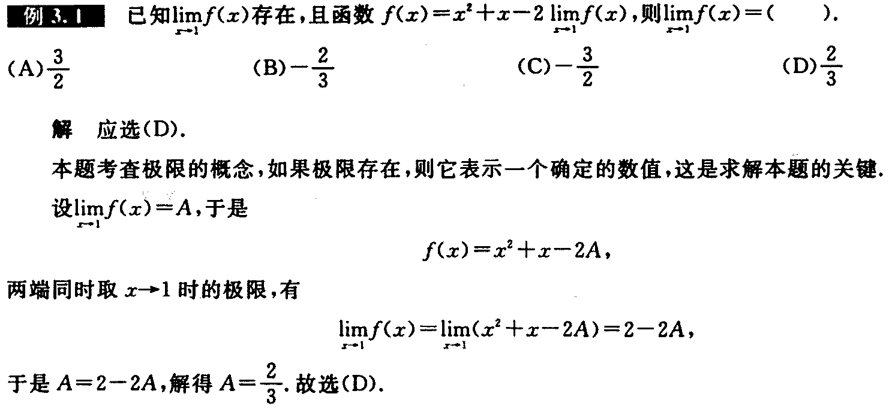

---

---

---

## 七种未定式的计算

本节内容极其重要,它是高等数学计算的基础

对于 $\underset{x\rightarrow\cdot}{\lim}f(x)$ 自变量 $x$ 的变化趋势共有六种情形： $x\rightarrow x_0^+(x\gt x_0),x\rightarrow x_0^-(x\lt x_0),x\rightarrow x_0,x\rightarrow+\infty,x\rightarrow-\infty,x\rightarrow\infty$ 

(1) 化简是第一步

**化简的方法**:①**提出极限不为 $0$ 的因式**；②**等价无穷小代换**；③恒等变形(基本的恒等变形法如**提公因式**，**拆项、合并、分子分母同除变量的最高次幂**等，高级的恒等变形法如变量代换，也叫**换元法**等)。需要强调的是，很多问题如果不化简就计算，可能计算会很复杂,甚至可能计算不出结果。

**对于无穷小替换：**

**要等价的部分使用等价无穷小替换之后还要和其他部分进行相乘除运算时，一般就能使用等价无穷小替换。**

**要等价的部分使用等价无穷小替换之后还要和其他部分进行相加减运算时，一般不能使用等价无穷小替换。**

(2) **判断类型，七种**： $\cfrac{0}{0};\cfrac{\infty}{\infty};0\cdot\infty=\left\{\begin{matrix}
\cfrac{0}{\cfrac{1}{\infty}}=\cfrac{0}{0}\\
\cfrac{\infty}{\cfrac{1}{0}}=\cfrac{\infty}{\infty}\\
\end{matrix}\right.;\infty-\infty;\infty^0;0^0;1^\infty$ 

**后面三种** $u^v=e^{v\ln u}\Rightarrow\left\{\begin{matrix}
\infty^0=e^{0\cdot+\infty}\\
0^0=e^{0\cdot-\infty} \\1^\infty=e^{\infty\cdot0}\end{matrix}\right.$​ 也可以转换为前两种。

**对于 $\infty-\infty$ 型未定式有两种思路**

1. 如果函数中**有分母，则通分**，将加减法变形为乘除法，以便于使用其他计算工具(比如洛必达法则)

2. 如果函数中**没有分母**，则可以通过提取公因式，或者作倒代换，出现分母后，再利用通分等恒等变形的方法，将加减法变形为乘除法

(3) 选择相应的方法进行计算(包括**运算规则、夹逼准则、洛必达法则、泰勒公式、归结原则**等)

### 例题

(1) $\cfrac{0}{0};\cfrac{\infty}{\infty};0\cdot\infty$ 型未定式

---

此题还可以使用泰勒公式求解

---

**求解无穷大的极限可以转换为求无穷小来方便求解**

---

---

---

---

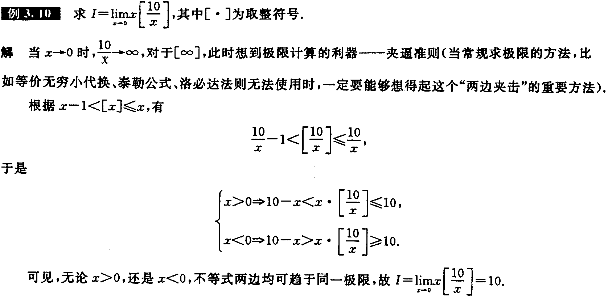

**遇到其他方式无法求解的时候尝试使用夹逼准则**

---

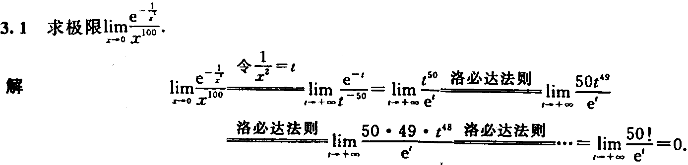

---

---

---

(2) $\infty-\infty$ 

---

---

---

(3) $\infty^0;0^0;1^\infty$ 

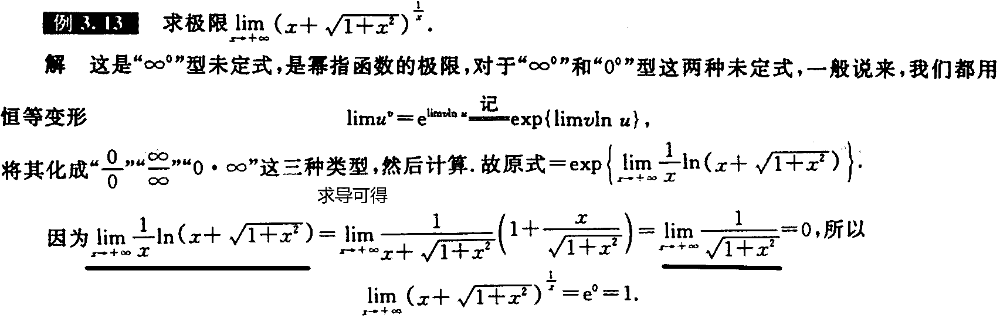

---

---

---

---

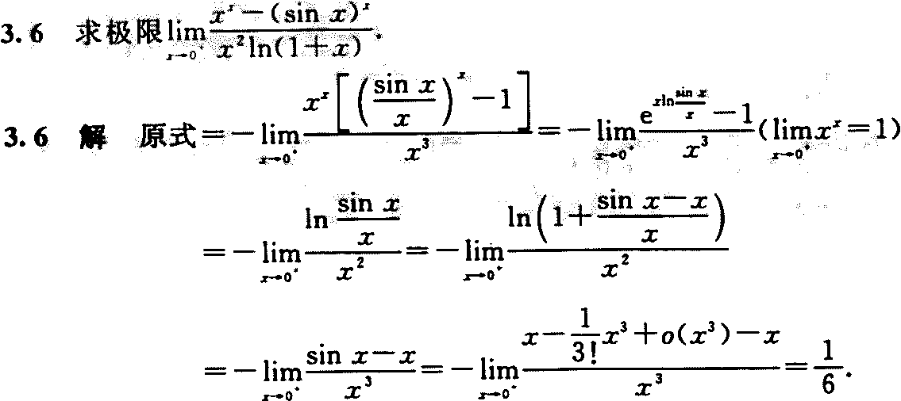

关键点 $\underset{x\rightarrow0^+}{\lim}x^x=1$ 

---

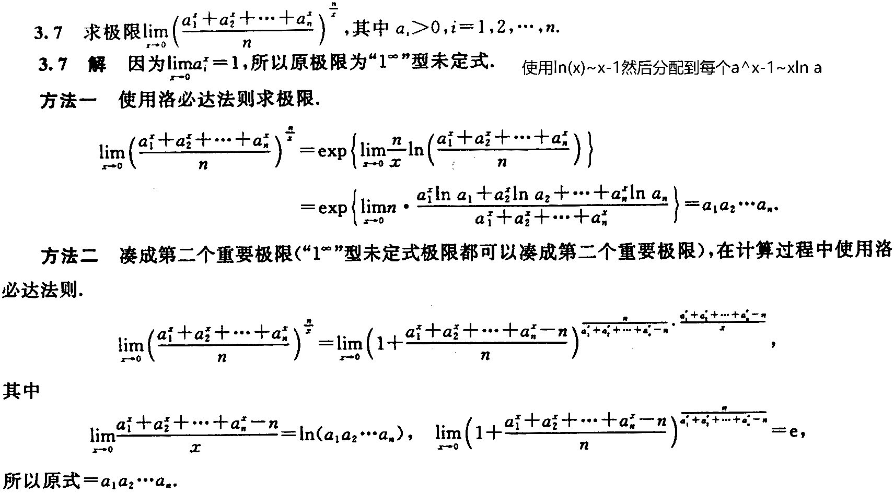

---

## 已知某一极限，求另一极限

### 例题

### 脱帽法

采用脱帽法做题，对于**脱帽法**有：
$$
\lim_{x\rightarrow\bullet}f(x)=A\Rightarrow f(x)=A+\alpha(x),
其中\lim_{x\rightarrow\bullet}\alpha(x)=0
$$
其中 $\alpha(x)$ 是极限和函数之间在趋近 $\bullet$ 的误差

根据题义可得
$$
\frac{\tan 2x+xf(x)}{\sin x^3}=0+\alpha(x)\\
求得f(x)=\frac{\sin x^3\alpha(x)-\tan 2x}{x}
$$
将 $f(x)$带 入到要求解的等式中得：
$$
\begin{aligned}
&\lim_{x\rightarrow0}\frac{2x+\sin x^3\alpha(x)-\tan 2x}{x^3}\\
=&\lim_{x\rightarrow0}\frac{2x-\tan 2x}{x^3}+\frac{\sin x^3\alpha(x)}{x^3}\\
=&\lim_{x\rightarrow0}\frac{-\frac{8x^3}{3}}{x^3}+\frac{x^3\alpha(x)}{x^3}
(\lim_{x\rightarrow0}\alpha(x)=0)\\
=&-\frac{8}{3}
\end{aligned}
$$

---

---

## 已知极限反求参数

### 例题

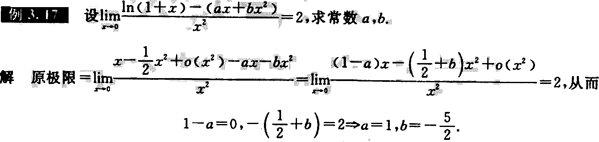

---

## 无穷小比阶

### 例题

---

---

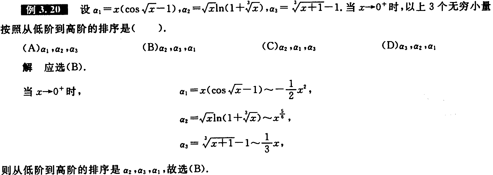

---

## 函数的连续与间断

### 例题

---

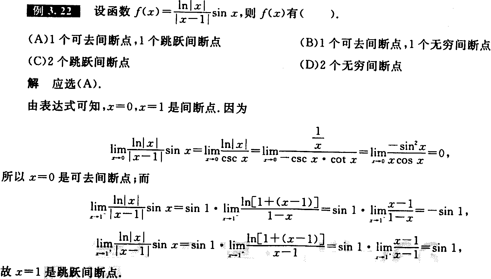

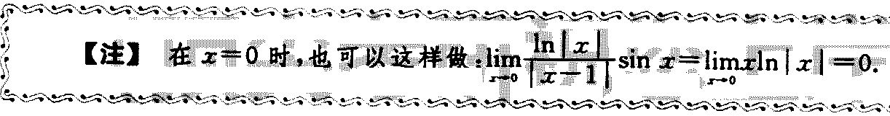

---

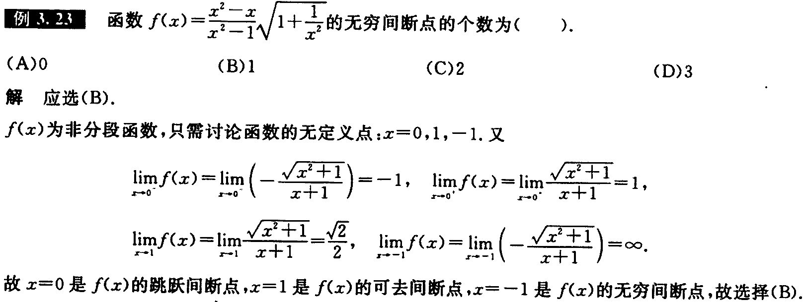

---

---

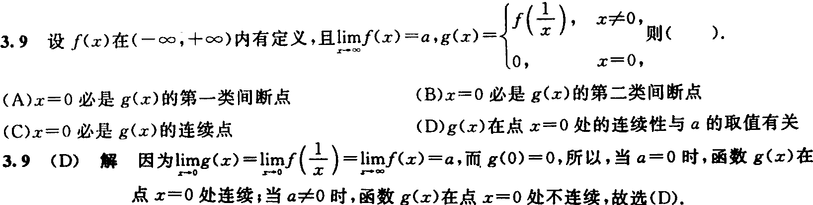

---

# 我的总结

| 小节             | 要点                                                         |
| :--------------- | ------------------------------------------------------------ |
| 函数极限的性质   | 对于唯一性、局部有界性、局部保号性的考察，一般在其他题目中穿插，唯一性考察从两边趋近是否唯一 |
| 函数极限的计算   | 对于七种未定式使用运算规则、夹逼准则、洛必达法则、泰勒公式、归结原则、无穷小比阶计算，对于七种未定式要回灵活转换；已知某一极限，求另一极限；已知极限反求参数，这里可以使用脱帽法； |
| 函数的连续与间断 | 主要是判断极端点，做题前先找点，然后再计算左右两边趋近得到间断点 |

