[书籍](./books/2023张宇数学基础30讲-高等数学分册.pdf#page=61)

# 概念

---

## 引导

记曲线 $l$ 为 $y=f(x)$ ，设 $P(x_0,y_0),Q(x,y)$ ，割线 $PQ$ 的**斜率**为
$$
\tan \theta = \frac{y-y_0}{x-x_0}=\frac{f(x)-f(x_0)}{x-x_0}
$$
角 $\theta$ 是割线 $PQ$ 的倾角。

当点 $Q$ 沿曲线 $y=f(x)$ 趋向点 $P$ 时，自然有 $x\rightarrow x_0$ ，于是
$$
\lim_{x\rightarrow x_0}\frac{f(x)-f(x_0)}{x-x_0}\overset{记}{=}k
$$
即割线斜率的极限，即切线的**斜率**。但斜率不一定存在

---

## 导数的概念

设 $y=f(x)$ 定义在区间 $I$ 上，让自变量在 $x=x_0$ 处增加一个增量 $\Delta x$ (可正可负)，其中 $x_0\in I,x_0+\Delta X\in I$ ，则可得函数增量 $\Delta y=f(x_0+\Delta x)-f(x_0)$ 。若函数增量 $\Delta y$ 与自变量增量 $\Delta x$ 的比值在 $\Delta x\rightarrow0$ 时的极限存在，即 $\underset{\Delta x\rightarrow0}{\lim}\frac{\Delta y}{\Delta x}$ 存在，则称函数 $y=f(x)$ 在点 $x_0$ 处**可导**，并称这个极限为 $y=f(x)$ 在点 $x_0$ 处的**导数**，记作 $f'(x_0)$ ，即
$$
f'(x_0)=\lim_{\Delta x\rightarrow 0}\frac{\Delta y}{\Delta x}=\lim_{\Delta x\rightarrow 0}\frac{f(x_0+\Delta x)-f(x_0)}{\Delta x}
$$
这个公式和上面引导的公式一样，只是做了一个等量代换 $\Delta x=x-x_0$ ，并无区别。

**考试注意**

1. 在考题中，增量 $\Delta x$ 一般会被命题人广义化为别的式子：
$$
  f'(x)=\lim_{\Delta x\rightarrow 0}\frac{f(x_0+\Delta x)-f(x_0)}{\Delta x}
  \overset{广义化}{=}
  \lim_{式子\rightarrow 0}\frac{f(x_0+式子)-f(x_0)}{式子}
$$

2. 上面式子中 $x_0+\Delta x=x$ ，则可写为
$$
  f'(x)=\lim_{x\rightarrow x_0}\frac{f(x)-f(x_0)}{x-x_0}
$$

3. 下面这三种提法是等价的

  -  $y=f(x)$ 在点 $x_0$ 处可导
  -  $y=f(x)$ 在点 $x_0$ 处导数存在
  -  $f'(x_0)=A$ ( $A$ 为有限数)

4. 对于**单侧导数**的概念有
$$
  \lim_{\Delta x\rightarrow0^-}\frac{f(x_0+\Delta x)-f(x_0)}{\Delta x}
  \overset{记}{=}f_{-}^{'}(x_0)\\
  \lim_{\Delta x\rightarrow0^+}\frac{f(x_0+\Delta x)-f(x_0)}{\Delta x}
  \overset{记}{=}f_{+}^{'}(x_0)
$$
  这里， $f_-^{'}(x_0),f_+^{'}(x_0)$ 分别是 $f(x)$ 在点 $x_0$ 处的**左导数、右导数**，统称为**单侧导数**

  其中 $f(x)$ 在点 $x_0$ 处可导的**充分必要条件**是其左导数与右导数均存在且相等即
$$
  f'(x)=A\Leftrightarrow f_{-}^{'}(x)=A且f_{+}^{'}(x)=A
$$

5. 导数的几何意义

    $y=f(x)$ 在点 $x_0$ 处的导数值 $f'(x)$ 就是曲线 $y=f(x)$ 在点 $(x_0,y_0)$ 处切线的斜率 $k$ ，即 $k=f'(x_0)$ ，于是曲线 $y=f(x)$ 在点 $(x_0,y_0)$ 处的切点方程为 $y-y_0=f'(x_0)(x-x_0)$ 

    法线方程为 $y-y_0=-\frac{1}{f'(x_0)}(x-x_0)(f'(x_0)\not=0)$ 

6. 高阶导数的概念

  就是对导数再次求导即可
$$
  f^{n}(x_0)=\lim_{\Delta x\rightarrow0}\frac{f^{(n-1)}(x_0+\Delta x)-f^{(n-1)}(x_0)}
  {\Delta x}
$$

---

## 微分的概念

设正方形边长为 $x$ ，当其边长增加 $\Delta x$ 时，它的面积 $S$ 增加了
$$
\Delta S=(x+\Delta x)^2-x^2=2x\Delta x+(\Delta x)^2
$$
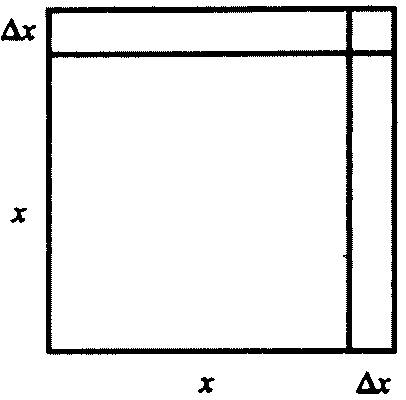

上述面积的增量 $\Delta S$ 由两部分组成，一部分是 $2x\Delta x$ ，另一部分是 $(\Delta x)^2$ ，他们满足 $\underset{\Delta x\rightarrow0}{\lim}\frac{(\Delta x)^2}{\Delta x}=0$ ，所以在式子中 $2x\Delta x$ 占据主要部分。

设函数 $y=f(x)$ 在点 $x_0$ 的某邻域内有定义，且 $x_0+\Delta x$ 在该邻域内，对于函数增量 $\Delta y=f(x_0+\Delta x)-f(x_0)$ ，若存在与 $\Delta x$ 无关的常数 $A$ ，使得 $\Delta y=A\Delta x+o(\Delta x)$ ，则称 $f(x)$ 在点 $x_0$ 处**可微**，并称 $A\Delta x$ (主部)为 $f(x)$ 在点 $x_0$ 处的**微分**，记作 ${\rm d}y|_{x=x_0}=A\Delta x$ ，所以 $\Delta y = {\rm d}y+o(\Delta x)$ 。同样的，对于 $\Delta x$ 有 $\Delta x=1\times\Delta x+0$ ，同样对于主部记作 $\Delta x$ ，所以 ${\rm d}x\equiv\Delta x$ 。

所以总结得出
$$
{\rm d}y|_{x=x_0}=A{\rm d}x
$$

可推得：
$$
\begin{aligned}
{\rm d}y|_{x=x_0}&=A\Delta x\\
&=y'(x_0)\Delta x\\
&=y'(x_0){\rm d}x
\end{aligned}
$$

**可微的判别步骤**：

>1. 写增量 $\Delta y=f(x_0+\Delta x)-f(x_0)$ 
>2. 写线性增量 $A\Delta x=f'(x)\Delta x$ 
>3. 作极限 $\underset{\Delta x\rightarrow 0}{\lim}\frac{\Delta y-A\Delta x}{\Delta x}$ 
>4. 若该极限等于 $0$ ，则 $y=f(x)$ 在点 $x_0$ 处可微，否则不可微。

---

## 例题

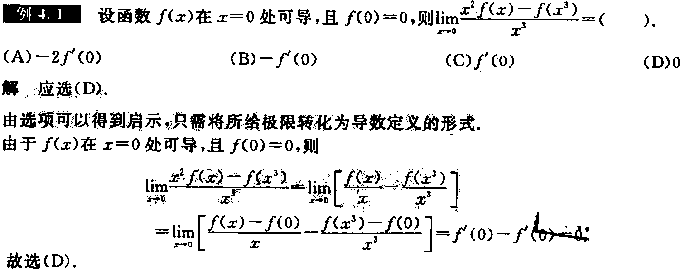

---

---

**注：**

若函数 $f(x)$ 在 $x=x_0$ 处连续，且 $\underset{x\rightarrow x_0}{\lim}\cfrac{f(x)}{x-x_0}=A$ (存在)。则 $f(x_0)=0$ 且 $f'(x_0)=A$ 。

证明：

因为**函数连续**，所以**函数值可以用极限表示**：
$$
f(x_0)=\lim_{x\rightarrow x_0}f(x)=\lim_{x\rightarrow x_0}\frac{f(x)}{x-x_0}(x-x_0)
=A\lim_{x\rightarrow x_0}(x-x_0)=0\\
f'(x_0)=\lim_{x\rightarrow x_0}\frac{f(x)-f(x_0)}{x-x_0}\overset{f(x_0)=0}{=}A
$$

上题中的A，C可以通过上面证明证出

---

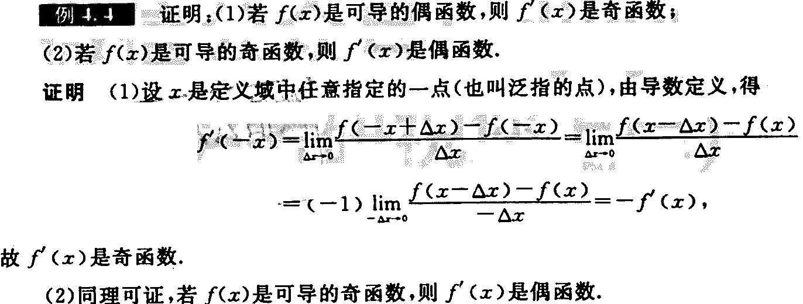

---

---

---

---

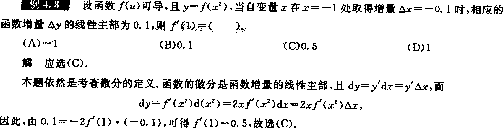

---

---

---

---

# 导数与微分的计算

---

## 四则运算

**和、差的导数(微分)**： $[u(x)\pm v(x)]'=u'(x)\pm v'(x),{\rm d}[u(x)\pm v(x)]={\rm d}[u(x)]\pm{\rm d}[v(x)]$ 

**积的导数(微分)**： $[u(x)v(x)]'=u'(x)v(x)+u(x)v'(x),{\rm d}[u(x)v(x)]=v(x){\rm d}[u(x)]+u(x){\rm d}[v(x)]$ 

**商的导数(微分)**： $\bigg[\cfrac{u(x)}{v(x)}\bigg]'=\cfrac{u'(x)v(x)-u(x)v'(x)}{[v(x)]^2},v(x)\not=0,$ 

​								${\rm d}\bigg[\cfrac{u(x)}{v(x)}\bigg]=\cfrac{v(x){\rm d}[u(x)]-u(x){\rm d}[v(x)]}{[v(x)]^2},v(x)\not=0$ 

### 例题

---

## 分段函数的导数

设 $f(x)=\left\{\begin{matrix}f_1(x),&x\ge x_0\\f_2(x),&x\lt x_0\end{matrix}\right.$ 其中 $f_1(x),f_2(x)$ 可导，则

①在分段点 $x_0$ 处用导数定义求导： $f_{+}^{'}(x_0)=\underset{x\rightarrow x_0^+}{\lim}\frac{f_1(x)-f(x_0)}{x-x_0},f_{-}^{'}(x_0)=\underset{x\rightarrow x_0^-}{\lim}\frac{f_2(x)-f(x_0)}{x-x_0}$ 。根据 $f_{+}^{'}(x_0)$ 是否等于 $f_{-}^{'}(x_0)$ 来判断。

②在非分段点用导直接用对应的范围的函数求导即可。

>要点：
> 1. 可导则连续，在分段点有 $f_1(x_0)=f_2(x_0)$ 
> 2. 可导在分段点有， $f'_-(x_0)=f'_+(x_0)$ 

### 例题

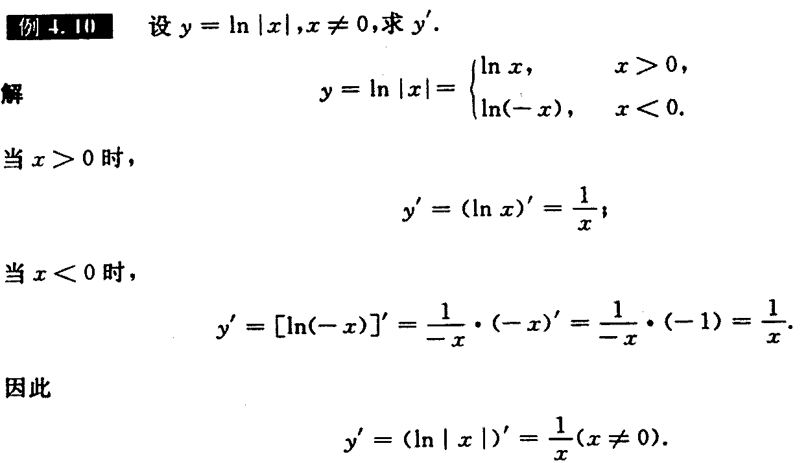

**注：**

根据结果可得， $\ln |x|$ 求导时，可视“**绝对值符号**”而不见

---

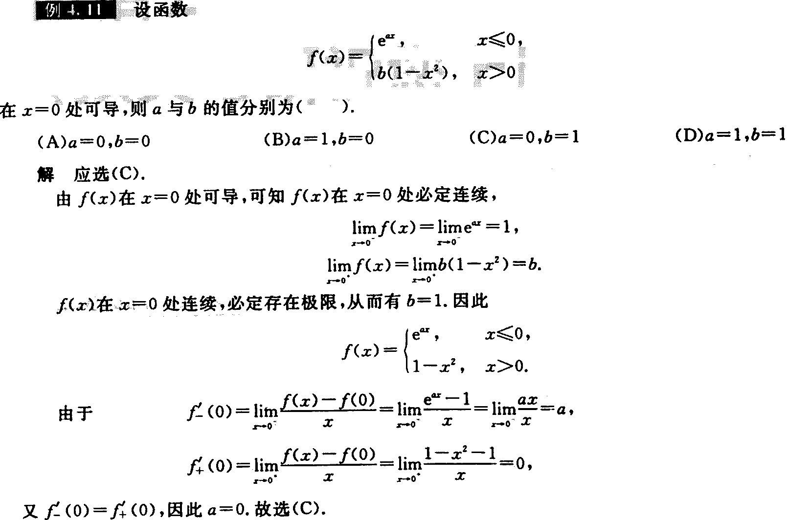

---

---

---

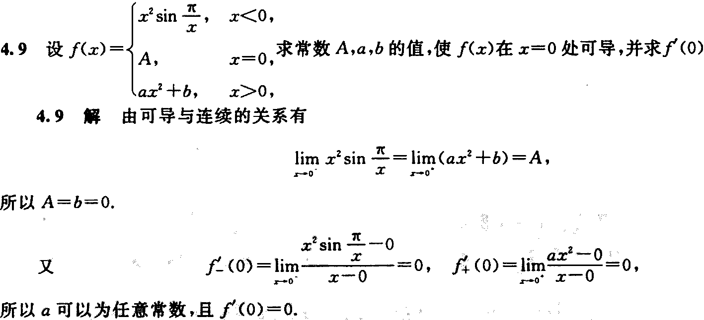

---

## 复合函数的导数与微分形式不变性

设 $u=g(x)$ 在点 $x$ 处可导， $y= f(u)$ 在点 $u=g(x)$ 处可导，则
$$
\{f[g(x)]\}'=f'[g(x)]g'(x),\\
{\rm d}\{f[g(x)]\}=f'[g(x)]g'(x){\rm d}x=f'[g(x)]{\rm d}[g(x)]
$$

### 例题

---

---

## 反函数的导数

设 $y=f(x)$ 可导，且 $f'(x)\not=0$ ，则存在反函数 $x=\varphi(y)$ ，且 $\frac{{\rm d}x}{{\rm d}y}=\frac{1}{\frac{{\rm d}y}{{\rm d}x}}$ ，即 $\varphi'(y)=\frac{1}{f'(x)}$ 

二阶导：在 $y= f(x)$ 单调，且二阶可导的情况下，若 $f’(x)\not=0$ ，则存在反函数 $x=\varphi(y)$ ，记 $f'(x)=y_x'，\varphi '(y)=x_y’$ ，则有
$$
y_x'=\frac{{\rm d}y}{{\rm d}x}=\frac{1}{\frac{{\rm d}x}{{\rm d}y}}=\frac{1}{x'},
y''_{xx}=\frac{{\rm d}^2y}{{\rm d}x^2}=\frac{{\rm d}(\frac{{\rm d}y}{{\rm d}x})}
{{\rm d}x}=\frac{{\rm d}(\frac{1}{x_y'})}{{\rm d}x}=
\frac{{\rm d}(\frac{1}{x_y'})}{{\rm d}y}\cdot\frac{{\rm d}y}{{\rm d}x}=
\frac{{\rm d}(\frac{1}{x_y'})}{{\rm d}y}\cdot\frac{1}{x'_y}=\frac{-x_{yy}''}
{(x'_y)^3}
$$
反过来有
$$
x_y'=\frac{1}{y_x'},x_{yy}''=\frac{-y_{xx}''}{(y'_x)^3}
$$

### 例题

我的思路

对于函数 $y=f(x)$ 的反函数 $x=f^{-1}(y)$ ，其中 $f$ 和 $f^{-1}$ 碰到会抵消
$$
\begin{aligned}
&x=\sin y\\
\overset{对x求导}{\Longrightarrow}&1=y'\cos y\\
\Longrightarrow&y'=\frac{1}{\cos y}\\
\Longrightarrow&y'=\frac{1}{\sqrt{1-\sin^2x}}\\
\overset{将y代入}{\Longrightarrow}&y'=\frac{1}{\sqrt{1-\sin^2(\arcsin x)}}\\
\overset{\sin\arcsin x=x}{\Longrightarrow}&\frac{1}{\sqrt{1-x^2}}\\
\end{aligned}
$$

---

用到了**变限积分求导**公式

定理：如果函数 $f(x)$ 连续， $\phi(x)$ 和 $\varphi(x)$ 那么变限积分函数求导公式可表示为
$$
\Phi'(x)=\frac{{\rm d}}{{\rm d}x}\int^{\varphi(x)}_{\phi(x)}f(t){\rm d}t=
f[\varphi(x)]\varphi'(x)-f[\phi(x)]\phi'(x)
$$
推导：

记函数 $f(x)$ 的原函数为 $F(x)$ ，则有 $F'(x)=f(x)$ 或 $\int f(x)=F(x)+C$ 。则对 $\Phi(x)=\int^{\varphi(x)}_{\phi(x)}f(t){\rm d}t$ 应用牛顿-莱布尼茨公式 $\int_a^{b}f(x)=F(x)|_a^b=F(b)-F(a)$ 可得 
$$
\Phi(x)=\int^{\varphi(x)}_{\phi(x)}f(t){\rm d}t=F(x)|^{\varphi(x)}_{\phi(x)}=F[\varphi(x)]-F[\phi(x)]
$$
由函数和的求导法则可得
$$
\{F[\varphi(x)]-F[\phi(x)]\}'=\{F[\varphi(x)]\}'-\{F[\phi(x)]\}'=F'[\varphi(x)]\varphi'(x)-F'[\phi(x)]\phi'(x)
$$

---

---

## 参数方程所确定的函数导数

设函数 $y=y(x)$ 由参数方程 $\left\{\begin{matrix}x=x(t)\\y=y(t)\end{matrix}\right.$ 确定，其中 $t$ 是参数，且 $x(t),y(t)$ 均对 $t$ 可导， $x'(t)\not=0$ ，则
$$
\frac{{\rm d}y}{{\rm d}x}=\frac{{\rm d}y/{\rm d}t}{{\rm d}x/{\rm d}t}
=\frac{y'(t)}{x'(t)}
$$
二阶导：设函数 $y=y(x)$ 由参数方程 $\left\{\begin{matrix}x=x(t)\\y=y(t)\end{matrix}\right.$ 确定，其中 $t$ 是参数，且 $x(t),y(t)$ 均二阶可导， $x'(t)\not=0$ ，则
$$
\frac{{\rm d}y}{{\rm d}x}=\frac{{\rm d}y/{\rm d}t}{{\rm d}x/{\rm d}t}
=\frac{y'(t)}{x'(t)},\frac{{\rm d}^2y}{{\rm d}x^2}=
\frac{{\rm d}(\frac{{\rm d}y}{{\rm d}x})}{{\rm d}x}=\frac{{\rm d}(u)/{\rm d}t}
{{\rm d}x/{\rm d}t}=\frac{u_t'}{x_t'}
$$

### 例题

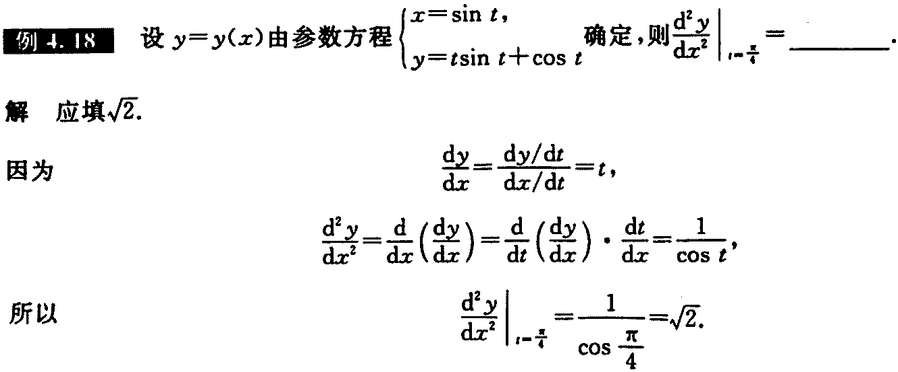

---

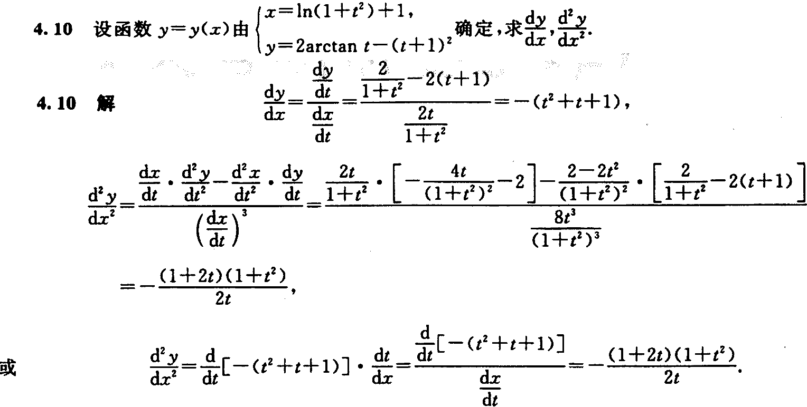

---

## 隐式数求导法

设函数 $y=y(x)$ 是由方程 $F(x,y)=0$ 确定的可导函数,则

> ①方程 $F(x,y)=0$ 两边对自变量 $x$ 求导，注意 $y=y(x)$ ，即将 $y$ 看作中间变量，得到一个关于 $y’$ 的方程②解该方程便可求出 $y’$ 

### 例题

---

---

## 对数求导法

对于多项相乘、相除、开方、乘方的式子，一般先取对数再求导。设 $y=f(x)(f(z)>0)$ ，则1

> ①等式两边取对数，得 $\ln y=\ln f(x)$ 
>
> ②两边对自变量 $x$ 求导(同样注意 $y=f(x)$ ,即将 $y$ 看作中间变量，得
> 
> $$
> \frac{1}{y}y'=[\ln f(x)]'\Rightarrow y'=\frac{yf'(x)}{f(x)}
> $$
### 例题

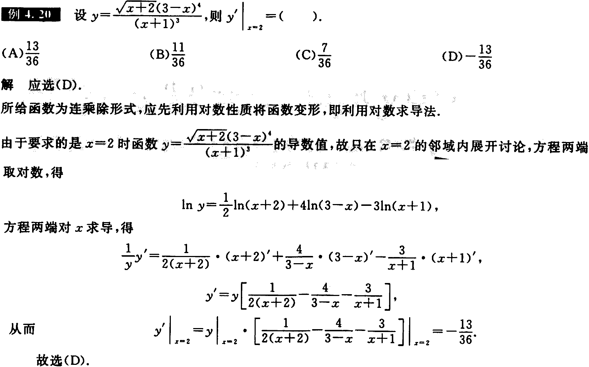

---

---

## 幂指函数求导法

对于 $u(x)^{v(x)}$ ( $u(x)\gt 0$ ，且 $u(x)$ 不恒为 $1$ )，除了用上面的对数求导法外，还可以先化成指数函数
$$
u(x)^{v(x)}=e^{v(x)\ln u(x)}
$$
然后求导，得
$$
[u(x)^{v(x)}]'=[e^{v(x)\ln u(x)}]'=u(x)^{v(x)}\bigg[v'(x)\ln u(x)+v(x)\cdot \frac{u'(x)}{u(x)}\bigg]
$$
### 例题

---

---

## 高阶导数

---

---

### 归纳法

逐次求导，探索规律，得出通式。

比如 ，设 $y=2^x$ ，则
$$
y'=2^x\ln 2,y''=2^x(\ln 2)^2,\cdots
$$
得出通式
$$
y^{(n)}=2^x(\ln 2)^n,n=0,1,2,\cdots
$$

---

---

### 莱布尼茨公式(高阶求导公式)

设 $u=u(x),v=v(x)$ ，均 $n$ 阶可导，则
$$
(u\pm v)^{(n)}=u^{(n)}\pm v^{(n)}\\
\begin{aligned}
(uv)^{(n)}&=u^{(n)}v+\textrm{C}_n^1u^{(n-1)}v'
+\textrm{C}_n^2u^{(n-2)}v''+\cdots+\textrm{C}_n^ku^{(n-k)}v^{(k)}
+\cdots+\textrm{C}_n^{n-1}u'v^{(n-1)}+uv^{(n)}\\
&=\sum_{k=0}^n\textrm{C}_n^ku^{(n-k)}v^{(k)}
\end{aligned}
$$
见到**两个函数乘积**的高阶导数，一般用莱布尼茨公式即可

**证明：**

---

---

### 泰勒公式

①任何一个无穷阶可导的函数(在收敛的条件下)都可写成 $y=f(x)=\underset{n=0}{\overset{\infty}{\sum}}\cfrac{f^{(n)}(x_0)}{n!}(x-x_0)^n$ ，或者
$$
y=f(x)=\sum_{n=0}^\infty\cfrac{f^{(n)}(0)}{n!}x^n
$$
②题目给出一个具体的无穷阶可导函数 $y=f(x)$ ，可以通过已知公式展开成幂级数。这些已知公式为
$$
e^x=\sum_{n=0}^\infty\frac{x^n}{n!}=1+x+\frac{x^2}{2!}+\cdots+\frac{x^n}{n!}+\cdots,
-\infty\lt x\lt +\infty\\
\frac{1}{1+x}=\sum_{n=0}^\infty(-1)^nx^n=1-x+x^2-x^3+\cdots+(-1)^nx^n+\cdots
,-1\lt x\lt 1\\
\frac{1}{1-x}=\sum_{n=0}^\infty x^n=1+x+x^2+x^3+\cdots+x^n+\cdots
,-1\lt x\lt 1\\
\ln (1+x)=\sum_{n=0}^\infty(-1)^{n-1}\frac{x^n}{n}=x-\frac{x^2}{2}+\frac{x^3}{3}-
\frac{x^4}{4}+\cdots+(-1)^{n-1}\frac{x^n}{n}+\cdots,-1\lt x\le1\\
\sin x=\sum_{n=0}^\infty(-1)^n\frac{x^{2n+1}}{(2n+1)!}=x-\frac{x^3}{3!}
+\frac{x^5}{5!}-\frac{x^7}{7!}+\cdots+(-1)^n\frac{x^{2n+1}}{(2n+1)!}
+\cdots,-\infty\lt x\lt-\infty\\
\cos x=\sum_{n=0}^\infty(-1)^n\frac{x^{2n}}{(2n)!}=1-\frac{x^2}{2!}
+\frac{x^4}{4!}-\frac{x^6}{6!}+\cdots+(-1)^n\frac{x^{2n}}{(2n)!}
+\cdots,-\infty\lt x\lt-\infty\\
(1+x)^\alpha=1+\alpha x+\frac{\alpha(\alpha-1)}{2!}x^2+\cdots
+\frac{\alpha(\alpha-1)\cdots(a-n+1)}{n!}x^n+\cdots,
\left\{\begin{matrix}
x\in(-1,1),&\alpha\le-1\\
x\in(-1,1],&-1\lt\alpha\lt0\\
x\in[-1,1],&\alpha\gt0且\alpha\not\in\mathbf{N}_+\\
x\in\mathbf{R},&a\in\mathbf{N}_+
\end{matrix}\right.
$$
③根据函数展开式的唯一性，比较①，②中 $(x-x_0)''$ 或 $x’’$ 的系数，就可以获得 $f^{(n)}(x_0)$ 或者 $f^{(n)}(0)$ 

---

---

### 例题

---

---

---

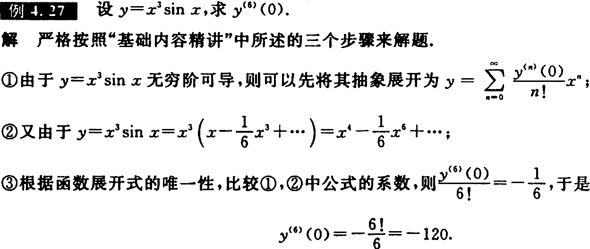

---

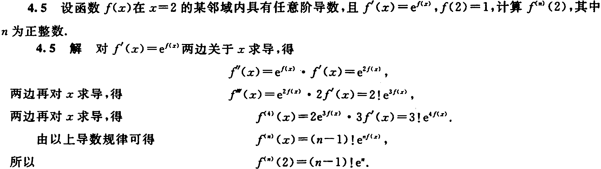

---

## 变限积分求导公式

设 $F(x)=\int_{\varphi_1(x)}^{\varphi_2(x)}f(t){\rm d}t$ ，其中 $f(x)$ 在 $[a,b]$ 上连续，可导函数 $\varphi_1(x)$ 和 $\varphi_2(x)$ 的值域在 $[a,b]$ 上，则函数 $\varphi_1(x)$ 和 $\varphi_2(x)$ 的公共定义域上，有
$$
F'(x)=\frac{{\rm d}}{{\rm d}x}\bigg[\int_{\varphi_1(x)}^{\varphi_2(x)}f(t)
{\rm d}t\bigg]=f[\varphi_2(x)]\varphi_2'(x)-f[\varphi_1(x)]\varphi_1'(X)
$$
---

## 基本求导公式
$$
(x^\alpha)'=\alpha x^{\alpha-1}(\alpha为常数),\quad(a^x)'=a^x\ln a(a\gt0,a\not=1),\quad
(e^x)'=e^x,\quad(\log_ax)'=\frac{1}{x\ln a}(a\gt0,a\not=1),\\
(\ln|x|)'=\frac{1}{x},\quad(\sin x)'=\cos x,\quad(\cos x)'
=-\sin x,(\arcsin x)'=\frac{1}{\sqrt{1-x^2}},\\
(\arccos x)'=-\frac{1}{\sqrt{1-x^2}},\quad(\tan x)'=\sec^2x,
\quad(\cot x)'=-\csc^2x,\quad
(\arctan x)'=\frac{1}{1+x^2},\\
({\rm arccot}\ x)'=-\frac{1}{1+x^2},\quad(\sec x)'=\sec x\tan x,\quad\
(\csc x)'=-\csc c\cot x,\\
[\ln(x+\sqrt{x^2+1})]'=\frac{1}{\sqrt{x^2+1}},\quad
[\ln(x+\sqrt{x^2-1})]'=\frac{1}{\sqrt{x^2-1}}
$$
# 例题

# 我的总结

| 小节             | 要点                             |
| ---------------- | -------------------------------- |
| 概念             | 使用导数和微分基础的定义进行推导 |
| 导数与微分的计算 | 要熟练使用各种求导公式和二阶求导 |

1. 极限的定义

	设函数 $f(x)$ 在点 $x_0$ 的某一去心邻域内有定义。若存在常数 $A$ ，对于任意给定的 $\epsilon\gt0$ (不论它多么小)，总存在正数 $\delta$ ，使得当 $0\lt|x-x_0|\lt\delta$ 时，对应的函数值 $f(x)$ 都满足不等式 $|f(x)-A|\lt\varepsilon$ ，则 $A$ 就叫作函数 $f(x)$ 当 $x\rightarrow x_0$ 时的极限，记为
	$$
	\lim_{x\rightarrow x_0}f(x)=A或f(x)\rightarrow A(x\rightarrow x_0)
	$$
	$\underset{x\rightarrow x_0}{\lim}f(x)$ 的理解
	
	1. 当 $x\rightarrow x_0$ 时函数 $f(x)$ 是否存在极限，与函数 $f(x)$ 在 $x=x_0$ 处是否有定义无关，因为并不要求考虑 $x=x_0$ 时函数 $f(x_0)$ 的值是多少
	2. 函数 $f(x)$ 在 $x_0$ 处存在极限的充要条件是 $f(x)$ 在 $x_0$ 处的左极限与右极限都存在且相等，即 $\underset{x\rightarrow x_0}{\lim}f(x)=a\Leftrightarrow\underset{x\rightarrow x_0^-}{\lim}f(x)=\underset{x\rightarrow x_0^+}{\lim}f(x)=a$
2. 连续的定义：

	设函数 $f(x)$ 在点 $x_0$ 的某一邻域内有定义（左右都有定义），且有 $\underset{x\rightarrow x_0}{\lim}f(x)=f(x_0)$ ，则称函数 $f(x)$ 在点 $x_0$ 处连续

	---

	如果函数 $f(x)$ 满足三个条件：

	1. 在 $x_0$ 处有定义
	2. 在 $x_0$ 处的极限存在
	3. 在 $x_0$ 处的极限值等于在 $x_0$ 处的函数值，即 $\underset{x\rightarrow x_0}{\lim}f(x)=f(x_0)$ 

	则 $f(x)$ 在 $x_0$ 处连续

3. 可微的定义

	设函数 $y=f(x)$ 在某区间内有定义， $x_0$ 及 $x_0+\Delta x$ 在这区间内，如果增量
	$$
	\Delta y=f(x_0+\Delta x)-f(x_0)
	$$
	可表示为
	$$
	\Delta y=A\Delta x+o(\Delta x)
	$$
	其中 $A$ 是不依赖于 $\Delta x$ 的常数，那么称函数 $y=f(x)$ 在点 $x_0$ 是可微的，而 $A\Delta x$ 叫做函数 $y= f(x)$ 在点 $x_0$ 。相应于自变量增量 $\Delta x$ 的微分，记作 ${\rm d} y$ ，即 ${\rm d}y=A\Delta x$ 

4. 可导的定义

	设 $y=f(x)$ 在点 $x_0$ 的某领域内有定义，如果极限
	$$
	f'(x_0)=\underset{\Delta x\rightarrow 0}{\lim}\cfrac{\Delta y}{\Delta x}=\underset{\Delta x\rightarrow 0}{\lim}\cfrac{f(x_0+\Delta x)-f(x_0)}{\Delta x}
	$$
	存在，则称 $f(x)$ 在点 $x_0$ 处可导，记作 $f'(x)$ 

	---

	函数 $f(x)$ 在 $x_0$ 处的导数 的理解

	1. 自变量 $x$ 在 $x_0$ 处的增量 $\Delta x$ 可正、可负，但不能为零
	2. 函数 $f(x)$ 在 $x_0$ 处连续是 $f(x)$ 在 $x_0$ 处可导的必要条件，但不是充分条件，例如 $y=|x|$ 

5. 可积的定义

	定理1：设 $f(x)$ 在区间 $[a, b]$ 上连续，则 $f(x)$ 在 $[a,b]$ 上可积
	定理2：设 $f(x)$ 在区间 $[a,b]$ 上有界，且只有有限个间断点，则 $f(x)$ 在 $[a,b]$ 上可积

6. 有界的定义

	设函数 $f(x)$ 在数集 $A$ 上有定义，如果存在常数 $M>0$ ，使得对任意 $x\in A$ ，有
	$$
	|f(x)|\le M
	$$
	则称函数在数集上有界，否则称为无界。

7. 之间的联系

	
