[书籍](./books/2023张宇数学基础30讲-高等数学分册.pdf#page=82)

# 极值与最值的概念

## 极值

**定义1** 若存在 $x_0$ 的**某个邻域**，使得在该邻域内任意一点 $x$ ，均有
$$
f(x)\le f(x_0)(或f(x)\ge f(x_0))
$$
成立，则称 $x$ 为 $f(x)$ 的**广义的极大值点**(或**极小值点**)， $f(x_0)$ 为 $f(x)$ 的**广义的极大值**(或**极小值**)。

**定义2** 若存在 $x_0$ 的**某个去心邻域**，使得对于该邻域内任一异于 $x_0$ 的点 $x$ ，均有
$$
f(x)\lt f(x_0)(或f(x)\gt f(x_0))
$$
成立，则称 $x_0$ 为 $f(x)$ 的**真正的极大值点**(或**极小值点**)， $f(x_0)$ 为 $f(x)$ 的**真正的极大值**(或**极小值**).

## 最值

**定义3** 设 $x_0$ 为 $f(x)$ **定义域**内一点，若对于 $f(x)$ 的定义域内任意一点 $x$ ，均有
$$
f(x)\le f(x_0)(或f(x)\ge f(x_0))
$$
成立，则称 $f(x_0)$ 为 $f(x)$ 的**广义的最大值**(或**最小值**)

**定义4** 设 $x_0$ 为 $f(x)$ **定义域**内一点，若对于 $f(x)$ 的定义域内任一异于 $x_0$ 的点 $x$ ，均有
$$
f(x)\lt f(x_0)(或f(x)\gt f(x_0))
$$
成立，则称 $f(x_0)$ 为 $f(x)$ 的**真正的最大值**(或**最小值**)

**注：**

**极值点并不一定是最值点，最值点也不一定是极值点**，间断点也可以是极值点

 $(1)f(x)=\left\{\begin{matrix}1,&x=0\\|x|,&x\not=0\end{matrix}\right.$  $x=0$ 是 $f(x)$ 的可去间断点，但它是 $f(x)$ 的极大值点

 $(2)f(x)=\left\{\begin{matrix}1,&x\gt0\\-x,&x\le0\end{matrix}\right.$  $x=0$ 是 $f(x)$ 的跳跃间断点，但它是 $f(x)$ 的极小值点

 $(3)f(x)=\left\{\begin{matrix}-1,&x=0\\ \frac{1}{x^2},&x\not=0\end{matrix}\right.$  $x=0$ 是 $f(x)$ 的无穷间断点，但它是 $f(x)$ 的极小值点

 $(4)f(x)=\left\{\begin{matrix}2,&x=0\\\sin\frac{1}{x},&x\not=0\end{matrix}\right.$  $x=0$ 是 $f(x)$ 的振荡间断点，但它是 $f(x)$ 的极大值点

# 单调性与极值的判别

## 单调性判别

用**导数**工具。若 $y=f(x)$ 在区间 $I$ 上有 $f’(x)>0$ ，则 $y=f(x)$ 在 $I$ 上严格**单调增加**；相应地，若 $y=f(x)$ 在区间 $I$ 上有 $f’(x)<0$ ，则 $y=f(x)$ 在 $I$ 上严格**单调减少**。

## 判极值的必要条件

设 $f(x)$ 在 $x=x_0$ 处可导，且在点 $x_0$ 处取得极值，则必有 $f’(x_0)=0$ 

## 判极值的第一充分条件

设 $f(x)$ 在 $x=x_0$ 处连续，且在 $x_0$ 的某去心邻域 $\overset{\circ}{U}(x_0,\delta)(\delta>0)$ 内可导

① 若 $x\in(x_0-\delta,x_0)$ 时， $f’(x)\lt0$ ，而 $x\in(x_0,x_0+\delta)$ 时， $f’(x)\gt0$ ，则 $f(x)$ 在 $x=x_0$ 处取得**极小值**

② 若 $x\in(x_0-\delta,x_0)$ 时， $f’(x)\gt0$ ，而 $x\in(x_0,x_0+\delta)$ 时， $f’(x)\lt0$ ，则 $f(x)$ 在 $x=x_0$ 处取得**极大值**

③ 若 $f’(x)$ 在 $(x_0-\delta,x_0)$ 和 $(x_0,x_0+\delta)$ 内不变号，则点 $x_0$ 不是极值点

## 判极值的第二充分条件

设 $f(x)$ 在 $x=x_0$ 处二阶可导，且 $f’(x)=0,f'’(x_0)\not=0$ 

① 若 $f’'(x_0)\lt0$ ，则 $f(x)$ 在 $x_0$ 处取得**极大值**

② 若 $f''(x_0)\gt0$ ，则 $f(x)$ 在 $x_0$ 处取得**极小值**

上述第二充分条件可以推广为第三充分条件

## 判极值的第三充分条件

设 $f(x)$ 在 $x$ 处 $n$ 阶可导，且 $f^{(m)}(x_0)=0(m=1,2,\cdots,n-1),f^{(n)}(x_0)\not=0(n\ge2)$ ，则

① 当 $n$ 为偶数且 $f^{(n)}(x_0)\lt0$ 时， $f(x)$ 在 $x_0$ 处取得**极大值**

② 当 $n$ 为偶数且 $f^{(n)}(x_0)\gt0$ 时， $f(x)$ 在 $x_0$ 处取得**极小值**

**证明：**

因为 $n$ 是偶数，所以令 $n=2k$ ，构造极限
$$
\lim_{x\rightarrow x_0}\frac{f(x)-f(x_0)}{(x-x_0)^{2k}}\overset{洛}{=}
\lim_{x\rightarrow x_0}\frac{f'(x)}{2k(x-x_0)^{2k-1}}\overset{洛}{=}\cdots
\overset{洛}{=}\lim_{x\rightarrow x_0}\frac{f^{(2k-1)}(x)}{(2k)!(x-x_0)}\\
=\lim_{x\rightarrow x_0}\frac{f^{(2k-1)}(x)-f^{(2k-1)}(x_0)}{(2k)!(x-x_0)}=
\frac{1}{(2k)!}f^{(2k)}(x_0)\not=0
$$
上述洛必达法则成立的依据是，最后的结果 $\cfrac{1}{(2k)!}f^{(2k)}(x_0)$ 是存在的

当 $f^{(2k)}(x_0)\lt0$ 时，由函数极限的局部保号性知，存在 $x_0$ 的某去心邻域，对于该邻域内的任意 $x$ ，因为 $\underset{x\rightarrow x_0}{\lim}\cfrac{f(x)-f(x_0)}{(x-x_0)^{2k}}\lt0$ ，所以有 $\cfrac{f(x)-f(x_0)}{(x-x_0)^{2k}}\lt0$ 然后得到 $f(x)\lt f(x_0)$ ， $x_0$ 比领域内的点都大，故 $x_0$ 为极大值点。

同理当 $f^{(2k)}(x_0)\gt0$ 时， $x_0$ 为极小值点。

**使用泰勒公式证明：**

根据泰勒展开式有
$$
f(x)=f(x_0)+f'(x_0)(x-x_0)+\cdots+\frac{f^{(n)}(x_0)}{n!}(x-x_0)^n+o(x-x_0)^n
$$
若 $f'(x_0)=f''(x_0)=\cdots=f^{(n-1)}(x_0)=0$ ，则 $f(x)=f(x_0)+\cfrac{f^{(n)}(x_0)}{n!}(x-x_0)^n+o(x-x_0)^n$ 

得到 $f(x)-f(x_0)=\cfrac{f^{(n)}(x_0)}{n!}(x-x_0)^n+o(x-x_0)^n$ 

当 $n$ 为偶数时，若 $f^{(n)}(x_0)\gt 0$ ，则 $f(x)-f(x_0)\gt 0$ ， $x_0$ 为极小值点

若 $f^{(n)}(x_0)\lt 0$ ，则 $f(x)-f(x_0)\lt 0$ ， $x_0$ 为极大值点

当 $n$ 为奇数 $x_0$ 两侧 $f(x)-f(x_0)$ 异号，不符合

# 凹凸性与拐点的概念

## 凹凸性

设函数 $f(x)$ 在区间 $I$ 上连续。如果对 $I$ 上任意不同两点 $x_1,x_2$ ，恒有
$$
f(\frac{x_1+x_2}{2})\lt\frac{f(x_1)+f(x_2)}{2}
$$
则称 $y= f(x)$ 在 $I$ 上的图形是**凹的**；如果恒有
$$
f(\frac{x_1+x_2}{2})\gt\frac{f(x_1)+f(x_2)}{2}
$$
则称 $y= f(x)$ 在 $I$ 上的图形是**凸的**

## 拐点

连续曲线的凹弧与凸弧的分界点称为该曲线的**拐点**

# 凹凸性与拐点的判别

## 凹凸性判别

设函数 $f(x)$ 在区间 $I$ 上二阶可导

① 若在 $I$ 上 $f’’(x)\gt0$ ，则 $f(x)$ 在 $I$ 上的图形是凹的

② 若在 $I$ 上 $f’’(x)\lt0$ ，则 $f(x)$ 在 $I$ 上的图形是凸的

## 判拐点的必要条件

设 $f’'(x_0)$ 存在，且点 $(x_0,f(x_0))$ 为曲线上的拐点，则 $f’'(x_0)=0$ 

## 判拐点的第一充分条件

设 $f(x)$ 在点 $x=x_0$ 处连续，在点 $x=x_0$ 的某去心邻域 $\overset{\circ}{U}(x,\delta)$ 内二阶导数存在，且在该点的左、右邻域内 $f’’(x)$ **变号**(无论是由正变负，还是由负变正)，则点 $(x_0,f(x_0))$ 为曲线上的**拐点**

注： $(x_0,f(x_0))$ 为曲线 $y=f(x)$ 上的拐点时，**并不要求 $f(x)$ 在点 $x_0$ 的导数存在**，如 $y=\sqrt[3]{x}$ 在 $x=0$ 的情形

## 判拐点的第二充分条件

设 $f(x)$ 在 $x=x_0$ 的某邻域内三阶可导，且 $f’’(x_0)=0,f’’'(x_0)\not=0$ ，则 $(x_0,f(x_0))$ 为**拐点**

## 判拐点的第三充分条件

设 $f(x)$ 在 $x_0$ 处 $n$ 阶可导，且 $f^{(m)}(x_0)=0(m=2,\cdots,n-1),f^{(n)}(x_0)\not=0(n\ge3)$ ，则当 $n$ 为奇数时， $(x_0,f(x_0))$ 为**拐点**

> 拐点求法：
>
> 1. 求 $f''(x)$ 
> 2. 令 $f''(x)=0$ ，解出方差在区间 $I$ 的实根，并求出在区间 $I$ 内 $f''(x)$ 不存在的点
> 3. 对求出的每一个实根或二阶导数不存在的点 $x_0$，检查 $f''(x)$ 在 $x_0$ 左右两侧邻近的符号，那么当两侧的符号相反时，点 $(x_0,f(x_0))$ 是拐点，当两侧的符号相同时，点 $(x_0,f(x_0))$ 不是拐点。

# 渐近线

## 铅锤渐近线

若 $\underset{x\rightarrow x_0^+}{\lim}f(x)=\infty$ (或 $\underset{x\rightarrow x_0^-}{\lim}f(x)=\infty$ )，则 $x=x_0$ 为一条铅垂渐近线

## 水平渐近线

若 $\underset{x\rightarrow+\infty}{\lim}f(x)=y_1$ ，则 $y=y_1$ 为一条水平渐近线；若 $\underset{x\rightarrow+\infty}{\lim}f(x)=y_2$ ,则 $y=y_2$ 为一条水平渐近线

## 斜渐近线

斜渐近线就是一条曲线和一条直线在 $x\rightarrow\infty$ 时无穷贴近，即 $\underset{x\rightarrow\infty}{\lim}[f(x)-(ax+b)]=0$ 所以 $\underset{x\rightarrow\infty}{\lim}\cfrac{[f(x)-(ax+b)]}{x}=0$ ，推出 $\underset{x\rightarrow\infty}{\lim}\cfrac{f(x)}{x}=a$ 。

根据上面推导可得：

若 $\underset{x\rightarrow+\infty}{\lim}\cfrac{f(x)}{x}=a_1,\underset{x\rightarrow+\infty}{\lim}[f(x)-a_1x]=b_1$ ，则 $y=a_1x+b_1$ 是曲线 $y=f(x)$ 的一条斜渐近线

若 $\underset{x\rightarrow-\infty}{\lim}\cfrac{f(x)}{x}=a_2,\underset{x\rightarrow-\infty}{\lim}[f(x)-a_2x]=b_2$ ，则 $y=a_2x+b_2$ 是曲线 $y=f(x)$ 的一条斜渐近线

# 最值或取值范围

## 在闭区间 $[a,b]$ 上求

① 求出 $f(x)$ 在 $(a,b)$ 内的可疑点——**驻点与不可导点**，并求出这些可疑点处的函数值

② 求出**端点的函数值** $f(a)$ 和 $f(b)$ 

③ 比较以上所求得的所有函数值，其中最大者为 $f(x)$ 在 $[a,b]$ 上的最大值 $M$ ，最小者为 $f(x)$ 在 $[a,b]$ 上的最小值 $m$ 

## 在开区间 $(a,b)$ 上求

① 求出 $f(x)$ 在 $(a,b)$ 内的可疑点——**驻点与不可导点**，并求出这些可疑点处的函数值

② 求 $(a,b)$ **两端的单侧极限**：若 $a,b$ 为有限常数，则求 $\underset{x\rightarrow a^+}{\lim}f(x)$ 与 $\underset{x\rightarrow b^-}{\lim}f(x)$ ；若 $a$ 为 $-\infty$ ，则求 $\underset{x\rightarrow-\infty}{\lim}f(x)$ ；若 $b$ 为 $+\infty$ ，则求 $\underset{x\rightarrow+\infty}{\lim}f(x)$ 。记以上所求左端极限为 $A$ ，右端极限为 $B$ 

③ 比较①，②所得结果，确定最值或取值范围

# 作函数图形

① 确定函数 $f(x)$ 的定义域，并考查它是否有**奇偶对称性**

② 求出 $f'(x)$ ， $f’’(x)$ ，用 **$f(x)$ 的无定义点**， **$f’(x)=0$ 的点**， **$f'(x)$ 不存在的点**， **$f’’(x)=0$ 的点**， **$f’’(x)$ 不存在的点**，将定义域划分为若干子区间，确定函数图形在各个子区间上的**单调性与凹凸性**，进而确定函数的**极值点和拐点**

③ **确定渐近线**(如果有的话)

④ 作出函数图形

# 例题

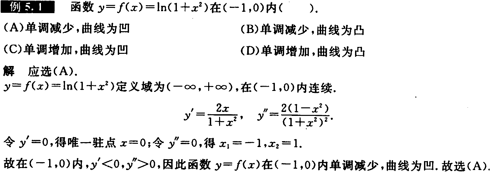

---

---

---

---

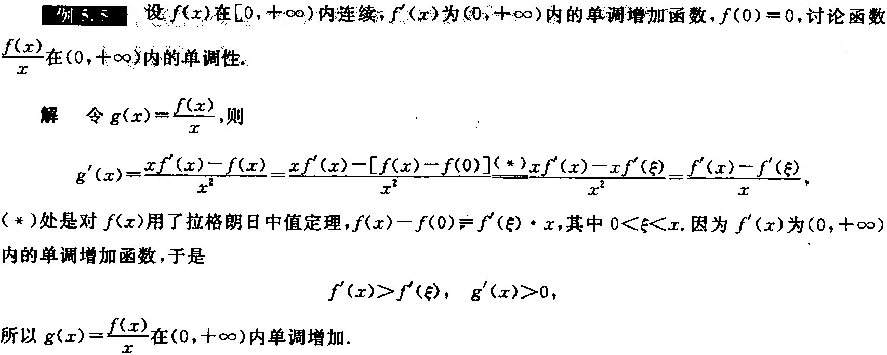

---

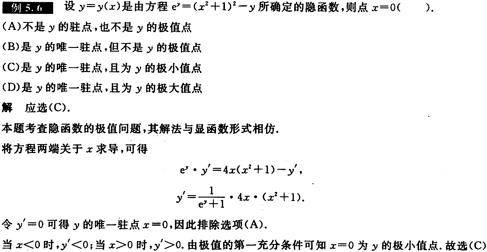

---

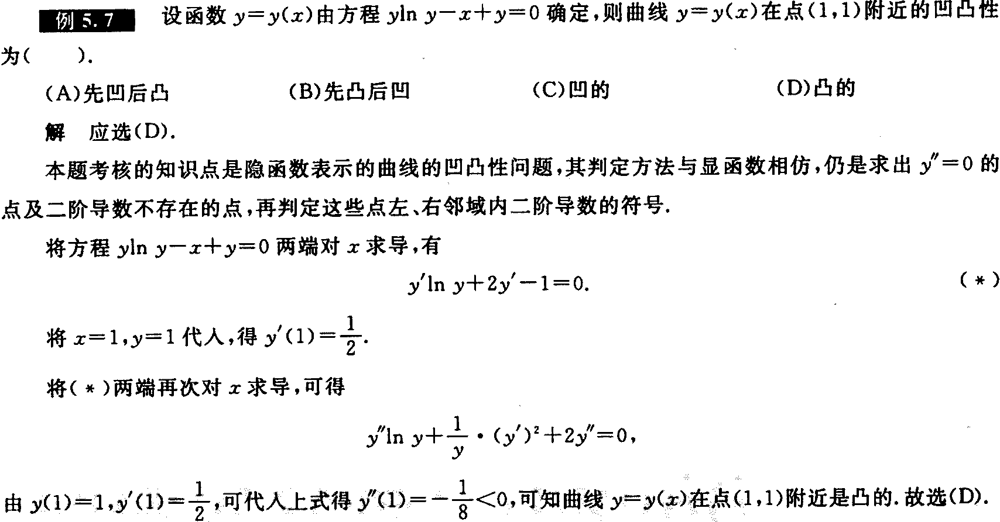

---

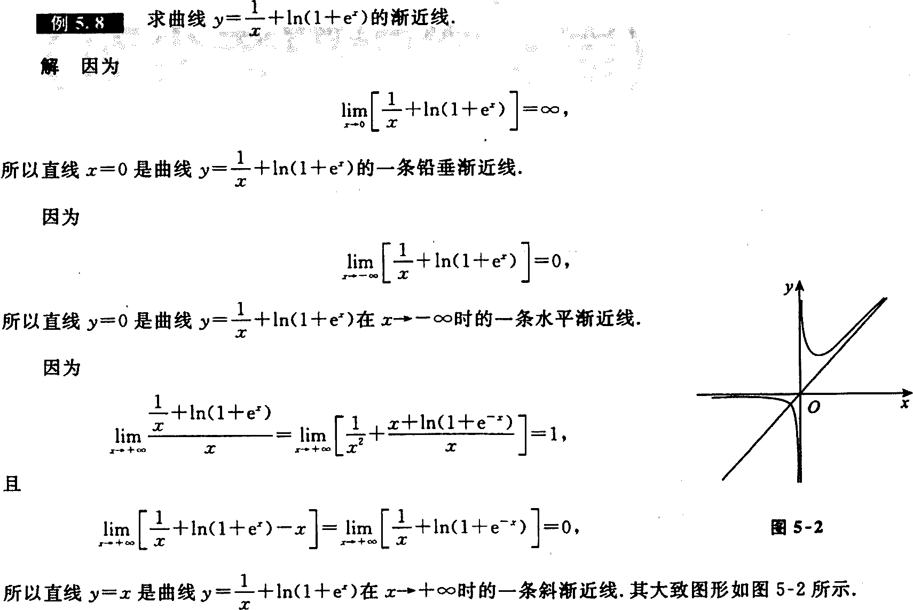

---

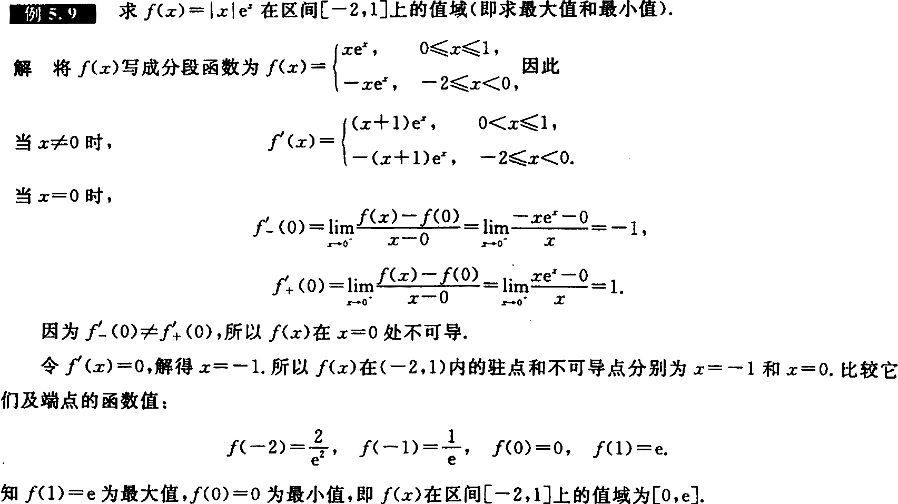

---

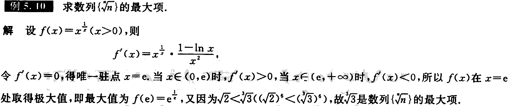

---

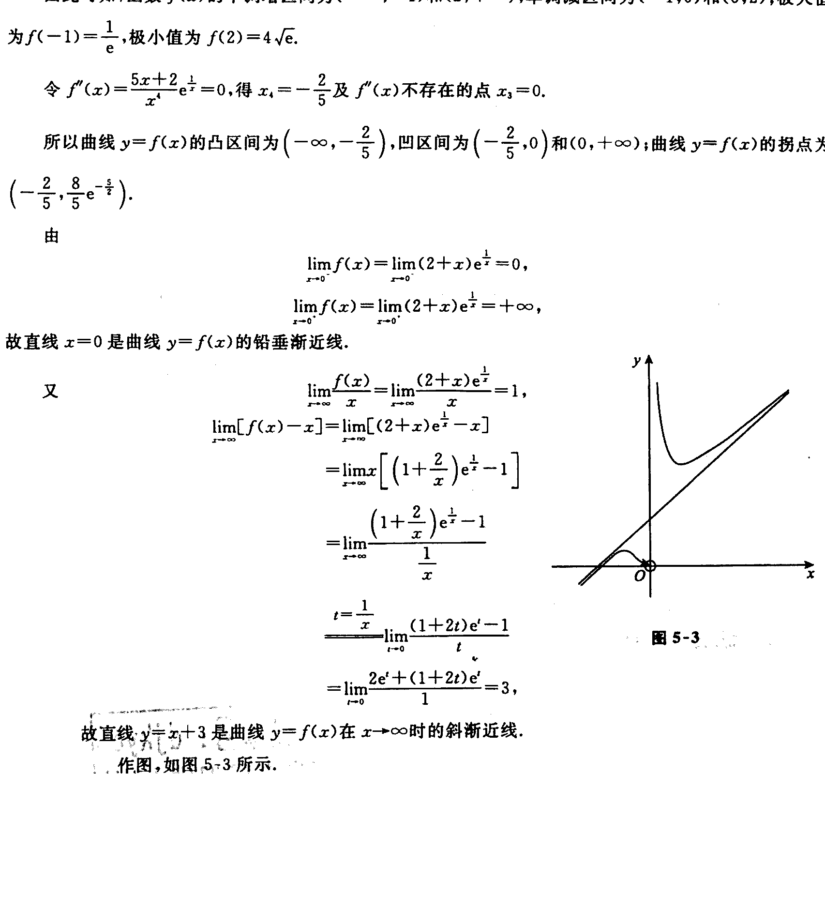

---

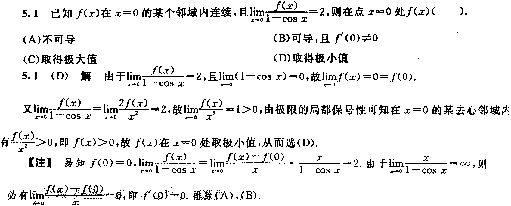

---

---

---

---

---

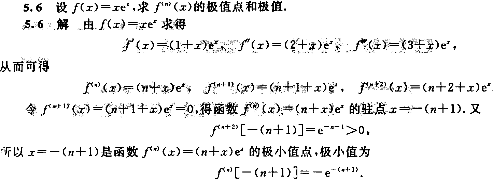

---

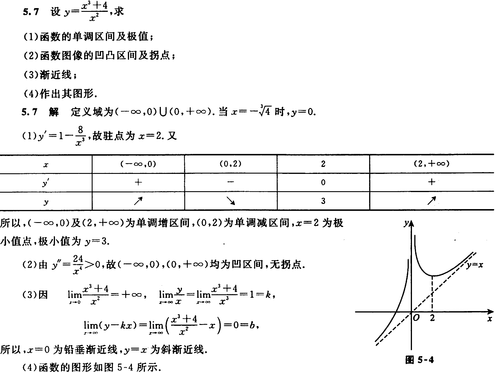

---

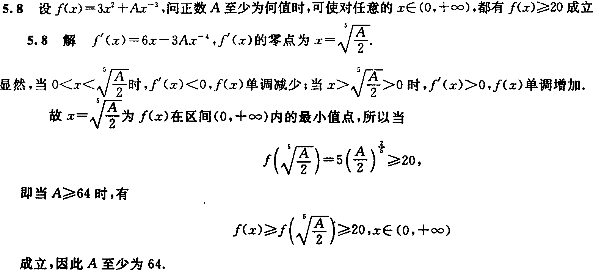

---

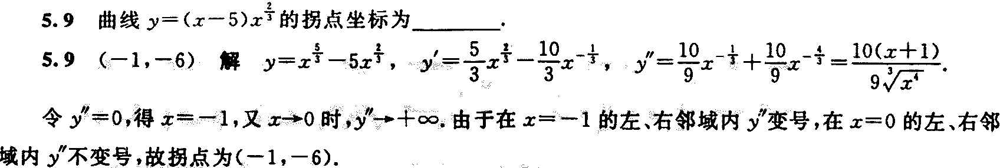

---

# 我的总结

| 小节               | 要点                                                         |
| ------------------ | ------------------------------------------------------------ |
| 极值与最值的概念   | 分清极值与最值                                               |
| 单调性与极值的判别 | 单调性的判别可以通过定义和导数两种方法；极值判别的一个必要三个充分 |
| 凹凸性与拐点的概念 | 凹凸性的定义和拐点的定义                                     |
| 凹凸性与拐点的判别 | 凹凸性的判别；拐点判别的一个必要三个充分                     |
| 渐近线             | 三种渐近线                                                   |
| 最值或取值范围     | 不同区间的求解方法                                           |
| 作函数图形         | 通过单调性、极值、凹凸性、拐点、渐近线等方法确定图像         |

