[书籍](./books/2023张宇数学基础30讲-高等数学分册.pdf#page=97)

# 涉及函数的中值定理

设 $f(x)$ 在 $[a,b]$ 上**连续**，则

## 定理1——有界与最值定理

 $m\le f(x)\le M$ ，其中， $m,M$ 分别为 $f(x)$ 在 $[a,b]$ 上的最大值与最小值

## 定理2——介值定理

当 $m\le\mu\le M$ 时，存在 $\xi\in[a,b]$ ，使得 $f(\xi)=\mu$ 

## 定理3——平均值定理

当 $a\lt x_1\lt x_2\lt\cdots\lt x_n\lt b$ 时，在 $[x_1,x_n]$ 内至少存在一点 $\xi$ ，使
$$
f(\xi)=\frac{f(x_1)+f(x_2)+\cdots+f(x_n)}{n}
$$

## 定理4——零点定理

当 $f(a)\cdot f(b)\lt0$ 时，存在 $\xi\in(a,b)$ ，使得 $f(\xi)=0$ 

# 涉及导数(微分)的中值定理

## 定理5——费马定理

设 $f(x)$ 满足在点 $x_0$ 处 $\left\{\begin{matrix}①可导\\②取极值\end{matrix}\right.$ ，则 $f'(x)=0$ 

**要求掌握证明：**

不妨假设 $f(x)$ 在点 $x_0$ 处取得极大值，则存在 $x_0$ 的邻域 $U(x_0)$ ，对任意的 $x\in U(x_0)$ ，都有 $\Delta f=f(x)-f(x_0)\le0$ ，于是根据导数的定义与极限的保号性，有
$$
f'_-(x_0)=\lim_{x\rightarrow x_0^-}\frac{f(x)-f(x_0)}{x-x_0}\ge0\\
f'_+(x_0)=\lim_{x\rightarrow x_0^+}\frac{f(x)-f(x_0)}{x-x_0}\le0
$$
又 $f(x)$ 在点 $x_0$ 处可导，于是 $f'_-(x_0)=f'_+(x_0)$ ，故 $f'(x_0)=0$ 

## 定理6——罗尔定理

设 $f(x)$ 满足 $\left\{\begin{matrix}①在[a,b]连续\\②在(a,b)内可导\\③f(a)=f(b)\end{matrix}\right.$ ，则存在 $\xi\in(a,b)$ ，使得 $f'(\xi)=0$ 

换句话说若函数在 $[a,b]$ 连续， $(a,b)$ 内可导且端点两值相同，则在 $(a,b)$ 之中存在极值

**证明：**

设区间最大值最小值分别为 $M,m$ 

若 $M=m$ ，那么说明这是一条直线 $f(x)=M$ ，因此对 $\forall \xi\in(a,b)$ 有 $f'(\xi)=0$ 

若 $M\neq m$ ，因为 $f(a)=f(b)$ 所以最大值 $M$ 与最小值 $m$ 至少有一个在 $(a,b)$ 内，因为**可导**，且为**极值**，根据费马定理在 $\xi\in(a,b)$ 有 $f'(\xi)=0$ 

**推广：**

(1) 设 $f(x)$ 在 $(a,b)$ 内可导， $\underset{x\rightarrow a^+}{\lim}f(x)=\underset{x\rightarrow b^-}{\lim}f(x)=A$ ，则在 $(a,b)$ 内至少存在一点 $\xi$ ，使 $f’(\xi)=0$ 

(2) 设 $f(x)$ 在 $(a,b)$ 内可导， $\underset{x\rightarrow a^+}{\lim}f(x)=\underset{x\rightarrow b^-}{\lim}f(x)=\pm\infty$ ，则在 $(a,b)$ 内至少存在一点 $\xi$ ，使 $f’(\xi)=0$ 

(3) 设 $f(x)$ 在 $(a,+\infty)$ 内可导， $\underset{x\rightarrow a^+}{\lim}f(x)=\underset{x\rightarrow+\infty}{\lim}f(x)=A$ ，则在 $(a,+\infty)$ 内至少存在一点 $\xi$ ，使 $f’(\xi)=0$ 

(4) 设 $f(x)$ 在 $(-\infty,+\infty)$ 内可导， $\underset{x\rightarrow-\infty}{\lim}f(x)=\underset{x\rightarrow+\infty}{\lim}f(x)=\pm\infty$ ，则在 $(-\infty,+\infty)$ 内至少存在一点 $\xi$ ，使 $f’(\xi)=0$ 

## 定理7——拉格朗日中值定理

设 $f(x)$ 满足 $\left\{\begin{matrix}①在[a,b]连续\\②在(a,b)内可导\end{matrix}\right.$ ，则存在 $\xi\in(a,b)$ ，使得
$$
f(a)-f(b) = f'(\xi)(b-a)
$$
或写成
$$
f'(\xi)=\frac{f(b)-f(a)}{b-a}
$$

**理解**：

其中 $\cfrac{f(b)-f(a)}{b-a}$ 可以看做是 $a,b$ 两个端点构成直线的**斜率 $k$** ，那么就在 $(a,b)$ 内存在一点 $\xi$ ，这个点的切线和 $k$ 相同

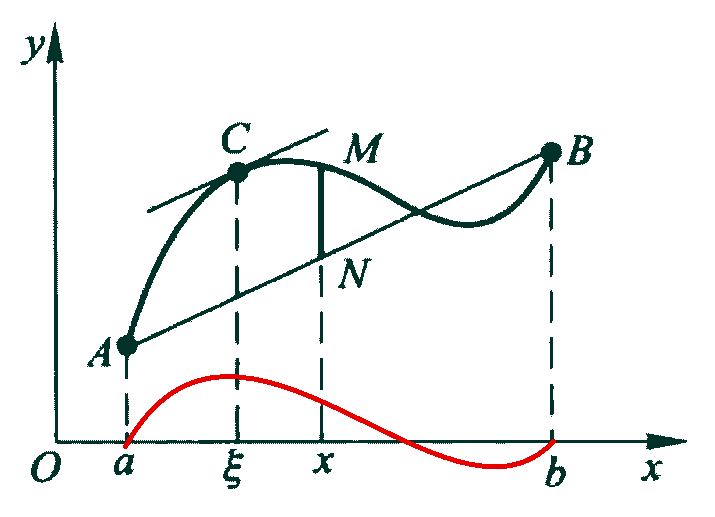

其中**罗尔定理**是拉格朗日中值定理的特殊形式，当 $f(a)=f(b)$ 时， $f’(\xi)=\cfrac{0}{b-a}=0$ 

- 通过图解**证明：**

以上面的图为例，使用罗尔定理证明拉格朗日中值定理。罗尔定理要求 $f(a)=f(b)$ ，所以需要构造一个与 $f(x)$ 有联系的辅助函数 $\varphi(x)$ ，使其满足  $\varphi(a)=\varphi(b)$ ，从上图可以看出直线 $AB$ 和函数 $f(x)$ 有密切关系，函数 $f(x)$ 上的点 $M$ 和直线 $AB$ 上的点 $N$ 在 $x$ 值相同时的有向线段 $NM$ ，可以表示成关于 $x$ 的函数 $\varphi(x)$ ，且 $\varphi(a)=\varphi(b)=0$ 。求得直线方程：
$$
L(x)=f(a)+\frac{f(b)-f(a)}{b-a}(x-a)
$$
函数 $f(x)$ 和 $L(x)$ 做差：
$$
\varphi(x)=f(x)-L(x)=f(x)-f(a)-\frac{f(b)-f(a)}{b-a}(x-a)
$$
得到的函数图像类似于图像红色线段，函数 $\varphi(x)$ 上的 $f(x)$ 在 $[a,b]$ 连续，在 $(a,b)$ 内可导，其他均为常数，所以 $\varphi(x)$ 在 $[a,b]$ 连续，在 $(a,b)$ 内可导，且 $\varphi(a)=\varphi(b)=0$ 。由罗尔定理可得存在 $\xi\in(a,b)$ ，使得 $\varphi'(\xi)=0$ 
$$
\begin{aligned}
&\varphi'(\xi)=f'(\xi)-\frac{f(b)-f(a)}{b-a}=0\\
\Rightarrow&f'(\xi)=\frac{f(b)-f(a)}{b-a}
\end{aligned}
$$

- 直接**证明：**

要证明 $f'(\xi)=\cfrac{f(b)-f(a)}{b-a}$ 成立，即证明 $f'(\xi)-\cfrac{f(b)-f(a)}{b-a}=0$ 成立，若设函数
$$
\varphi(x)=f(x)-\frac{f(b)-f(a)}{b-a}x
$$
即要证明 $\varphi'(\xi)=f'(\xi)-\cfrac{f(b)-f(a)}{b-a}=0$ ，于是想到罗尔定理，验证左右两端点相等
$$
\varphi(a)=\frac{bf(a)-af(b)}{b-a}=\varphi(b)
$$
显然可导，于是有
$$
\varphi'(\xi)=f'(\xi)-\frac{f(b)-f(a)}{b-a}=0
$$
证得
$$
f'(\xi)=\frac{f(b)-f(a)}{b-a}
$$

## 定理8——柯西中值定理

设 $f(x),g(x)$ 满足 $\left\{\begin{matrix}①在[a,b]连续\\②在(a,b)内可导\\③g'(x)\not=0\end{matrix}\right.$ ，则存在 $\xi\in(a,b)$ ，使得
$$
\frac{f(b)-f(a)}{g(b)-g(a)}=\frac{f'(\xi)}{g'(\xi)}
$$

**证明：**

这个证明和拉格朗日中值定理的第二证明类似
$$
\frac{f(b)-f(a)}{g(b)-g(a)}=\frac{f'(\xi)}{g'(\xi)}\\
\Rightarrow f'(\xi)-\frac{f(b)-f(a)}{g(b)-g(a)}g'(\xi)=0
$$
若设函数
$$
\varphi(x)=f(x)-\frac{f(b)-f(a)}{g(b)-g(a)}g(x)
$$
即要证明 $\varphi'(x)=f'(x)-\cfrac{f(b)-f(a)}{g(b)-g(a)}g'(x)=0$ ，使用罗尔定理证明，验证左右两端点相等
$$
\varphi(a)=\frac{[g(b)-g(a)]f(a)-[f(b)-f(a)]g(a)}{g(b)-g(a)}=
\frac{g(b)f(a)-g(a)f(b)}{g(b)-g(a)}\\
\varphi(b)=\frac{[g(b)-g(a)]f(b)-[f(b)-f(a)]g(b)}{g(b)-g(a)}=
\frac{g(b)f(a)-g(a)f(b)}{g(b)-g(a)}
$$
所以 $\varphi(a)=\varphi(b)$ ，显然函数 $\varphi(x)$ 在 $[a,b]$ 上连续，在开区间 $(a,b)$ 上可导，根据罗尔定理，存在 $\xi\in(a,b)$ ，使得
$$
\varphi'(\xi)=f'(\xi)-\frac{f(b)-f(a)}{g(b)-g(a)}g'(\xi)=0
$$
证得
$$
\frac{f(b)-f(a)}{g(b)-g(a)}=\frac{f'(\xi)}{g'(\xi)}
$$

## 定理9——泰勒公式

- 带拉格朗日余项的 $n$ 阶泰勒公式

设 $f(x)$ 在点 $x_0$ 的某个邻域内 $n+1$ 阶导数存在，则对该邻域内的任意点 $x$ ，有
$$
f(x)=f(x_0)+f'(x_0)(x-x_0)+\cdots+\frac{1}{n!}f^{(n)(x_0)}(x-x_0)^n+
\frac{f^{(n+1)}(\xi)}{(n+1)!}(x-x_0)^{n+1}
$$
其中 $\xi$ 介于 $x,x_0$ 之间

- 带佩亚诺余项的 $n$ 阶泰勒公式

设 $f(x)$ 在点 $x_0$ 处 $n$ 阶可导，则存在 $x_0$ 的一个邻域，对于该邻域内的任意点 $x$ ，有
$$
f(x)=f(x_0)+f'(x_0)(x-x_0)+\frac{1}{2!}f''(x_0)(x-x_0)^2+\cdots+\frac{1}{n!}
f^{(n)}(x_0)(x-x_0)^n+o((x-x_0)^n)
$$

**注**

- 当 $x_0=0$ 时的泰勒公式称为**麦克劳林公式**

(1) $f(x)=f(0)+f'(0)x+\cfrac{f''(0)}{2!}x^2+\cdots+\cfrac{f^{(n)}(0)}{n!}x^n+\cfrac{f^{(n+1)}(\xi)}{(n+1)!}x^{n+1}$ ，其中 $\xi$ 介于 $0$ 和 $x$ 之间

(2) $f(x)=f(0)+f'(0)x+\cfrac{f''(0)}{2!}x^2+\cdots+\cfrac{f^{(n)}(0)}{n!}x^n+o(x^n)$ 

- 几个重要函数的麦克劳林展开式

(1) $e^x=1+x+\cfrac{1}{2!}x^2+\cdots+\frac{1}{n!}x^n+o(x^n)$ 

(2) $\sin x=x-\cfrac{1}{3!}x^3+\cdots+(-1)^n\cfrac{x^{2n+1}}{(2n+1)!}+o(x^{2n+1})$ 

(3) $\cos x=1-\cfrac{x^2}{2!}+\cfrac{x^4}{4!}-\cdots+(-1)^n\cfrac{x^{2n}}{(2n)!}+o(x^{2n})$ 

(4) $\cfrac{1}{1-x}=1+x+x^2+\cdots+x^n+o(x^n)$ 

(5) $\cfrac{1}{1+x}=1-x+x^2-\cdots+(-1)^nx^n+o(x^n)$ 

(6) $\ln(1+x)=x-\cfrac{x^2}{2}+\cfrac{x^3}{3}-\cdots+(-1)^{n-1}\cfrac{x^n}{n}+o(x^n)$ 

(7) $(1+x)^\alpha=1+\alpha x+\cfrac{\alpha(\alpha-1)}{2!}x^2+\cdots+\cfrac{\alpha(\alpha-1)\cdots(\alpha-n+1)}{n!}+o(x^n)$ 

**泰勒公式推导：**

设 $f(x)$ 在 $x_0$ 处具有 $n$ 阶导数，试找出一个关于 $(x-x_0)$ 的 $n$ 次多项式
$$
P_n(x)=a_0+a_1(x-x_0)+a_2(x-x_0)^2+\cdots+a_n(x-x_0)^n\approx f(x)
$$
来近似表达 $f(x)$ ，要求使得 $P_n(x)$ 与 $f(x)$ 之差是 $(x-x_0)^n$ 高阶的无穷小

首先 $f(x_0)=P_n(x_0)$ 表明两个函数过同一点 $(x_0,f(x_0))$

$f'(x_0)=P_n'(x_0)$ 表明两个函数在 $x_0$ 处相切

$f''(x_0)=P_n''(x_0)$ 表明两个函数在 $x_0$ 处凹凸性相同

$\vdots$

$f^{(n)}(x_0)=P_n^{(n)}(x_0))$ 

计算：
$$
\begin{aligned}
&f(x_0)=P_n(x_0)&\Leftrightarrow&\quad f(x_0)=a_0\\
&f'(x_0)=P_n'(x_0)&\Leftrightarrow&\quad f'(x_0)=a_1+2a_2(x-x_0)+\cdots+na_n(x-x_0)^{n-1}\big|_{x=x_0}=a_1\\
&f''(x_0)=P_n''(x_0)&\Leftrightarrow&\quad f''(x_0)=2a_2+3\cdot2\cdot a_3(x-x_0)+\cdots+n(n-1)a_n(x-x_0)^{n-2}=2!a_2\\
&\vdots\\
&f^{(n)}(x_0)=P_n^{(n)}(x0)&\Leftrightarrow&\quad f^{(n)}(x_0)=n!a_n
\end{aligned}
$$
将所有 $a_n$ 代入到 $P_n$ 有
$$
P_n(x)=f(x_0)+f'(x_0)(x-x_0)+\frac{f''(x_0)}{2!}(x-x_0)^2+\frac{f'''(x_0)}{3!}(x-x_0)^3+\cdots+\frac{f^{(n)}(x_0)}{n!}(x-x_0)^n
$$
**误差的研究**

记 $f(x)$ 与 $P_n(x)$ 之间的误差为 $R_n(x)$ ，即
$$
f(x)-P_n(x)=R_n(x)
$$
设 $f(x)$ 在 $x_0$ 的某领域 $U(x_0)$ 内有 $n+1$ 阶导数，则
$$
R_n(x)=\frac{f^{(n+1)}(\xi)}{(n+1)!}(x-x_0)^{n+1}
$$
$\xi$ 在 $x_0$ 与 $x$ 之间

证明：

由条件 $f^{(i)}(x_0)=P_n^{(i)}(x_0)$ 其中 $i$ 为 $0$ 到 $n$ 的整数得
$$
R_n(x_0)=R_n'(x_0)=\cdots=R_n^{(n)}(x_0)=0
$$
对两个函数 $R_n(x)$ 和 $(x-x_0)^{n+1}$ 使用柯西中值定理
$$
\frac{R_n(x)}{(x-x_0)^{n+1}}=\frac{R_n(x)-R_n(x_0)}{(x-x_0)^{n+1}-(x_0-x_0)^{n+1}}
=\frac{R_n'(\xi_1)}{(n+1)(\xi_1-x_0)^n}(\xi_1在x_0与x之间)
$$
然后在 $\xi_1$ 和 $x_0$ 为端点再使用柯西中值定理得
$$
\frac{R_n'(\xi_1)}{(n+1)(\xi_1-x_0)^n}=\frac{R_n'(\xi_1)-R_n'(x_0)}{(n+1)(\xi_1-x_0)^n-(n+1)(x_0-x_0)^n}=\frac{R_n''(\xi_2)}{(n+1)n(\xi_2-x_0)^{n-1}}(\xi_2在x_0与\xi_1之间)
$$
经过 $n+1$ 次后
$$
\frac{R_n(x)}{(x-x_0)^{n+1}}=\frac{R_n^{(n+1)}(\xi)}{(x+1)!}(\xi在x_0与\xi_n之间，所以也在x_0与x之间)
$$
而 $R_n^{(n+1)}(x)=(f(x)-P_n(x))^{(n+1)}=f^{(n+1)}(x)-P_n^{(n+1)}(x)=f^{(n+1)}(x)$ ，由上式得
$$
R_n(x)=\frac{f^{(n+1)}(\xi)(x-x_0)^{n+1}}{(x+1)!}
$$
**误差的研究总结**

如果函数在 $f(x)$ 在 $x_0$ 的某个领域 $U(x_0)$ 内具有 $(n+1)$ 阶导数，则 $\forall x\in U(x_0)$ 有
$$
f(x)=f(x_0)+f'(x_0)(x-x_0)+\frac{f''(x_0)}{2!}(x-x_0)^2+\cdots+\frac{f^{(n)}(x_0)}{n!}(x-x_0)^n+R_n(x)
$$
其中 $R_n(x)=\cfrac{f^{(n+1)}(\xi)(x-x_0)^{n+1}}{(x+1)!}$ ， $\xi$ 位于 $x_0$ 与 $x$ 之间，这个公式被称为**带拉格朗日余项的 $n$ 阶泰勒公式**

**误差估计**

设 $f^{(x+1)}(x)$ 在 $U(x_0)$ 中有界，即 $\exist M,|f^{(n+1)}|\le M$ 则
$$
|R_n(x)|\le\frac{|f^{(n+1)}(\xi)|}{(n+1)!}|x-x_0|^{n+1}\le\frac{M}{(n+1)!}|x-x_0|^{n+1}
$$
其中
$$
\frac{\frac{M}{(n+1)!}|x-x_0|^{n+1}}{(x-x_0)^n}=\frac{M}{(n+1)!}|x-x_0|=0
$$
所以
$$
R_n(x)=o((x-x_0)^n)
$$
**误差估计总结**

如果函数在 $f(x)$ 在 $x_0$ 处具有 $n$ 阶导数，那么存在 $x_0$ 的一个领域 $U(x_0)$ ，$\forall x\in U(x_0)$ 有：
$$
f(x)=f(x_0)+f'(x_0)(x-x_0)+\frac{f''(x_0)}{2!}(x-x_0)^2+\cdots+\frac{f^{(n)}(x_0)}{n!}(x-x_0)^n+R_n(x)
$$
其中 $R_n(x)=o((x-x_0)^n)$ ，这个公式被称为 $f(x)$ 在 $x=x_0$ 处的**佩亚诺型余项**

**特殊情况**

当 $n=0$ 时(0阶泰勒公式)，得

$f(x)=f(x_0)+R_n(x)=f(x_0)+f'(\xi)(x-x_0)\Rightarrow f(x)-f(x_0)=f'(x)(x-x_0)$ 

正好得到拉格朗日中值定理。

**总结**

泰勒公式本质是**用 $n$ 次多项式去拟合原函数**， **$x_0$ 代表在这点进行来拟合原函数**，如果在 $x_0=0$ 处展开，那么就是以 $x=0$ 这个点开始向两边拟合。[任意点的函数值，都可用同一点泰勒展开去估计吗](https://blog.csdn.net/weixin_42031518/article/details/98086668)

拉格朗日余项的泰勒公式是描述整体，皮亚诺余项的泰勒公式描述局部。

# 涉及积分的中值定理

## 定理10——积分中值定理

设 $f(x)$ 在 $[a,b]$ 上连续，证明存在 $\xi\in[a,b]$ ，使得
$$
\int_{a}^{b}f(x){\rm d}x=f(\xi)(b-a)
$$
**证明**

因为 $f(x)$ 在 $[a,b]$ 上连续，所以 $f(x)$ 在 $[a,b]$ 上存在最大值 $M$ 与最小值 $m$ ，使得
$$
m(b-a)\le\int_a^bf(x){\rm d}x\le M(b-a)
$$
所以
$$
m\le\frac{1}{b-a}\int_a^bf(x){\rm d}x\le M
$$
由介值定理可知，存在 $\xi\in[a,b]$ ，使得 $f(\xi)=\cfrac{1}{b-a}\int_a^bf(x){\rm d}x$ ，得证

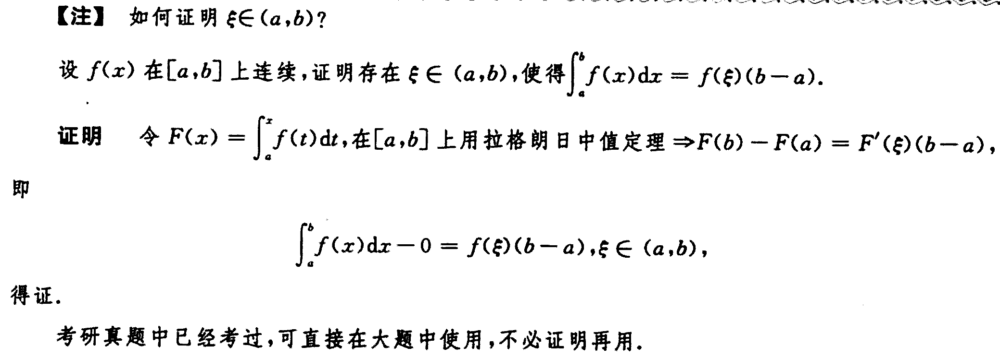

# 例题

## 介值定理的使用

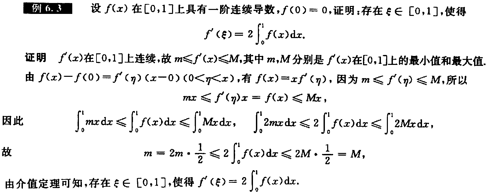

## 罗尔定理的使用

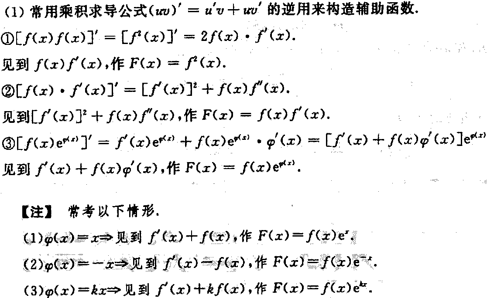

---

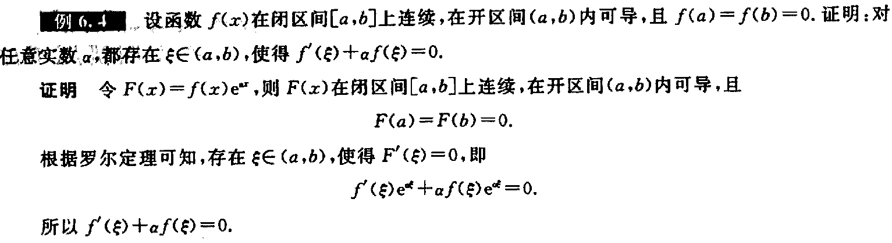

---

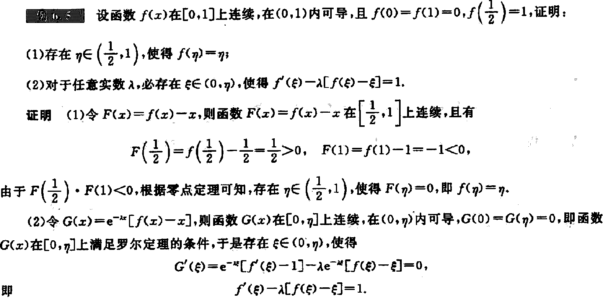

---

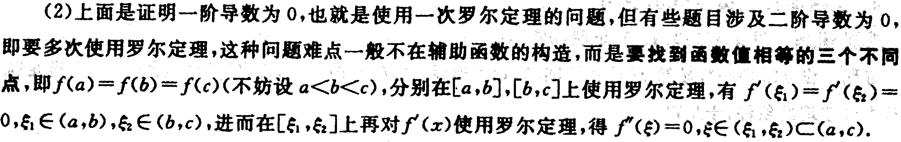

---

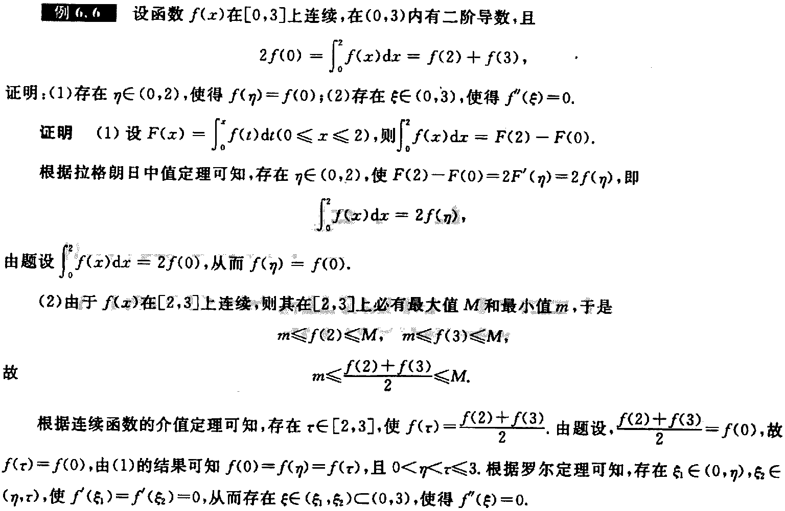

---

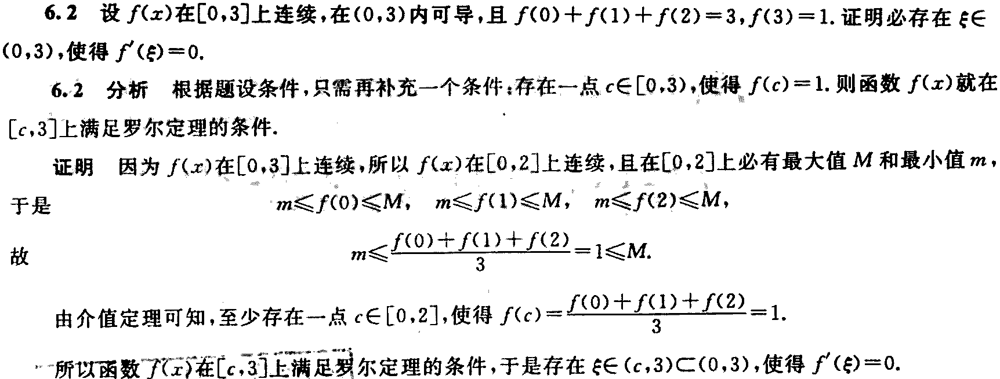

---

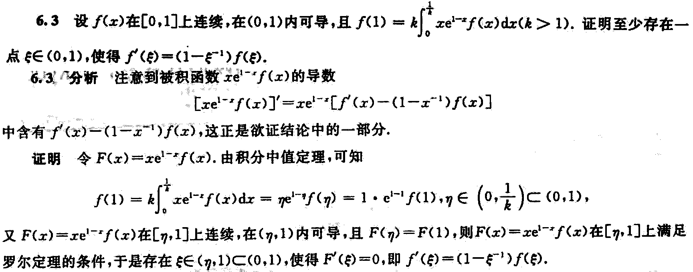

---

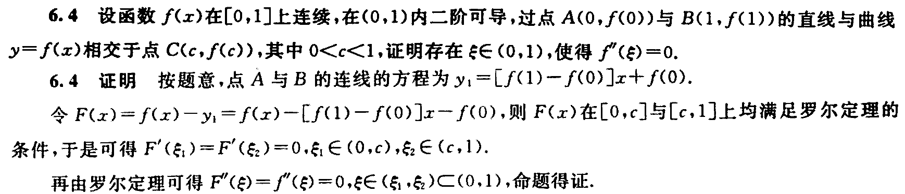

## 费马定理的使用

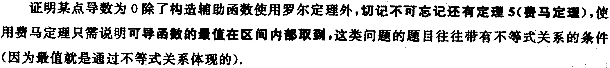

---

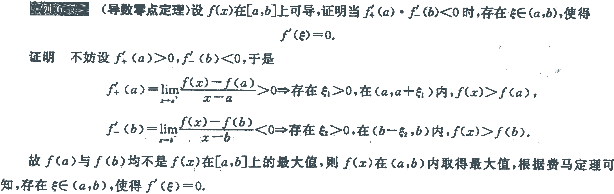

---

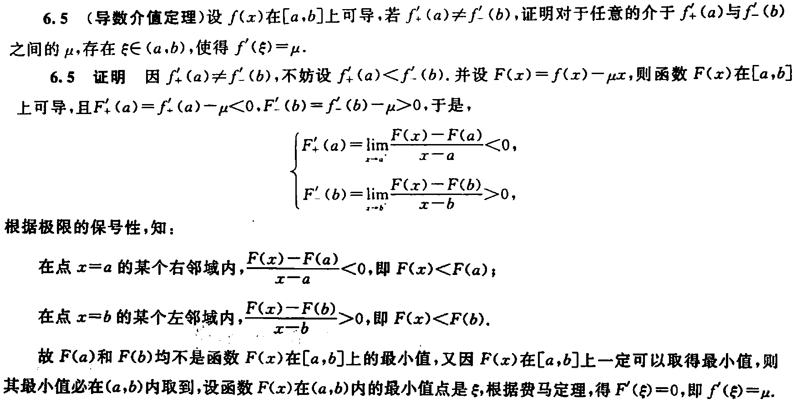

---

## 拉格朗日中值定理的使用

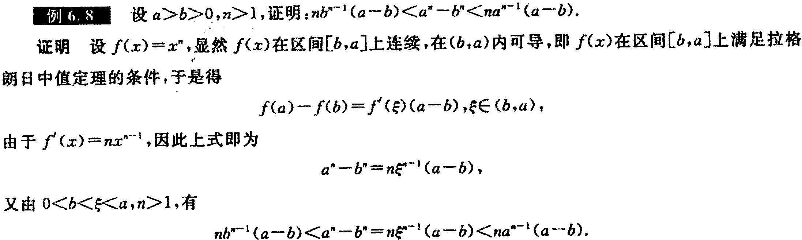

---

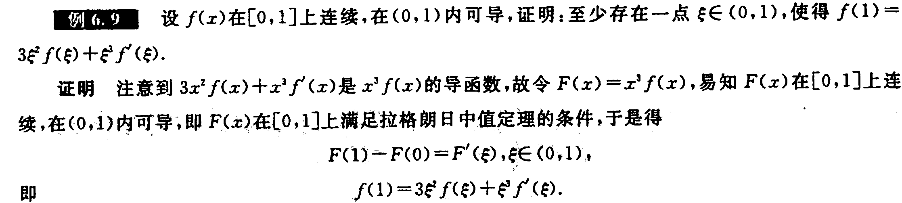

---

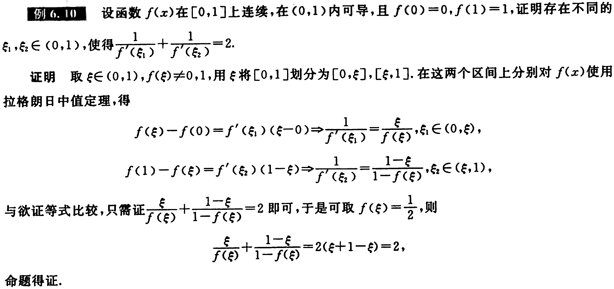

---

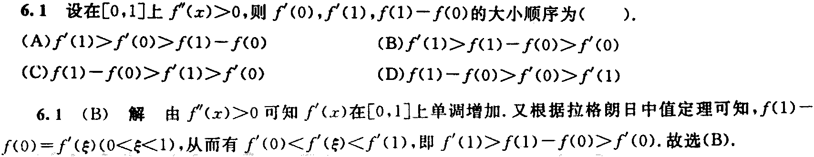

---

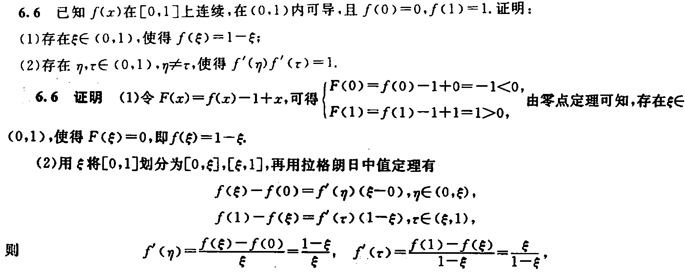

---

## 柯西中值定理的使用

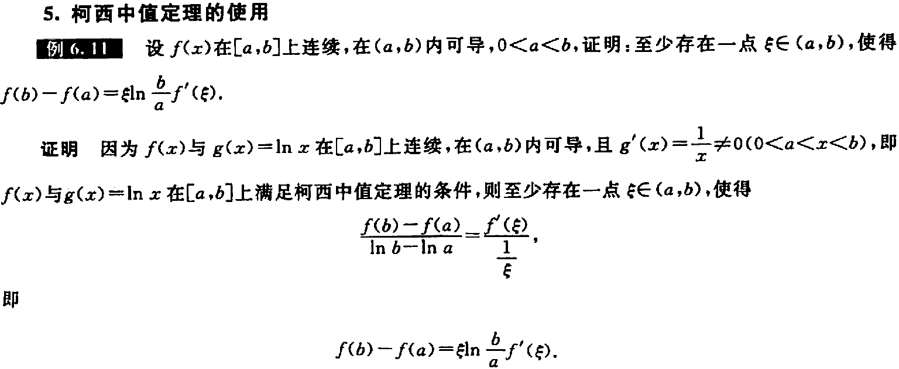

---

## 泰勒公式的使用

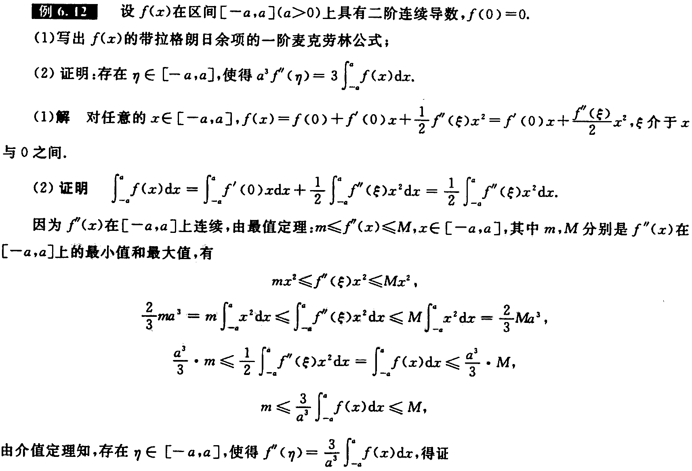

---

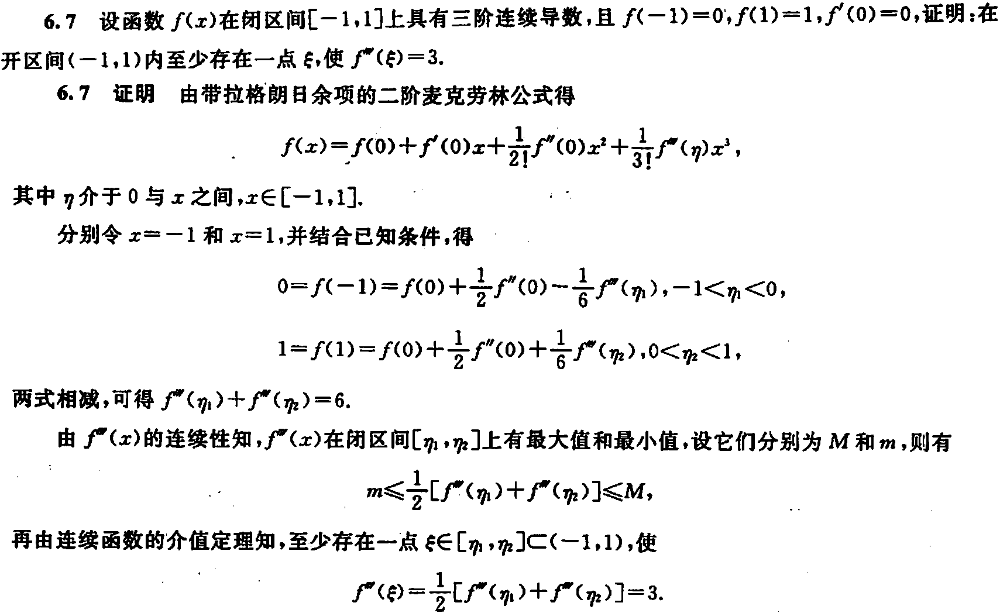

---

# 总结

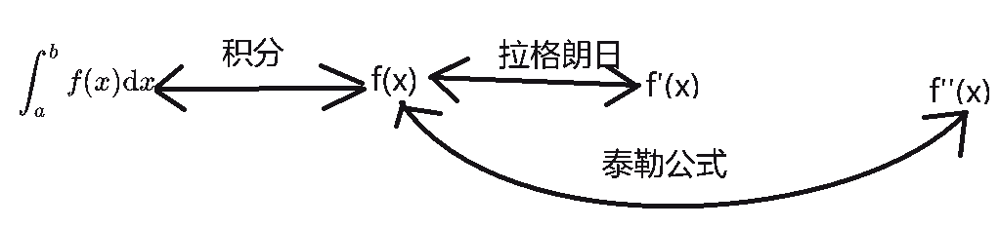

