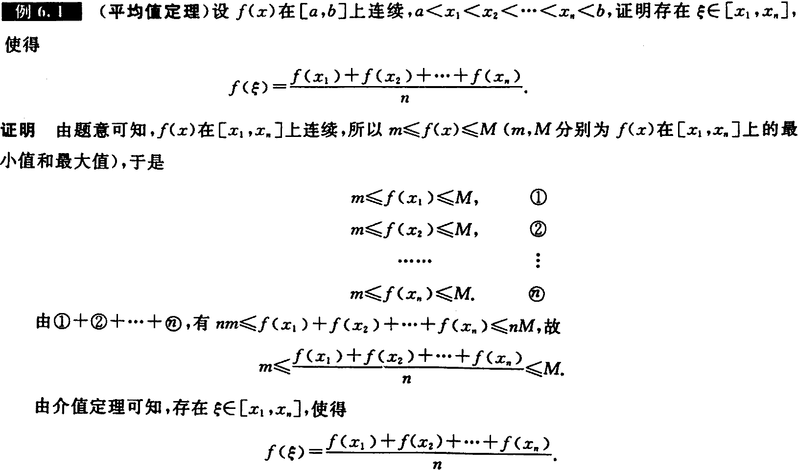

[书籍](./books/2023张宇数学基础30讲-高等数学分册.pdf#page=97)

# 涉及函数的中值定理

设 $f(x)$ 在 $[a,b]$ 上**连续**，则

---

## 定理1——有界与最值定理

 $m\le f(x)\le M$ ，其中， $m,M$ 分别为 $f(x)$ 在 $[a,b]$ 上的最大值与最小值

---

## 定理2——介值定理

当 $m\le\mu\le M$ 时，存在 $\xi\in[a,b]$ ，使得 $f(\xi)=\mu$ 

---

## 定理3——平均值定理

当 $a\lt x_1\lt x_2\lt\cdots\lt x_n\lt b$ 时，在 $[x_1,x_n]$ 内至少存在一点 $\xi$ ，使
$$
f(\xi)=\frac{f(x_1)+f(x_2)+\cdots+f(x_n)}{n}
$$

---

## 定理4——零点定理

当 $f(a)\cdot f(b)\lt0$ 时，存在 $\xi\in(a,b)$ ，使得 $f(\xi)=0$ 

# 涉及导数(微分)的中值定理

---

## 定理5——费马定理

设 $f(x)$ 满足在点 $x_0$ 处 $\left\{\begin{matrix}①可导\\②取极值\end{matrix}\right.$ ，则 $f'(x)=0$ 

**证明：**

[^123]:好的

不妨假设 $f(x)$ 在点 $x_0$ 处取得极大值，则存在 $x_0$ 的邻域 $U(x_0)$ ，对任意的 $x\in U(x_0)$ ，都有 $\Delta f=f(x)-f(x_0)\le0$ ，于是根据导数的定义与极限的保号性，有
$$
f'_-(x_0)=\lim_{x\rightarrow x_0^-}\frac{f(x)-f(x_0)}{x-x_0}\ge0\\
f'_+(x_0)=\lim_{x\rightarrow x_0^+}\frac{f(x)-f(x_0)}{x-x_0}\le0
$$
又 $f(x)$ 在点 $x_0$ 处可导，于是 $f'_-(x_0)=f'_+(x_0)$ ，故 $f'(x_0)=0$ 

---

## 定理6——罗尔定理

设 $f(x)$ 满足 $\left\{\begin{matrix}①在[a,b]连续\\②在(a,b)内可导\\③f(a)=f(b)\end{matrix}\right.$ ，则存在 $\xi\in(a,b)$ ，使得 $f'(\xi)=0$ 

换成人话就是若 $f(a)=f(b)$ 则他们之中存在极值。

**证明：**

设区间最大值最小值分别为 $M,m$ ，因为 $f(a)=f(b)$ 所以最大值 $M$ 与最小值 $m$ 至少有一个在 $(a,b)$ 内，因为可导，且为极值，根据费马定理可得 $f'(\xi)=0$ 

**推广：**

(1) 设 $f(x)$ 在 $(a,b)$ 内可导， $\underset{x\rightarrow a^+}{\lim}f(x)=\underset{x\rightarrow b^-}{\lim}f(x)=A$ ，则在 $(a,b)$ 内至少存在一点 $\xi$ ，使 $f’(\xi)=0$ 

(2) 设 $f(x)$ 在 $(a,b)$ 内可导， $\underset{x\rightarrow a^+}{\lim}f(x)=\underset{x\rightarrow b^-}{\lim}f(x)=\pm\infty$ ，则在 $(a,b)$ 内至少存在一点 $\xi$ ，使 $f’(\xi)=0$ 

(3) 设 $f(x)$ 在 $(a,+\infty)$ 内可导， $\underset{x\rightarrow a^+}{\lim}f(x)=\underset{x\rightarrow+\infty}{\lim}f(x)=A$ ，则在 $(a,+\infty)$ 内至少存在一点 $\xi$ ，使 $f’(\xi)=0$ 

(4) 设 $f(x)$ 在 $(-\infty,+\infty)$ 内可导， $\underset{x\rightarrow-\infty}{\lim}f(x)=\underset{x\rightarrow+\infty}{\lim}f(x)=\pm\infty$ ，则在 $(-\infty,+\infty)$ 内至少存在一点 $\xi$ ，使 $f’(\xi)=0$ 

---

## 定理7——拉格朗日中值定理

设 $f(x)$ 满足 $\left\{\begin{matrix}①在[a,b]连续\\②在(a,b)内可导\end{matrix}\right.$ ，则存在 $\xi\in(a,b)$ ，使得
$$
f(a)-f(b) = f'(\xi)(b-a)
$$
或写成
$$
f'(\xi)=\frac{f(b)-f(a)}{b-a}
$$

---

## 定理8——柯西中值定理

设 $f(x),g(x)$ 满足 $\left\{\begin{matrix}①在[a,b]连续\\②在(a,b)内可导\\③g'(x)\not=0\end{matrix}\right.$ ，则存在 $\xi\in(a,b)$ ，使得
$$
\frac{f(b)-f(a)}{g(b)-g(a)}=\frac{f'(\xi)}{g'(x)}
$$

---

## 定理9——泰勒公式

(1) 带拉格朗日余项的 $n$ 阶泰勒公式

设 $f(x)$ 在点 $x_0$ 的某个邻域内 $n+1$ 阶导数存在，则对该邻域内的任意点 $x$ ，有
$$
f(x)=f(x_0)+f'(x_0)(x-x_0)+\cdots+\frac{1}{n!}f^{(n)(x_0)}(x-x_0)^n+
\frac{f^{(n+1)}(\xi)}{(n+1)!}(x-x_0)^{n+1}
$$
其中 $\xi$ 介于 $x,x_0$ 之间

(2) 带佩亚诺余项的 $n$ 阶泰勒公式

设 $f(x)$ 在点 $x_0$ 处 $n$ 阶可导，则存在 $x_0$ 的一个邻域，对于该邻域内的任意点 $x$ ，有
$$
f(x)=f(x_0)+f'(x_0)(x-x_0)+\frac{1}{2!}f''(x_0)(x-x_0)^2+\cdots+\frac{1}{n!}
f^{(n)}(x_0)(x-x_0)^n+o((x-x_0)^n)
$$

**注**

当 $x_0=0$ 时的泰勒公式称为**麦克劳林公式**

(1) $f(x)=f(0)+f'(0)x+\cfrac{f''(0)}{2!}x^2+\cdots+\cfrac{f^{(n)}(0)}{n!}x^n+\cfrac{f^{(n+1)}(\xi)}{(n+1)!}x^{n+1}$ ，其中 $\xi$ 介于 $0$ 和 $x$ 之间

(2) $f(x)=f(0)+f'(0)x+\cfrac{f''(0)}{2!}x^2+\cdots+\cfrac{f^{(n)}(0)}{n!}x^n+o(x^n)$ 

几个重要函数的麦克劳林展开式

(1) $e^x=1+x+\cfrac{1}{2!}x^2+\cdots+\frac{1}{n!}x^n+o(x^n)$ 

(2) $\sin x=x-\cfrac{1}{3!}x^3+\cdots+(-1)^n\cfrac{x^{2n+1}}{(2n+1)!}+o(x^{2n+1})$ 

(3) $\cos x=1-\cfrac{x^2}{2!}+\cfrac{x^4}{4!}-\cdots+(-1)^n\cfrac{x^{2n}}{(2n)!}+o(x^{2n})$ 

(4) $\cfrac{1}{1-x}=1+x+x^2+\cdots+x^n+o(x^n)$ 

(5) $\cfrac{1}{1+x}=1-x+x^2-\cdots+(-1)^nx^n+o(x^n)$ 

(6) $\ln(1+x)=x-\cfrac{x^2}{2}+\cfrac{x^3}{3}-\cdots+(-1)^{n-1}\cfrac{x^n}{n}+o(x^n)$ 

(7) $(1+x)^\alpha=1+\alpha x+\cfrac{\alpha(\alpha-1)}{2!}x^2+\cdots+\cfrac{\alpha(\alpha-1)\cdots(\alpha-n+1)}{n!}+o(x^n)$ 

# 涉及积分的中值定理

---

## 定理10——积分中值定理

设 $f(x)$ 在 $[a,b]$ 上连续，证明存在 $\xi\in[a,b]$ ，使得
$$
\int_{a}^{b}f(x){\rm d}x=f(\xi)(b-a)
$$
**证明**

因为 $f(x)$ 在 $[a,b]$ 上连续，所以 $f(x)$ 在 $[a,b]$ 上存在最大值 $M$ 与最小值 $m$ ，使得
$$
m(b-a)\le\int_a^bf(x){\rm d}x\le M(b-a)
$$
所以
$$
m\le\frac{1}{b-a}\int_a^bf(x){\rm d}x\le M
$$
由介值定理可知，存在 $\xi\in[a,b]$ ，使得 $f(\xi)=\cfrac{1}{b-a}\int_a^bf(x){\rm d}x$ ，得证
