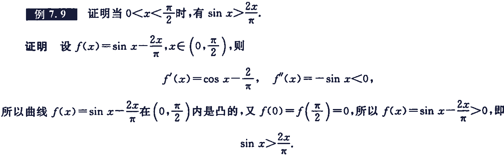

[书籍](./books/2023张宇数学基础30讲-高等数学分册.pdf#page=107)

# 零点问题

## 零点定理(证根存在性)

若 $f(x)$ 在 $[a,b]$ 上连续，且 $f(a)f(b)\lt0$ ，则 $f(x)=0$ 在 $(a,b)$ 内至少有一个根

**注**

推广的零点定理：若 $f(x)$ 在 $(a,b)$ 内连续， $\underset{x\rightarrow a^+}{\lim}f(x)=\alpha,\underset{x\rightarrow b^-}{\lim}f(x)=\beta$ ，且 $\alpha\cdot\beta\lt0$ ，则 $f(x)=0$ 在 $(a,b)$ 内至少有一个根，这里 $a,b,\alpha,\beta$ 可以是有限数，也可以是无穷大

### 例题

## 单调性(证根唯一性)

若 $f(x)$ 在 $(a,b)$ 内单调，则 $f(x)=0$ 在 $(a,b)$ 内至多有一个根，这里 $a,b$ 可以是有限数，也可以是无穷大

### 例题

## 罗尔原话

若 $f’^{(n)}(x)=0$ 至多有 $k$ 个根，则 $f(x)=0$ 至多有 $k+n$ 个根

### 例题

---

---

## 实系数奇次方程至少有一个实根

### 例题

---

---

---

上面的几题中有些题目在导数中含有未知数，有些不含，在不含未知数的题目中在结论时讨论未知数，含有未知数在求导过程中就需要讨论

---

# 微分不等式

## 用函数性态证明不等式

一般地，使用如下依据

- 若有 $f’(x)\ge0,a<x<b$ ，则有 $f(a)\le f(x)\le f(b)$ 
- 若有 $f''(x)\ge0,a<x<b$ ，则有 $f’(a)\le f’(x)\le f’(b)$ 
	- 当 $f'(a)>0$ 时， $f'(x)>0\Rightarrow f(x)$ 单调增加
	- 当 $f’(b)<0$ 时， $f'(x)<0\Rightarrow f(x)$ 单调减少
- 设 $f(x)$ 在 $I$ 内连续，且有唯一的极值点 $x_0$ ，则 $\left\{\begin{matrix}当x_0为极大值点时，f(x_0)\ge f(x),\\当x_0为极小值点时，f(x_0)\le f(x),\end{matrix}\right.\forall x\in I$ 
- 若有 $f’’(x)\gt0$ ， $a<x<b$ ， $f(a)=f(b)=0$ ，则有 $f(x)<0$ 

## 用常数变量化证明不等式

如果欲证的不等式中都是常数，则可以将其中一个或者几个常数变量化，再利用上面所述的导数工具去证明

## 用中值定理证明不等式

主要用拉格朗日中值定理或者泰勒公式

## 例题

---

---

---

---

---

---

---

---

---

---

