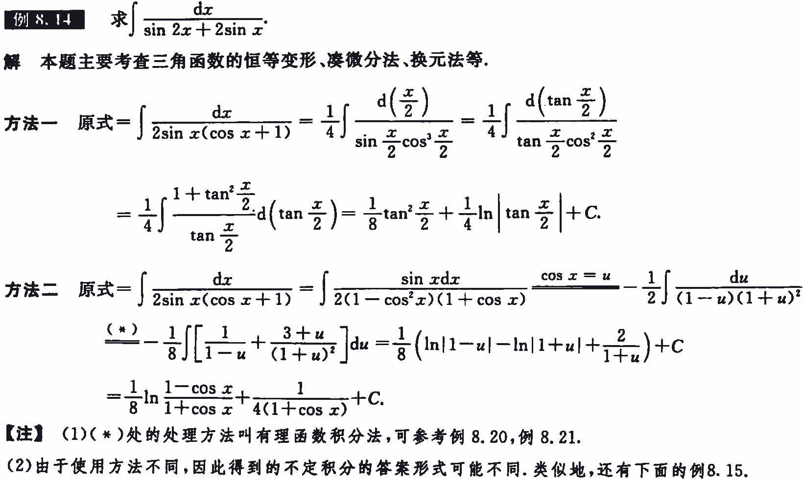
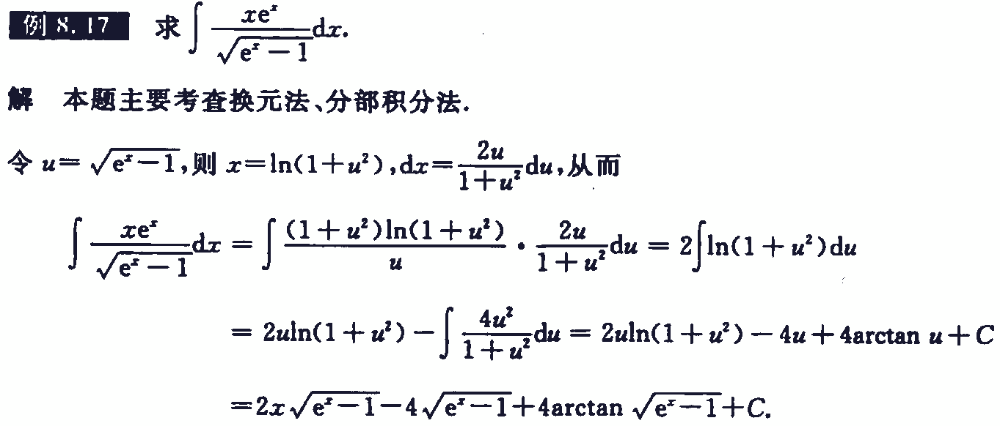
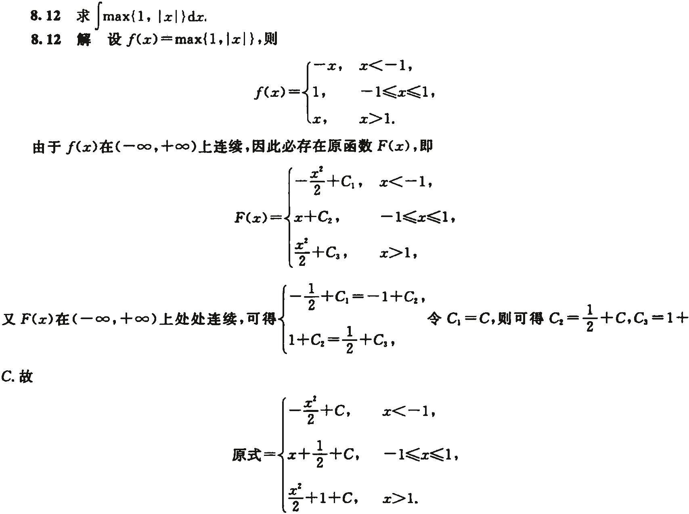

[书籍](./books/2023张宇数学基础30讲-高等数学分册.pdf#page=116)

# 概念

## 不定积分

### 原函数与不定积分

设函数 $f(x)$ 定义在某区间 $I$ 上，若存在可导函数 $F(x)$ ，对于该区间上任意一点都有 $F’(x)=f(x)$ 成立，则称 $F(x)$ 是 $f(x)$ 在区间 $I$ 上的一个**原函数**，称 $\int f(x){\rm d}x=F(x)+C$ 为 $f(x)$ 在区间 $I$ 上的**不定积分**

**注**
谈到函数 $f(x)$ 的原函数与不定积分，必须指明 $f(x)$ 所定义的区间

### 原函数(不定积分)存在定

- **连续函数 $f(x)$ 必有原函数 $F(x)$** 

证：如果函数 $f(x)$ 在 $[a,b]$ 上连续，则函数 $F(x)=\int_a^xf(t){\rm d}t$ 在 $[a,b]$ 上可导，且 $F’(x)=f(x)$ 

**证明**

若 $x\in(a,b)$ ，取 $\Delta x$ 使 $x+\Delta x\in(a,b)$ ，则
$$
\begin{aligned}
\Delta F&=F(x+\Delta x)-F(x)=\int_a^{x+\Delta x}f(t){\rm d}t-\int_a^{x}f(t){\rm d}t\\
&=\int_a^{x}f(t){\rm d}t+\int_x^{x+\Delta x}f(t){\rm d}t-\int_a^{x}f(t){\rm d}t=\int_x^{x+\Delta x}f(t){\rm d}t
\end{aligned}
$$
使用积分中值定理，有 $\int_{x}^{x+\Delta x}f(t){\rm d}t=f(\xi)\Delta x$ ，其中 $\xi$ 介于 $x$ 与 $x+\Delta x$ 之间，当 $\Delta x\rightarrow0$ 时， $\xi\rightarrow x$ 于是 $\Delta F=f(\xi)\Delta x$ ，得到
$$
F'(x)=\lim_{\Delta x\rightarrow0}\frac{\Delta F}{\Delta x}=\lim_{\Delta x\rightarrow0}f(\xi)=\lim_{\xi\rightarrow x}f(\xi)=f(x)
$$
若 $x=a$ ，取 $\Delta x>0$ ，则同理可证 $F_+^{'}(a)= f(a)$ ；若 $x=b$ ，取 $\Delta\lt0$ ，则同理可证 $F_-^{’}(b)=f(b)$ 

- **含有第一类间断点和无穷间断点的函数 $f(x)$ 在包含该间断点的区间内必没有原函数 $F(x)$** 

设 $F(x)$ 为 $f(x)$ 在 $I$ 内的一个原函数，则 $F(x)$ 在 $I$ 内可导，且 $F'(x)=f(x)$ ，并设 $x=x_0\in I$ 为 $F'(x)$ 的间断点，我们讨论如下三种情况:

**证明**

1.  $x=x_0$ 为可去间断点，即 $\displaystyle\lim_{x\rightarrow x_0}F'(x)$ 存在且为 $A$ ，但 $A\neq F’(x_0)$ ，而
	$$
	F'(x_0)=\lim_{x\rightarrow x_0}\frac{F(x)-F(x_0)}{x-x_0}\overset{洛}{=}\lim_{x\rightarrow x_0}F'(x)=A
	$$
	矛盾

2.  $x=x_0$ 为跳跃间断点，即 $\displaystyle\lim_{x\rightarrow x_0^+}F'(x)$ 存在且为 $A_+$ ， $\displaystyle\lim_{x\rightarrow x_0^-}F'(x)$ 存在且为 $A_-$ ，但 $A_+\neq A_-$ ，而
	$$
	F'_+(x_0)=\lim_{x\rightarrow x_0^+}\frac{F(x)-F(x_0)}{x-x_0}\overset{洛}{=}\lim_{x\rightarrow x_0^+}F'(x)=A_+\\
	F'_-(x_0)=\lim_{x\rightarrow x_0^-}\frac{F(x)-F(x_0)}{x-x_0}\overset{洛}{=}\lim_{x\rightarrow x_0^-}F'(x)=A_-
	$$
	又 $F'(x_0)$ 是存在的，则 $F’_+(x_0)=F’_-(x_0)$ ，即 $A_+=A_-$ ，矛盾

3.  $x=x_0$ 为无穷间断点，即 $\displaystyle\lim_{x\rightarrow x_0}F'(x)=\infty$ ，而
	$$
	F'(x_0)=\lim_{x\rightarrow x_0}\frac{F(x)-F(x_0)}{x-x_0}\overset{洛}{=}\lim_{x\rightarrow x_0}F'(x)=\infty
	$$
	
	又 $F'(x_0)$ 是存在的，矛盾。

---

含有振荡间断点的函数是否有原函数呢？举例说来，对于
$$
f(x)=\left\{\begin{matrix}
\begin{aligned}
&2x\sin\frac{1}{x}-\cos\frac{1}{x},&x\neq0\\
&0,&0
\end{aligned}
\end{matrix}\right.
$$
其在 $(-\infty,+\infty)$ 上不连续,它有一个振荡间断点 $x=0$ ，但是它在 $(-\infty,+\infty)$ 上存在原函数
$$
f(x)=\left\{\begin{matrix}
\begin{aligned}
&x^2\sin\frac{1}{x},&x\neq0\\
&0,&0
\end{aligned}
\end{matrix}\right.
$$

即对于 $(-\infty,+\infty)$ 上任一点都有 $F’(x)=f(x)$ 成立

当然，对于
$$
f(x)=\left\{\begin{matrix}
\begin{aligned}
&\frac{1}{x}\sin\frac{1}{x},&x\neq0\\
&0,&0
\end{aligned}
\end{matrix}\right.
$$
其在 $(-\infty,+\infty)$ 上也有一个振荡间断点 $x=0$ ，且其在 $(-\infty,+\infty)$ 上没有原函数

综合以上几点，可以得出重要结论：可导函数 $F(x)$ 求导后的函数 $F’(x)=f(x)$ 不一定是连续函数，但是如果有间断点，一定是第二类间断点(在考研的范畴内，**只能是振荡间断点**)

## 定积分

### 定积分的概念

若函数 $f(x)$ 在区间 $[a,b]$ 上有界，在 $(a,b)$ 上任取 $n-1$ 个分点 $x_i(i=1,2,3\cdots,n一1)$ ，定义 $x=a$ 和 $x=b$ ，且 $a=x_0<x_1<x_2<x_3<\cdots<x_{n_1}<x_n=b$ ,记 $\Delta x_k=x_k-x_{k-1},k=1,2,3,\cdots,n$ 。并任取一点： $\xi_k\in[x_{k-1},x_k]$ ，记 $\lambda=\underset{1\le k\le n}{max}{\Delta x_k}$ ，若当 $\lambda\rightarrow0$ 时，极限 $\underset{\lambda\rightarrow0}{\lim}\underset{k=1}{\overset{n}{\sum}}f(\xi_k)\Delta x_k$ 存在且与分点 $x_i$ 及点 $\xi_k$ 的取法无关，则称函数 $f(x)$ 在区间 $[a,b]上$ 可积，即
$$
\int_a^bf(x){\rm d}x=\lim_{\lambda\rightarrow0}\sum_{k=1}^nf(\xi_k)\Delta x_k
$$

- 若 $f(x)\lt0$ ，曲边梯形就在 $x$ 轴下方,定积分的绝对值仍等于曲边梯形的面积，但定积分的值是负的

- 当我们说到”a到b上的定积分“时，不要总认为 $a<b$ ，事实上， $a>b$ 的情形是完全可以的，不过注意，  $a<b$ 时， ${\rm d}x>0$ ； $a>b$ 时， ${\rm d}x<0$ 

- 定积分的定义是由德国数学家波恩哈德·黎曼(Bernhard Riemann)给出的,故这种积分又被称为**黎曼积分**

- **定积分的精确定义(重点)**
	$$
	\int_a^bf(x){\rm d}x=\lim_{n\rightarrow\infty}\sum_{i=1}^nf(a+\frac{b-a}{n}i)\frac{b-a}{n}
	$$

### 定积分存在定理

定积分的存在性，也称之为**一元函数的(常义)可积性**。这里的“常义”是指“区间有限，函数有界”，也有人称为“黎曼"可积性，与后面要谈到的“区间无穷，函数无界”的“反常”积分有所区别。在本讲中所谈到的可积性都是指常义可积性。

按照《考试大纲》，定积分存在定理包括下面两个方面

1. 定积分存在的充分条件

    1. **若 $f(x)$ 在 $[a,b]$ 上连续，则 $f(x)$ 在 $[a,b]$  上可积** 

    2. **若 $f(x)$ 在 $[a,b]$ 上单调，则 $f(x)$ 在 $[a,b]$  上可积** 
    3. **若 $f(x)$ 在 $[a,b]$ 上有界，且只有有限个间断点，则 $f(x)$ 在 $[a,b]$  上可积** 

2. 定积分存在的必要条件

​	**可积函数必有界**，即若定积分 $\int_a^bf(x){\rm d}x$ 存在，则 $f(x)$ 在 $[a,b]$ 上必有界

【注1】关于定积分存在的必要条件，不妨这样理解：当我们任意分割图形底边为若干小段时，若 $f(x)$ 在区间 $[a,b]$ 上无界，则至少存在一个小段 $\Delta x$ ，在 $\Delta x$ 上， $f(x)$ 可以任意大，于是一个“小竖条”的面积 $f(x)\Delta x$ 便可以无穷大，这样整个曲边梯形的面积就是无穷大，于是极限就不存在了，所以可积函数必有界

【注2】函数不定积分存在定理与定积分存在定理的区别与联系见例8.1

### 定积分的性质

**性质1(求区间长度)**	假设 $a<b$ ，则 $\int_a^b{\rm d}x=b-a=L$ ，其中 $L$ 为区间 $[a,b]$ 的长度

**性质2(积分的线性性质)**	设 $k_1,k_2$ 为常数，则 $\int_a^b[k_1f(x)\pm k_2g(x)]{\rm d}x=k_1\int_a^bf(x){\rm d}\pm k_2\int_a^bg(x){\rm d}$ 

**性质3(积分的可加(拆)性)**	无论 $a,b,c$ 的大小如何，总有 $\int_a^bf(x){\rm d}x=\int_a^cf(x){\rm d}x+\int_c^bf(x){\rm d}x$ 

**性质4(积分的保号性)**	若在区间 $[a,b]$ 上 $f(x)\le g(x)$ ，则有 $\int_a^bf(x){\rm d}x\le \int_a^bg(x){\rm d}x$ ，特殊的有
$$
\bigg|\int_a^bf(x){\rm d}x\bigg|\le\int_a^b|f(x)|{\rm d}x
$$
【注】事实上，设 $f(x)$ 是 $[a,b]$ 上非负的连续函数，只要 $f(x)$ 不恒等于零，则必有
$$
\int_a^bf(x){\rm d}x\gt0
$$
**性质5(估值定理)**	设 $M,m$ 分别是 $f(x)$ 在 $[a,b]$ 上的最大值和最小值， $L$ 为区间 $[a,b]$ 的长度，则有
$$
mL\le\int_a^bf(x){\rm d}x\le ML
$$
**性质6(中值定理)**	设 $f(x)$ 在闭区间 $[a,b]$ 上连续，则在 $[a,b]$ 上至少存在一点，使得
$$
\int_a^bf(x){\rm d}x=f(\xi)(b-a)
$$

## 变限积分

### 变限积分的概念

当 $x$ 在 $[a,b]$ 上变动时，对应于每一个 $x$ 值，积分 $\int_a^xf(t){\rm d}t$ 就有一个确定的值，因此 $\int_a^xf(t){\rm d}t$ 是一个关于的函数，记作 $\Phi(x)=\int_a^xf(t){\rm d}t(a\le x\le b)$ ，**称函数 $\Phi(x)$ 为变上限的定积分**。同理可以定义变下限的定积分和上、下限都变化的定积分，这些都称为变限积分。事实上，变限积分就是定积分的推广

### 变限积分的性质

1. 函数 $f(x)$ 在 $[a,b]$ 上可积，则函数 $F(x)=\int_a^xf(t){\rm d}t$ 在 $[a,b]$ 上连续
2. 函数 $f(x)$ 在 $[a,b]$ 上连续，则函数 $F(x)=\int_a^xf(t){\rm d}t$ 在 $[a,b]$ 上可导

【注】

(1)第一个性质的证明如下

**证明：** 任意 $x$ ， $x+\Delta x\in[a,b]$ (当 $x=a$ 时， $0\lt\Delta x\lt b-a$ ；当 $x=b$ 时， $a-b\lt\Delta x\lt0$ )，则
$$
F(x+\Delta x)-F(x)=\int_x^{x+\Delta x}f(t){\rm d}t
$$
由可积的必要条件可知，存在 $M>0$ ，使得在 $[a,b]$ 上有 $|f(x)|\le M$ ，所以有
$$
0\le|F(x+\Delta x)-F(x)|\le M|\Delta x|
$$
则 $\underset{\Delta x\rightarrow0}{\lim}|F(x+\Delta x)-F(x)|=0$ ，即 $\underset{\Delta x\rightarrow0}{\lim}F(x+\Delta x)=F(x)$ ，得证

第二个性质的证明已经在“(一)不定积分”的“2．原函数(不定积分)存在定理”的(1)中给出了

(2)考研中常用到函数 $f(x)$ 的原函数的一个具体形式；如果函数 $f(x)$ 在区间 $[a,b]$ 上连续，则 $F(x)=\int_a^xf(t){\rm d}t$ 是 $f(x)$ 在区间 $[a,b]$ 上的一个原函数

由上述性质可以得出一个重要结论：对于变限积分 $F(x)=\int_a^xf(t){\rm d}t$ ，只要它存在，就必然是连续的。记住这一点，在有些考研题中可以起到重要作用，见例8.2

### 变限积分的求导公式

设 $F(x)=\int_{\varphi_1(x)}^{\varphi_2(x)}f(t){\rm d}t$ ，其中 $f(x)$ 在 $[a,b]$ 上连续，可导函数 $\varphi_1(x)$ 和 $\varphi_2(x)$ 的值域在 $[a,b]$ 上，则在函数 $\varphi_1(x)$ 和 $\varphi_2(x)$ 的公共定义域上，有
$$
F'(x)=\frac{{\rm d}}{{\rm d}x}\big[\int_{\varphi_1(x)}^{\varphi_2(x)}f(t){\rm d}t\big]=f[\varphi_2(x)]\varphi_2'(x)-f[\varphi_1(x)]\varphi_1'(x)
$$
【注】我们称上面公式中的x为“求导变量”，t为“积分变量”。“求导变量”x只出现在积分的上、下限时才能使用变限积分求导公式，若“求导变量”x出现在被积函数中,必须通过恒等变形(比如变量代换等）将其移出被积函数，才能使用变限积分求导公式

## 反常积分

### 无穷区间上反常积分的概念与敛散性

1.  $\int^{+\infty}_af(x){\rm d}x$ 的定义为 $\int^{+\infty}_af(x){\rm d}x=\underset{b\rightarrow+\infty}{\lim}\int_a^bf(x){\rm d}x$ 

	若上述极限存在，则称反常积分 $\int^{+\infty}_af(x){\rm d}x$ **收敛**，否则称为**发散**

2.  $\int^{b}_{-\infty}f(x){\rm d}x$ 的定义为 $\int^{b}_{-\infty}f(x){\rm d}x=\underset{a\rightarrow-\infty}{\lim}\int_a^bf(x){\rm d}x$ 

	若上述极限存在，则称反常积分 $\int^{b}_{-\infty}f(x){\rm d}x$ **收敛**，否则称为**发散**

3.  $\int^{+\infty}_{-\infty}f(x){\rm d}x$ 的定义为 $\int^{+\infty}_{-\infty}f(x){\rm d}x=\int^{c}_{-\infty}f(x){\rm d}x+\int^{+\infty}_{c}f(x){\rm d}x$ 

	若右边两个反常积分都收敛，则称反常积分 $\int^{+\infty}_{-\infty}f(x){\rm d}x$ **收敛**，否则称为**发散**

【注】在反常积分中，一般把“ $\infty$ ”和使得函数极限为无穷的点(瑕点)统称为奇点

### 无界函数的反常积分的概念与敛散性

1. 若 $b$ 是 $f(x)$ 的唯一瑕点，则无界函数 $f(x)$ 的反常积分 $\int^{b}_af(x){\rm d}x$ 定义为

    $$
    \int_a^bf(x){\rm d}x=\lim_{\epsilon\rightarrow0^+}\int_a^{b-\epsilon}f(x){\rm d}x
    $$
    若上述极限存在，则称反常积分 $\int^{b}_af(x){\rm d}x$ **收敛**，否则称为**发散**

    【注】当 $x=b$ 为 $f(x)$ 的无穷间断点时， $f(x)$ 便是一个无界函数了，积分 $\int^{b}_af(x){\rm d}x$ 也可能存
    在。细心的考生可能会联想到，前面我们不是说“ $\int^{b}_af(x){\rm d}x$ 存在的必要条件是f(x)有界”吗?这不是
    矛盾了吗?事实上，前面所说的 $\int^{b}_af(x){\rm d}x$ 是**定积分(黎曼积分)**，而这里的 $\int^{b}_af(x){\rm d}x$ 是**反常积分**，它们并不是一个概念，所以没有任何矛盾。只是当考生读完这一段后，最好今后在提到积分存在时,特别强调一下，是定积分存在(黎曼可积,常义可积)，还是反常积分存在(广义可积)

2. 若 $a$ 是 $f(x)$ 的唯一瑕点，则无界函数 $f(x)$ 的反常积分 $\int^{b}_af(x){\rm d}x$ 定义为

    $$
    \int_a^bf(x){\rm d}x=\lim_{\epsilon\rightarrow0^+}\int_{a+\epsilon}^{b}f(x){\rm d}x
    $$
    若上述极限存在，则称反常积分 $\int^{b}_af(x){\rm d}x$ **收敛**，否则称为**发散**

    3. 若 $c\in(a,b)$ 是 $f(x)$ 的唯一瑕点，则无界函数 $f(x)$ 的反常积分 $\int^{b}_af(x){\rm d}x$ 定义为

    $$
    \int^{b}_af(x){\rm d}x=\int^{c}_{a}f(x){\rm d}x+\int^{b}_{c}f(x){\rm d}x
    $$
    若右边两个反常积分都收敛，则称反常积分 $\int^{b}_af(x){\rm d}x$ **收敛**，否则称为**发散**

    关于敛散性的判别，具体参看“基础例题精解”的“六、反常积分的计算与敛散性判别”部分

# 计算

## 不定积分的积分法

### 基本积分公式

### 凑微分法

基本思想 $\int f[g(x)]g'(x){\rm d}x=\int f[g(x)]{\rm d}[g(x)]=\int f(u){\rm d}u$ 

熟练掌握基本积分公式及常用的凑微分公式，比如，能熟练计算下面这种题目

### 换元法

(1)基本思想 $\int f(x){\rm d}x\overset{x=g(u)}{=}\int f[g(u)]d[g(u)]=\int f[g(u)]g'(u){\rm d}u$ 

(2)归纳总结换元法的思维结构

- **三角函数代换**——当被积函数含有如下根式时，可作三角代换，这里a>0

	

- **恒等变形后作三角函数代换**——当被积函数含有根式 $\sqrt{ax^2+bx+c}$ 时，可先化为以下三种形式 $\sqrt{\varphi^2(x)+k^2},\sqrt{\varphi^2(x)-k^2},\sqrt{k^2-\varphi^2(x)}$ ，再作三角函数代换

- **根式代换**——当被积函数含有根式 $\sqrt{ax+b},\sqrt{\cfrac{ax+b}{xc+d}},\sqrt{ae^{bx}+c}$ 等时,一般令根式 $\sqrt{*}=t$ (因为事实上，很难通过根号内换元的办法凑成平方，所以根号无法去掉)。对既含有 $\sqrt[n]{ax+b}$ ，也含有$\sqrt[m]{ax+b}$ 的函数，一般取 $m,n$ 的最小公倍数 $l$ ，令 $\sqrt[l]{ax+b}=t$ 

- **倒代换**——当被积函数分母的幂次比分子高两次及两次以上时，作倒代换，令 $x=\frac{1}{t}$ 

- **复杂函数的直接代换**——当被积函数中含有 $a^x,e^x,\ln x,\arcsin x,\arctan x$ 等时，可考虑直接令复杂函数等于 $t$ ，值得指出的是，当 $\ln x,\arcsin x,\arctan x$ 与 $P_n(x)$ 或 $e^ax$ 作乘法时(其中 $P_n(x)$ 为 $x$ 的 $n$ 次多项式)，优先考虑分部积分法

要能熟练计算这种题目:计算 $\int e^{\sqrt{2x-1}}{\rm d}x$ 

### 分部积分法

(1)基本思想 $\int u{\rm d}v=uv-\int v{\rm d}u$ ，取 $v$ 的优先原则记住**反对幂指三**

(2)分部积分法的推广公式与 $\int P_n(x)e^{kx}{\rm d}x,\int P_n(x)\sin ax{\rm d}x,\int P_n(x)\cos bx{\rm d}x$ 

设函数 $u=u(x)$ 与 $v=v(x)$ 具有直到第 $(n+1)$ 阶的连续导数，并根据分部积分公式有
$$
\int uv^{n+1}{\rm d}x=uv^{(n)}-u'v^{(n-1)}+u''v^{(n-2)}-\cdots+(-1)^nu^{(n)}v+(-1)^{n+1}\int u^{(n+1)}v{\rm d}x
$$
事实上，可写成如下表格

计算方法：以u作起点左上、右下错位相乘，各项符号“+”“-”相间，最后一项为 $(-1)^{n+1}\int u^{(n+1)}v{\rm d}x$ 

---

对于 $\int P_n(x)e^{kx}{\rm d}x,\int P_n(x)\sin ax{\rm d}x,\int P_n(x)\cos bx{\rm d}x$ 三种积分，其中 $P_n(x)$ 是 $x$ 的 $n$ 次多项式，令 $u=P_n(x)$ ，则 $u^{(n+1)}=0$ ，于是积分便可顺利算出

### 有理函数积分

1. 定义    形如 $\int\cfrac{P_n(x)}{Q_m(x)}{\rm d}x(n\lt m)$ 的积分称为**有理函数的积分**，其中 ${P_n(x)},{Q_m(x)}$ 分别是 $x$ 的 $n$ 次多项式和 $m$ 次多项式
2. 方法    先将 $Q_m(x)$ 因式分解，再把 $\cfrac{P_n(x)}{Q_m(x)}$ 拆成若干项最简有理分式之和
3. 分解的基本原则
	1.  $Q_m(x)$ 的一次单因式 $ax+b$ 产生一项 $\cfrac{A}{ax+b}$ 
	2.  $Q_m(x)$ 的 $k$ 重一次因式 $(ax+b)^k$ 产生 $k$ 项 $\cfrac{A_1}{ax+b}+\cfrac{A_2}{(ax+b)^2}+\cdots+\cfrac{A_k}{(ax+b)^k}$ 
	3.  $Q_m(x)$ 的二次单因式 $px^2+qx+r$ 产生一项 $\cfrac{Ax+b}{px^2+qx+r}$ 
	4.  $Q_m(x)$ 的 $k$ 重二次因式 $(px^2+qx+r)^k$ 产生 $k$ 项 $\cfrac{A_1x+B_1}{px^2+qx+r}+\cfrac{A_2x+B_2}{(px^2+qx+r)^2}+\cdots+\cfrac{A_kx+B_k}{(px^2+qx+r)^k}$ 

## 定积分的计算

定积分的计算，主要依赖于牛顿-莱布尼茨公式。若f(x)在[a,b]上连续，则
$$
\begin{equation}
\int_a^b f(x){\rm d}x\xlongequal{F'(x)=f(x)}F(x)\bigg|^b_a=F(b)-F(a)
\end{equation}
$$

### 定积分的换元积分法

设 $f(x)$ 在 $[a,b]$ 上连续，函数 $x=\varphi(t)$ 满足① $\varphi(\alpha)=a,\varphi(\beta)=b$ ;② $x=\varphi(t)$ 在 $[\alpha,\beta]$ (或 $[\beta,\alpha]$ )上有连续的导数，且其值域为 $R_\varphi=[a,b]$ ，则有
$$
\int_a^bf(x){\rm d}x=\int_\alpha^\beta f[\varphi(t)]\varphi'(t){\rm d}t
$$
【注】当 $\varphi(t)$ 的值域 $R_\varphi$ 超出 $[a,b]$ ，但 $\varphi(t)$ 满足其余条件时，只要 $f(x)$ 在 $R_\varphi$ 上连续，则上述结论仍成立

### 定积分的分部积分法

$$
\int_a^b u(x)v'(x){\rm d}x=u(x)v(x)\bigg|_a^b-\int_a^b v(x)u'(x){\rm d}x
$$

这里要求 $u'(x),v'(x)$ 在 $[a,b]$ 上连续

# 例题

## 一元函数积分学的概念与性质

### 不定积分、定积分、变限积分和反常积分的概念与存在性

---

### 积分函数的奇偶性、有界性、单调性、周期性

---

---

---

故要**证明一个函数的原函数是否为周期函数，则要证明其一个周期的积分是否为0**

---

## 不定积分的基本计算

---

---

---

---

---

---

---

---

---

---

---

---

---

## 定积分的精确定义

---

---

## 定积分的计算

---

---

---

---

---

---

---

---

---

---

---

---

---

## 变限积分

---

---

## 反常积分的计算与敛散性判别

### 计算

---

---

---

---

---

### 敛散性的判别

对于（2）如果奇点在 $x=a$ 处，那么令 $x=x-a$ 即可

---

---

---

# 习题

---

---

---

---

---

---

---

---

---

---

---

---

---

---

---

---

---

---

---

---

---

