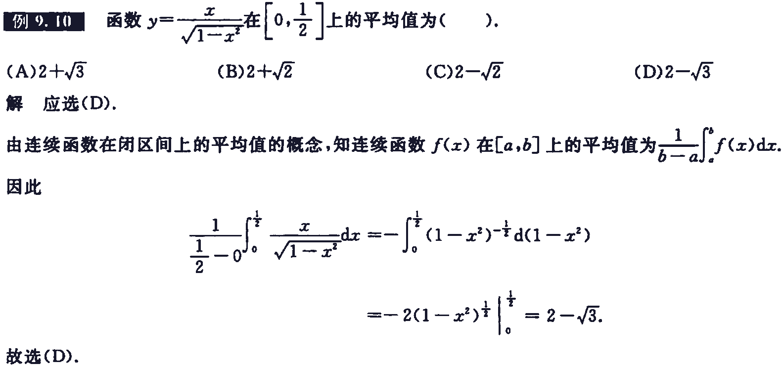

[书籍](./books/2023张宇数学基础30讲-高等数学分册.pdf#page=155)

假设以下曲线都是连续的

# 平面图形的面积

1. 曲线 $y=y_1(x)$ 与 $y=y_2(x)$ 及 $x=a,x=b(a<b)$ 所围成的平面图形的面积
    $$
    S=\int_a^b|y_a(x)-y_2(x)|{\rm d}x
    $$
    

2. 曲线 $r=r_1(\theta)$ 与 $r=r_2(\theta)$ 与两射线 $\theta=\alpha$ 与 $\theta=\beta(0\lt\beta-\alpha\lt2\pi)$ 所围成的曲边扇形的面积
    $$
    S=\frac{1}{2}\int_a^b|r_1^2(\theta)-r_2^2(\theta)|{\rm d}\theta
    $$
    

     $弧长=r\theta$ ，扇形面积公式为 $A=\cfrac{1}{2}r^2\theta$ ，因为曲线，所以其并不是扇形，设在 $[\theta,\theta+{\rm d}\theta]$ 上其一个小角度 ${\rm d}\theta$ 可知 ${\rm d}A=\cfrac{1}{2}[\rho(\theta)]^2{\rm d}\theta$ ，所以曲边扇形面积为
    $$
    A=\int_\alpha^\beta\cfrac{1}{2}[\rho(\theta)]^2{\rm d}\theta
    $$

# 旋转体的体积

# 函数的平均值

设 $x\in[a,b]$ ，函数 $y(x)$ 在 $[a,b]$ 上的平均值为 $\bar{y}=\cfrac{1}{b-a}\int_a^by(x){\rm d}x$ 

# 例题

---

---

---

---

---

---

---

---

---

# 习题

---

---

---

---

---

