[书籍](./books/2023张宇数学基础30讲-高等数学分册.pdf#page=155)

# 积分等式

## 用中值定理

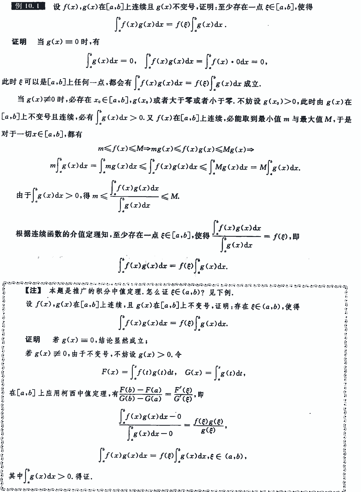

---

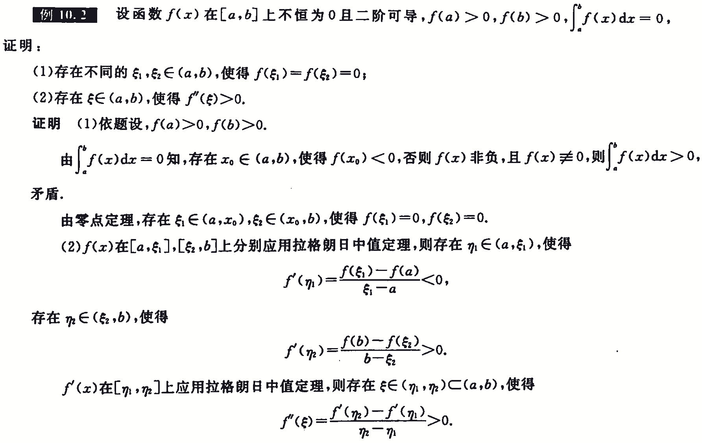

## 用夹逼准则

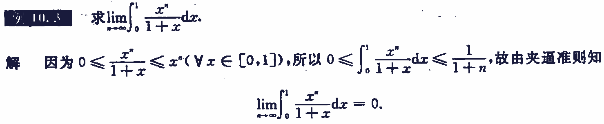

---

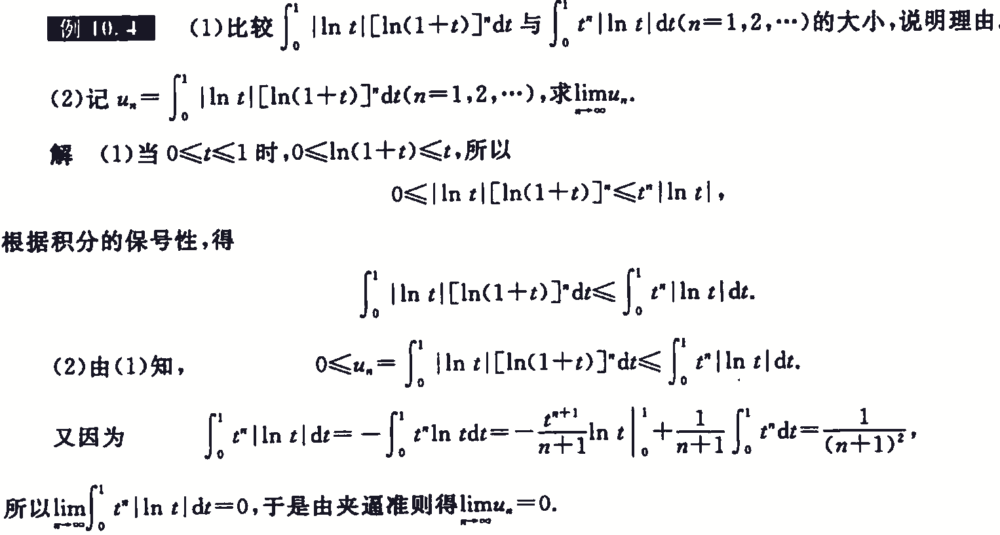

## 用积分法

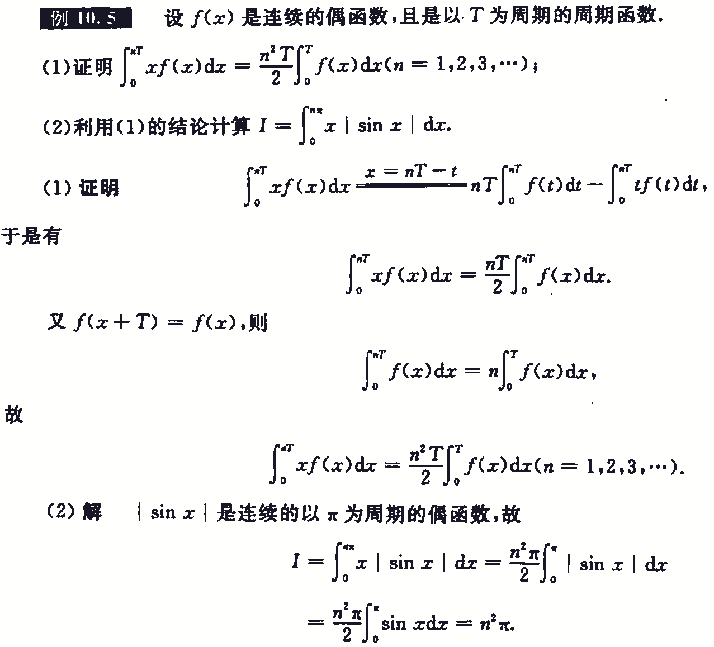

# 积分不等式

## 用函数的单调性

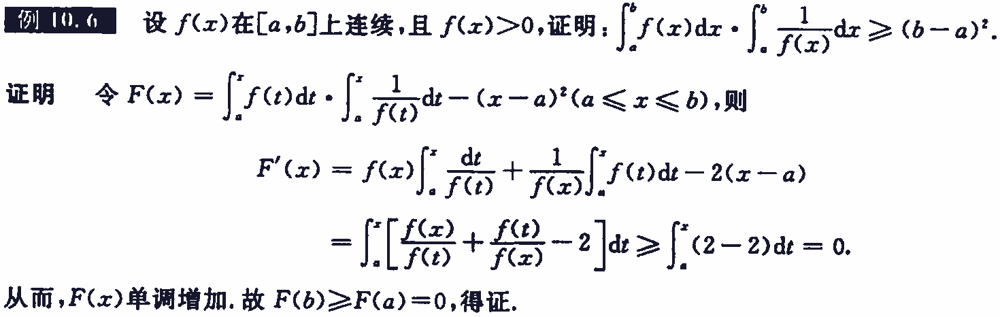

---

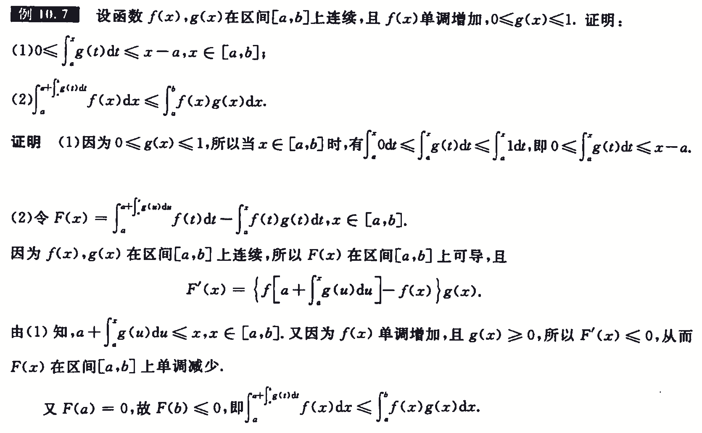

## 用拉格朗日中值定理

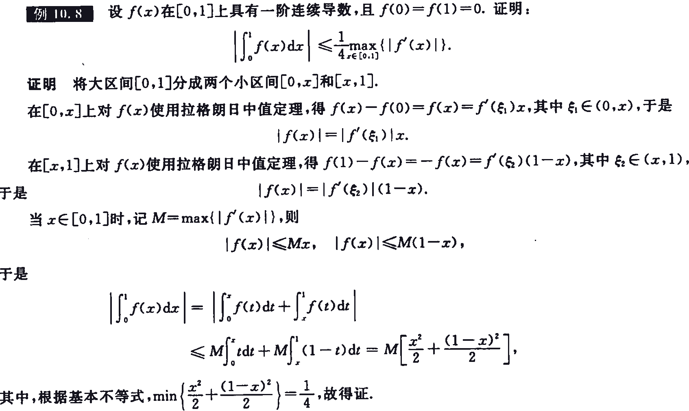

## 用泰勒公式

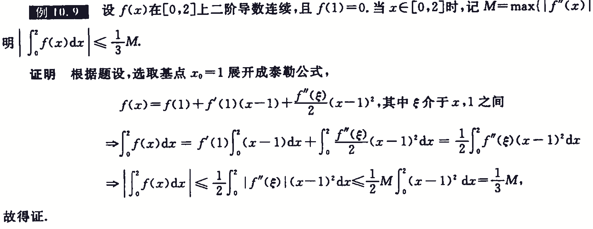

## 用积分法

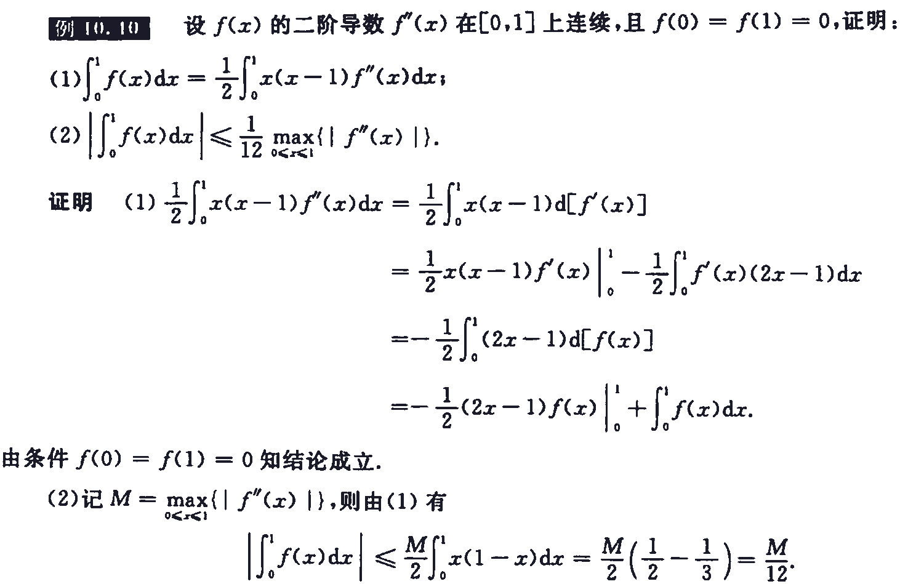

# 例题

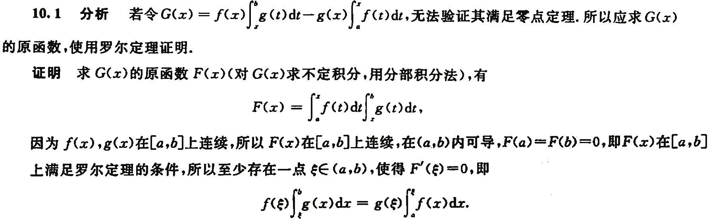

---

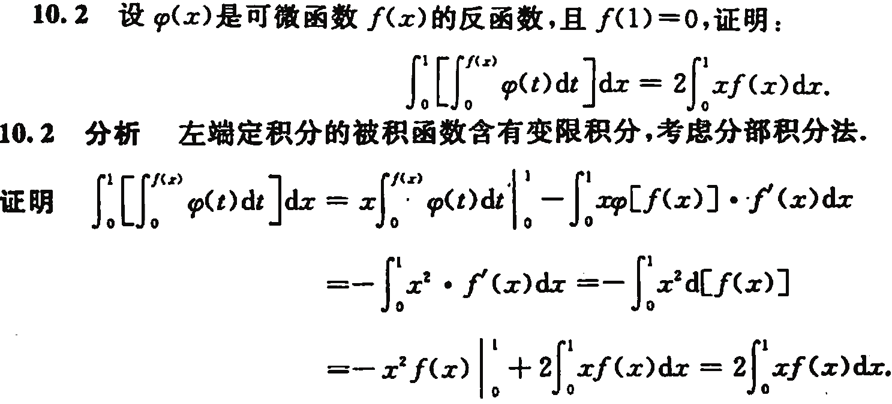

---

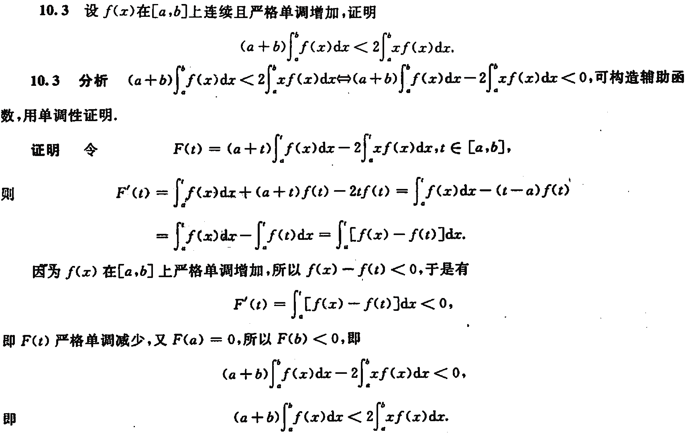

---

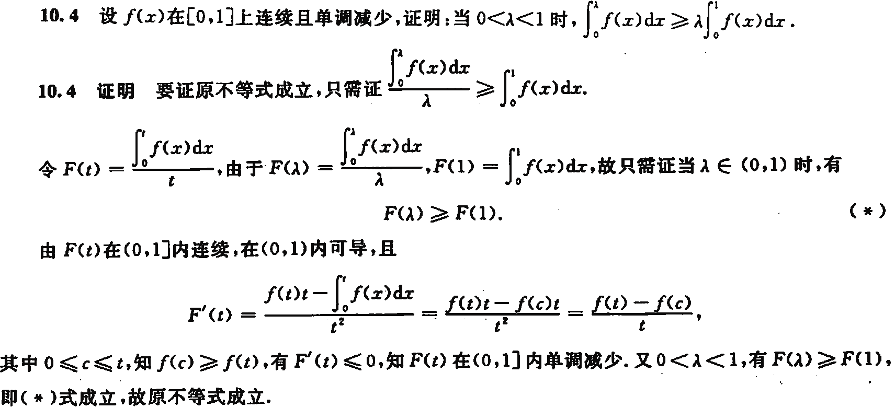

---

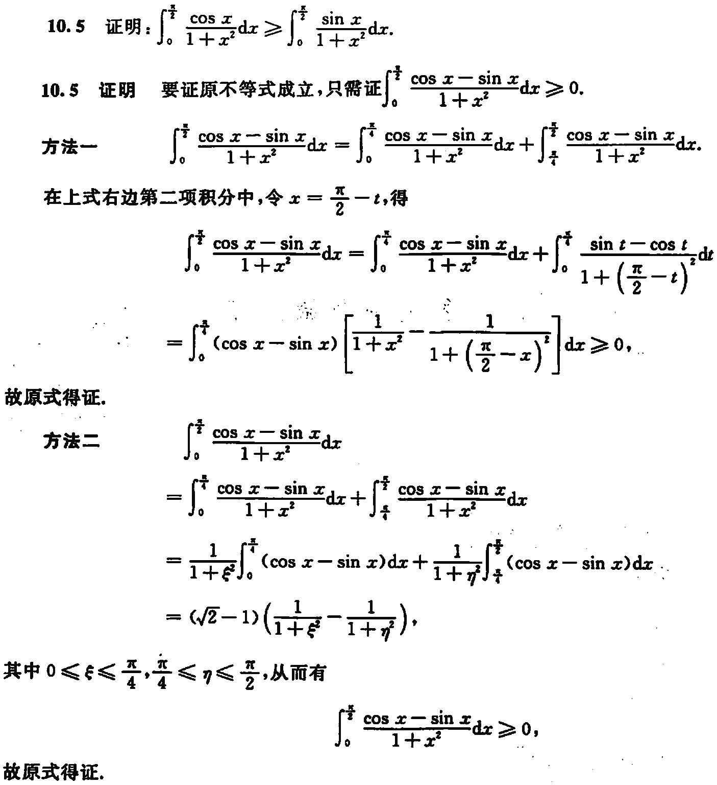

